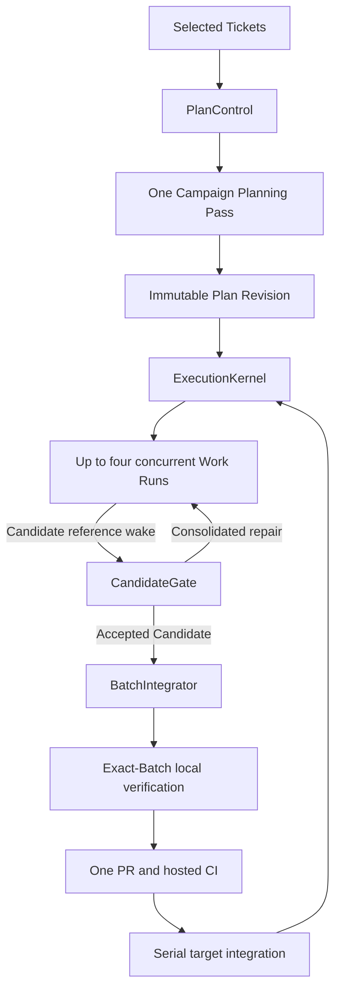

# GWO V8 lean architecture

Status: sole integrated current V8 mechanics contract. Implementation and
production cutover are incomplete.

`CONTEXT.md` owns ubiquitous language. Accepted ADRs own individual decisions
and their amendment history. This document integrates those decisions into one
current mechanics contract. The stabilization specification is a subordinate
dated requirement and Ticket-publication record; the lean roadmap owns
sequencing and exit criteria only.

V8 is a concurrent GitHub Ticket execution engine. LLMs perform bounded
semantic work; deterministic modules own scheduling, persistence, recovery,
verification orchestration, and repository delivery.

## Outcomes

V8 must:

- run independent Tickets concurrently, with four Worker Slots per Campaign by
  default;
- let semantic roles use independently configured Runtime Profiles without
  putting provider, model, or CLI facts in PlanSpec;
- keep the normal path moving after every semantic turn ends;
- freeze provider-neutral Authority Grants with the accepted Ticket contract;
- bound every semantic loop and infrastructure retry;
- combine compatible Candidates behind one exact PR and hosted-CI boundary;
- preserve exact Campaign, Work Run, Candidate, Evidence, Batch, and
  target-integration identity; and
- remain portable across Codex, Claude Code, Paseo, and compatible runtimes.

The framework succeeds when it removes coordination work from LLMs. Agent
count and protocol sophistication are not objectives.

## External API and status

The complete public orchestration surface is:

```text
start(repository, ready_refs, options?) -> CampaignHandle
advance(campaign_handle, wake_ref?) -> Running | Wait | Decision | Complete | Blocked
inspect(campaign_handle) -> Diagnostics
```

`CampaignHandle` is an opaque stable reference to `(repository, campaign_key)`.
It does not identify an Agent or Plan Revision and remains stable across
successor revisions of the same Campaign.

`Diagnostics` is a read-only projection containing the Campaign identity,
active Plan Revision digest, public status, named status reason, Work Run and
delivery summaries, outstanding event or due-time references, and Evidence
links. It is data, not another workflow actor.

`Diagnostics.status` and the result of `advance` use the same five values.
After authoritative readback, ExecutionKernel derives exactly one in this
order:

1. `Complete` when all required work and delivery are terminal and accepted;
2. otherwise `Running` when any semantic or deterministic action is active or
   currently due;
3. otherwise `Decision` when a named durable choice is required;
4. otherwise `Wait` when a named observable event or due time can continue the
   Campaign; and
5. otherwise `Blocked` when no authorized action, Decision, or wake remains.

Repair is a nested Work Run phase. A Work Run performing repair contributes
`Running`; Repair is never a sixth public status.

`options` may provide only the exact Runtime overrides described below. It
cannot rewrite Ticket contracts, expand Authority Grants, change PlanSpec
content, enlarge budgets, weaken Assurance Policy, or alter delivery policy.

## Five deep modules

| Module | Small interface, hidden behavior |
| --- | --- |
| PlanControl | Selected Ticket readback, one Campaign Planning Pass, PlanSpec v3 compilation, Authority Grant compilation, publication, activation, and readback |
| ExecutionKernel | The only persisted Campaign state machine, capacity owner, budget owner, and next-action authority |
| RuntimeGateway | Runtime selector resolution, multi-CLI execution, identity readback, exact permission handling, fallback, recovery, and retirement |
| CandidateGate | Authoritative Candidate readback, private Candidate receipt and complete diff identity, affected checks, Assurance Requirement derivation, Formal Review, Review Finding reconciliation, and consolidated repair |
| BatchIntegrator | Campaign-scoped compatibility, composition, exact verification, PR, hosted CI, serial integration, and delivery recovery |

Campaign Watchdog is an event-and-timer wake adapter, not a sixth domain
module. Runtime, Git, GitHub, CI, and filesystem adapters remain private seams
inside the module that owns their policy.

Deleting any of the five modules would spread its invariants across multiple
callers. A forwarding module that owns no invariant is prohibited.

## End-to-end flow



## PlanControl and Campaign planning

PlanControl snapshots the complete selected Ticket set, canonical blocker
relationships, Campaign source, target, and frozen repository policy. It
rejects invalid labels, missing contracts, blocker cycles, conflicting Ticket
claims, and oversized input before spending an LLM turn.

After that immutable snapshot exists, and still before it acquires a Ticket
claim or requests semantic action, PlanControl forms one pre-Plan
`CampaignPlanningSubject`. The closed subject binds the repository, stable
Campaign key and handle, expected previous Plan Revision digest (or `null`),
snapshot Artifact digest, Policy Witness digest, immutable planning
protocol/request Artifact digest, and stable action. It asks RuntimeGateway for
the subject's mechanically read-only planning-configuration preflight receipt.
The preflight resolves only the required `coordinator` configuration; it
creates no Agent, session, workspace, provider action, claim, or capacity
reservation. Missing or invalid configuration fails closed at this point.
Its semantic signature is only `planning_preflight(subject)`. An optional
Campaign-start assertion is host-composed configuration keyed by exact
Campaign identity. Absence persists empty configuration on first use and
reuses an existing durable binding; a present assertion must match that
binding exactly.
The opaque preflight receipt binds the complete Campaign-start overrides
digest plus the resolved assignment digest.  The assignment digest covers the
closed selector/source/Profile/fallback choice together with repository,
Campaign, and exact subject provenance. Campaign, preflight, override, and
assignment schemas are closed, and journal load recomputes each digest before
any Adapter readback; unrelated Ticket overrides therefore still change the
receipt.
Each Campaign record also cross-binds the planning stable action to the exact
subject and complete override digest. Journal load requires a one-to-one match
between Campaign links and preflight records.

Each initial or successor Plan Revision receives one bounded Campaign Planning
Pass over that complete snapshot. Its output is private to PlanControl and may
contain only:

- admitted Ticket keys;
- justified dependency additions;
- genuine Exclusive Resources;
- factual Runtime capability requirements; and
- named Decision requirements.

The Coordinator cannot rewrite acceptance, add work, expand authority, select
a model or CLI, predict files, author lifecycle policy, or prescribe Worker
steps. A semantic Coordinator Decision can never expand authority. PlanControl
deterministically validates the private output and is the only PlanSpec
compiler. Compilation, publication, and readback retry the same validated
output and never repeat the Planning Pass. It requests that one pass only by
giving RuntimeGateway the preflight receipt and `CampaignPlanningSubject`.
RuntimeGateway returns an Artifact-backed planning receipt for the same stable
action; PlanControl consumes that opaque receipt and never receives a provider,
CLI, Runtime Profile, session, Runtime Binding, adapter, or command fact.

A configured byte limit bounds the Planning input. Exceeding it returns a
named split-Campaign Decision; V8 neither truncates contracts nor creates an
automatic multi-call planning tree.

## PlanSpec v3 and frozen authority

PlanSpec v3 is a provider-, model-, and CLI-neutral Ticket Manifest. This
illustrative canonical shape shows the required ownership:

```yaml
schema_version: 3
repository: owner/repo
target_branch: main
campaign:
  key: campaign-key
  source: {ref: source-ref, digest: source-digest}
  contract: optional-frozen-parent-contract
  authority:
    policy_witness_digest: policy-digest
    grants:
      - {operation_id: repository.read.v1, resource_id: campaign.snapshot.v1}
policy: {ref: policy-ref, digest: policy-digest}
work:
  - key: issue:109
    source: {ref: issue-ref, digest: ticket-contract-digest}
    contract: complete-frozen-ticket-contract
    depends_on: []
    exclusive_resources: []
    capabilities: [git, local_check]
    authority:
      policy_witness_digest: policy-digest
      worker:
        grants:
          - {operation_id: workspace.write.v1, resource_id: work-run.workspace.v1}
      recovery_worker:
        grants:
          - {operation_id: workspace.write.v1, resource_id: work-run.workspace.v1}
      review:
        grants:
          - {operation_id: repository.read.v1, resource_id: review.subject.v1}
```

The Campaign Authority Grant permits only the read-only Coordinator planning
and Decision scope. Each PlanSpec work entry contains isolated-workspace
Authority Grants for `worker` and `recovery_worker` plus read-only grants for
Review Internal Subagents. Operation and resource identifiers are versioned
repository-policy identifiers, never provider permission strings.

PlanControl compiles every grant deterministically from the frozen Policy
Witness. Neither the Planning Pass, a semantic Coordinator Decision, nor
Campaign-start Runtime options can add an operation or resource. The canonical
PlanSpec digest is the authority root. The relevant authority-subtree digest
is persisted and read back through Work Run admission, Prompt acceptance,
Runtime Binding, Candidate receipt, Review Evidence, and accepted-Candidate
receipt.

Runtime permission policy belongs to the frozen grants. Deterministic
PlanControl and BatchIntegrator service authority is not semantic Runtime
authority and remains repository policy enforced by their private adapters.

PlanSpec contains no generic Agent DAG, lifecycle nodes, predicted paths,
checks, Review instructions, recovery ladder, risk, difficulty, model,
provider, CLI, Runtime binding, capacity, timeout, permission decision, or
integration node.

## Campaign and Plan Revision activation

One Campaign has exactly one active Plan Revision. Several Campaigns may be
active in one repository only when their Ticket claims are disjoint. Ticket
claim acquisition and Plan Revision activation fail closed on overlap.

Activation compare-and-swaps the key `(repository, campaign_key)` using
`expected_previous_revision_digest`, which is null for the initial revision.
A successor revision names the exact previous digest. `CampaignHandle` remains
stable while the active revision changes.

Every Activation Receipt records:

- repository;
- Campaign key;
- activated Plan Revision digest;
- expected previous revision digest; and
- repository writer generation.

The immutable Plan record and Activation Receipt are published and read back
before any Work Run is admitted. Pending activation cannot execute. After a
receipt exists, recovery rolls forward; rollback is a new durable action.

The writer generation remains repository-global and prevents simultaneous
production writers. The Integration Lease is also repository-global. Those
repository fences do not collapse independent disjoint Campaigns into one
Plan Revision.

## Runtime assignment

Runtime assignment uses exact selectors:

- Campaign-scoped `coordinator`;
- Ticket-scoped `worker`;
- Ticket-scoped `recovery_worker`;
- Ticket-scoped `review_primary`;
- Ticket-scoped `review_strong`; and
- Ticket-scoped `specialist:<policy-id>`.

Those selectors are private configuration vocabulary. Work Run callers use
the closed `WorkRunPurpose` values implementation, terminal-recovery
implementation, Formal Review, invalid Review payload retry, and specialist
review with a policy ID. RuntimeGateway performs the exact private
mapping; raw selector strings and subclasses are rejected at the subject
boundary.

The `coordinator` selector resolves in this order:

1. Campaign-start Coordinator override;
2. repository `coordinator` role mapping; and
3. host-global `coordinator` role mapping.

Each Ticket-scoped selector resolves in this order:

1. exact Campaign-start `(ticket_key, role)` override;
2. repository role mapping; and
3. host-global role mapping.

There is no Ticket-wide shorthand and no Ticket override for Coordinator.
Every mapping resolves one required primary Runtime Profile and at most one
optional availability fallback. Different selectors may intentionally resolve
to the same Profile. Missing required configuration fails closed.

Campaign-start overrides are persisted with the Campaign. For every stable
Runtime action, RuntimeGateway records the selector, configuration source,
resolved Profile digest, and whether the optional fallback was selected.
Retries, resume, readback, and same-binding recovery reuse that assignment.

Availability fallback is permitted only before any Agent identity may exist
for the stable action. After identity, RuntimeGateway recovers the same
binding. A replacement Worker binding requires terminal-binding Evidence and
uses the already resolved `recovery_worker` assignment.

PlanSpec may state factual capabilities, but it never contains a selector,
Profile, provider, model, reasoning setting, CLI, fallback, or configuration
source.

## RuntimeGateway adapter contract

This successor PlanSpec v3 contract is supplied by #111 before #109 wires the
new composition. The schema-version-2 Kernel and `runtime.py` adapters remain
explicit predecessor compatibility until #118 Cutover Guard. They are not a
RuntimeGateway bypass for any successor V3 module.

RuntimeGateway accepts only two materialization subjects: the pre-Plan
`CampaignPlanningSubject` above, and a Plan-Revision Work Run subject that
binds the repository, Campaign, Plan Revision, Work Run, Ticket, semantic
purpose, stable action, authority subtree, and Artifact-backed Prompt. The
closed Work Run purposes are implementation, terminal-recovery
implementation, Formal Review, invalid Review payload retry, and specialist
review with one policy ID. RuntimeGateway privately maps those
purposes to the configured selector vocabulary; callers never provide raw
selector strings. It does
not fabricate a Plan Revision for planning, and accepts no generic Agent or
provider subject.

Its caller interface has only three operations:
`planning_preflight(subject)`,
`progress(subject, preflight=None, wake_cursor=None)`, and
`transition(stable_action_id, transition)`. Progress owns the complete
observe-before-start and readback-first recovery loop; callers cannot prepare,
observe, command, inspect a Runtime Binding, or treat an event as state.
Campaign-start overrides are durable Campaign configuration, not PlanSpec;
the gateway persists each stable action's selector, configuration source,
resolved Profile digest, fallback choice, and closed assignment digest before
any provider operation. A Planning action's seal must equal the independently
persisted preflight and Campaign cross-binding; an action-local digest rewrite
cannot select another otherwise valid Profile or source on restart.
Planning preflights and materialized actions share one stable-action identity
namespace in that same journal: the transaction that commits either record
also reserves the subject kind and complete canonical-subject digest. Exact
replay is valid, while any cross-kind or changed-subject reuse fails before
Adapter readback, preparation, command, or provider effect. The current
Gateway recovery journal is schema version 2 and requires every top-level,
preflight, Campaign, and action field. Earlier Gateway journal schemas lack
the complete assignment seal and fail closed rather than being interpreted or
rebuilt.
Only the host configuration assembler reads immutable Runtime Profile
provider/model facts and supplies the composed `RuntimeConfiguration`; that
host-only composition data is not a PlanSpec or semantic-workflow input.
`RuntimeProfile` is an immutable provider-neutral value in a neutral module
shared with predecessor compatibility code; the successor gateway does not
import the predecessor runtime implementation.
Its nested JSON feature objects and arrays are recursively defensive-copied
and immutable without changing canonical serialization or digest. They are
composition-only views, not `dict`/`list` subclasses, and identity uses an
explicit plain-JSON projection while `dict(profile.features)` remains V2
compatible. `RuntimeConfiguration` reconstructs and freezes every Profile,
selector, mapping, nested repository mapping, and Campaign assertion rather
than retaining caller values. Every lookup and resolution rechecks exact value
types and registry-key digests before Adapter or provider activity. The
tuple-backed public values reject initializer re-entry and object-attribute
mutation, while RuntimeGateway pins and rechecks the digest of the complete
composed configuration. `RuntimeRepositoryContext` is likewise copied into a
private sealed snapshot at production-adapter and static-validator entry; a
caller cannot reinitialize or redirect a later prepare/restart to another
repository or base ref.
PlanControl, ExecutionKernel, CandidateGate, and other semantic workflow
callers receive neither those facts nor a vendor command surface. Host
composition uses provider-neutral `build_runtime_gateway` and
`RuntimeRepositoryContext`; the factory accepts the composed configuration but
has no direct provider, CLI, transport, raw-adapter, or binding parameter.

RuntimeGateway owns one module-private provider-neutral adapter contract.
Every production adapter and the deterministic in-memory adapter implements
exactly:

```text
prepare(RuntimeActionSpec) -> PrepareReceipt | RuntimeFailure
observe(stable_action_id) -> PreparedObservation | BoundObservation | RuntimeFailure
command(stable_action_id, RuntimeTransition) -> CommandReceipt | RuntimeFailure
events(after_cursor) -> RuntimeEventPage
```

`ObservationRead` is an adapter-private sealed reconciliation value, not an
adapter-contract result. It binds the requested/selected action, complete
semantic and prepared-spec identity, Workspace and optional binding identity,
exact observation or closed failure, Artifact evidence, and a causal
selected-record token at one readback linearization point. The adapter uses it
to validate `observe`; RuntimeGateway validates the resulting public private-
seam observation against its durable identity and independently proves every
governed Artifact. One pure total validator owns the exact outer and nested
schemas, causal-token consistency, and failure classification for Gateway
progress, acknowledgement-loss recovery, commands, and event scans. Receipt
and event unions are equally closed; subclasses, missing or extra fields,
tuple subclasses, unknown failures, and cross-action evidence are protocol
invalid.
The validator returns exactly one of `prepared`, `bound`,
`authoritative_absence`, `fairness_advance`, `failure`, or `invalid`.
Transport, same-action binding-missing, and same-action
materialization-pending classification is protocol-owned
`fairness_advance`; event callers do not inspect raw failure codes. Gateway
progression, transition, durable observation recording, command recovery, and
Adapter command gates retain that verdict and branch only on its kind; only
the external compatibility `observe` edge unwraps it. One exact field table
covers the read, identity, token, Artifact evidence/read/output proofs, and
Prepared/Bound observations. Every scalar and bounded proof length is
validated before equality, hashing, membership, attribute use, or conversion,
and arbitrary hostile objects are converted to typed invalid verdicts rather
than escaping as Python exceptions.
Any populated failure action ID must equal the selected action even when no
materialized identity exists. Absence, binding-missing,
materialization-pending, prepare/command acknowledgement-loss, and
effect-ambiguity failures are action-bound and require that ID. Prepare
follow-up readback recovery is restricted to same-action
`RUNTIME_PREPARE_ACK_LOST` and `RUNTIME_EFFECT_AMBIGUOUS`; configuration,
protocol, unknown, transport, and other permanent failures retain their
original typed result.

`prepare` is idempotent by stable action identity. It resolves or creates the
action-owned isolated Workspace and stages every governed Artifact-backed
input, including the Prompt, but it
cannot create an Agent, session, or Runtime Binding or begin semantic
execution. Only a typed authoritative absence permits prepare; transport,
malformed result, and ambiguity fail closed. A Prepared observation proves
the exact subject, Profile, authority, Workspace, Prompt, and boolean fence
state while Agent/session/binding are explicitly absent. It also proves the
fixed action result path is absent before prepare commit, every Prepared
readback, and the `start` claim/effect; a planted valid result is invalid
provenance. The complete Ticket contract,
planning protocol/request, Review Subject, and Review Finding context travel
through bounded Artifact references or files, never a short CLI argument; an
adapter fails closed rather than exceeding an OS or Paseo command-length
limit. A validated `ObservationRead` authoritatively proves the
repository, Campaign, Plan Revision, Work Run, stable action, selected Profile,
Agent, session, workspace, and Runtime Binding identities, plus Prompt
acceptance, lifecycle, outstanding normalized Permission Requests, and strict
boolean fencing state. That is a Bound observation.

`RuntimeTransition` is the closed union of seven typed transitions. Its
`RuntimeCommand` enum contains six values, while `PermissionResponse` is the
seventh typed transition:

```text
start | resume | park | interrupt | fence | retire
PermissionResponse(request_id, allow|deny)
```

Both permission fields are exact non-empty strings before any effect. `None`
is the sole event-cursor origin. Every concrete cursor is canonical ASCII
`[1-9][0-9]{0,18}` in `1..2^63-1`; zero and leading-zero aliases,
booleans, integers, subclasses, Unicode digits, overflows, and coercible
objects fail without changing the fair-scan cursor or event publication.
Events are strictly newer than the requested cursor. A non-empty page returns
exactly its last event cursor, while an empty page echoes the request.
Persistent event history is a non-normalizing consecutive ring of at most 64
events. Once cursor `2^63-1` has been emitted, any later state change that
would need a new event returns `RUNTIME_EVENT_CURSOR_EXHAUSTED` before
changing scan, wake, event, or terminal state.

RuntimeGateway may issue `start` only after readback proves the exact
Prepared state; Paseo then atomically creates and starts the Agent. It accepts
the action only after stable-action label lookup and `inspect` prove the exact
Bound state. `resume` requires an exact parked Bound observation and uses a
Prompt file. No adapter has an implicit launch-on-prepare path. After an
acknowledged-create loss, restart, or ambiguous materialization, it first
observes the stable action and can neither create a second Agent/workspace/
Prompt nor begin a second Planning Pass. `events` provides cursor-based wake
hints; it never replaces authoritative readback. One event poll selects at
most one fair-scan candidate without mutation and performs at most one action
readback.
It captures the scan cursor, ordered eligible-set digest, and selected action,
validates the complete observation, and captures the reconciled selected
action-record digest. One final CAS must still match all four identities before
it publishes the scan cursor, wake digest, event, and terminal marker together.
A concurrent scanner, selected-action update, or eligible-set change makes the
CAS publish and advance nothing; a later poll re-reads. Malformed
observations—including Bound plus `prepared`—and malformed absence evidence
also publish nothing and do not update Bound Workspace history. Exact
`authoritative_absence` and protocol-owned `fairness_advance` verdicts may
consume one scan position as an isolated missed hint, so one stale action
cannot starve other actions. The event-page protocol separately owns
`page`, `transient_failure`, `failure`, and `invalid`; Gateway wake handling
branches on that kind without reclassifying a raw code. A terminal action
stores one pageable terminal wake and then leaves the scan set. A
state-changing fence or retire claim atomically re-arms that action; proven
non-dispatch restores the former terminal marker. Subject progress performs
its authoritative observation validation before it polls these advisory
hints.
Every successful `observe` opens one adapter-private, ephemeral command gate
from its sealed reconciliation read. `command` takes no caller-supplied token,
consumes that gate exactly once, and rejects a fresh command, an event-only
read, a stale gate, a previously consumed gate, or a gate from a restarted
adapter before provider state changes. The Adapter compares the complete
identity and selected-record digest against current state before dispatch; a
concurrent rebind, reconciliation, or retire therefore rejects an old gate
without changing provider state. Paseo performs the final selected-record,
action, subject, and reconciled-identity check in the same durable transaction
that grants the effect claim; it never validates one record and claims a later
sample. The in-memory Adapter validates the complete current sealed read
within the same re-entrant lock as its effect.

Every accepted command receipt (including acknowledgement-loss recovery) is
valid only after Bound readback proves its named effect: start/resume produce
running or completed, park/interrupt parked, fence exactly true, retire
retired, and `PermissionResponse` has an exact same-decision provider receipt
and removes the exact request. Absence without that receipt is ambiguous, not
acknowledgement-loss recovery. Paseo first verifies the native receipt name
against the provider-namespaced operation, then retains the normalized
operation ID in `name`; ingestion, restart, and readback all require
`receipt.name == request.operation_id`. A fenced parked binding cannot resume. Production persists lifecycle, fence, and pending
permission state changes as advisory cursor wake hints.

All local files and provider arguments are validated before an effect claim.
Only provider-process creation failure proves that a call was not dispatched
and permits exact claim restoration. Timeout, output overflow, malformed
protocol, native failure, and receipt mismatch retain their durable pending
claim and require readback-first recovery.

The Gateway-owned Artifact Store verifies bounded byte length and digest for
every input and completed output. Canonical JSON Prompt and output Artifacts
also prove their exact subject, stable action, authority, and payload binding;
missing, truncated, oversized, or drifted Artifacts stop progression before a
corresponding mutating provider effect or receipt. Read-only Agent or Workspace
registry discovery may precede local validation when an unrecorded Workspace
path is not yet known. Paseo uses a short bootstrap and `--output-schema`,
but a completed receipt is authoritative only after the Agent atomically writes
the action-owned Workspace result Artifact; logs are wake hints, never output.
The host Store publishes an `ArtifactRef` only after a unique exclusive
temporary create, complete write and flush, file `fsync`, atomic replacement,
directory `fsync` where supported, and bounded final readback matching both
digest and exact bytes. Existing targets are verified before adoption and
concurrent same-digest writers are idempotent. Failure returns no reference
and cleans only the temporary file owned by that attempt. This host durability
contract is separate from the non-racing Runtime Workspace filesystem threat
model below.
Completed output uses one shared exact `gwo.runtime.output.v1` proof operation.
RuntimeGateway performs its own proof at the authoritative observation edge;
an Adapter's acceptance cannot substitute for that proof. The object admits only
schema version, subject, stable action, authority, and payload fields; missing,
corrupt, cross-action, or extra-field output fails before reconciliation,
journal mutation, or receipt emission.
The shared canonical layer accepts only exact JSON values: `null`, strings,
booleans, integers, finite floats, arrays, and objects with exact string keys.
It disables non-finite output and Python key coercion. Artifact, journal, and
provider ingress reject duplicate names, `NaN`/infinities, invalid UTF-8, and
noncanonical bytes and translate them into boundary-owned typed failures.
It also rejects active-reference cycles, values beyond a fixed nesting depth,
and integers beyond an explicit digit bound without leaking interpreter
recursion or integer-conversion failures. Strings and object keys contain
Unicode scalar values only: lone high and low surrogate code points are
rejected recursively, while supplementary characters and valid JSON surrogate
pairs decoded into one scalar remain valid.
Paseo label list readback establishes the stable action before `inspect`, whose
Agent ID, provider, model, thinking, mode, current working directory, and
status must exactly match the binding. Its working directory joins the exact
recorded workspace ID/name/worktree record. Registry selection is target-
scoped to the action-owned worktree slug and exact durable identity; unrelated
rows are ignored, conflicting target rows fail closed, and untrusted durable
network paths are never resolved. Bounded Git readback proves the
same repository common directory; a Prepared Workspace also has the configured
base commit as its `HEAD`. Pinned equality applies only to Prepared. Bound
readback and exact prepare replay re-prove Agent/label identity, common
directory, ownership marker, and staged Artifacts, then require a monotonic
descendant chain from the pinned base and the last observed Bound head.
Ordinary Worker commits remain valid; unrelated history or rewind is
ambiguous.
Agent and Workspace compatibility aliases use one exact decoder across
inspect, Agent-list, Workspace-list, and Workspace-create receipt paths:
missing stays missing, equal populated aliases remain compatible, and
conflicting populated aliases fail as ambiguous identity rather than selecting
one spelling.

The pinned base must not contain any casefold-equivalent reserved `.gwo`
top-level path, including `.GWO`. Before Workspace creation, the durable intent
records a random ownership nonce and layout version. After exact registry and
Git identity readback, prepare creates or
recovers a nonce-bound marker and only fixed artifact, schema, result, and
resume targets. Restart re-derives all recorded paths. Every governed file
operation rejects links, Windows reparse points, non-directory parents,
non-regular or multiply linked leaves, and resolved containment escapes before
using an exclusive temporary file and verified atomic replacement. This is a
non-racing link/reparse defense; it does not claim portable descriptor-grade
protection against a local attacker racing between the checks and use.
Marker creation uses one deterministic nonce-owned temporary path; recovery
validates its containment, regular type, non-reparse state, and single link
before removal and reconstruction.

Because Paseo does not
expose a provider session ID, `paseo-agent:<agent-id>` is an explicit
adapter-derived session reference; non-empty Profile features fail closed.
Before Workspace create, run, or resume, the production adapter persists the
exact pending effect. Paseo's schema-version-5 recovery journal is a closed
union: every action carries every pending claim (`pending_start` included),
its idempotent-recovery state, an irreversible `binding_established` proof
paired with its Agent ID, and exact built-in field types from its first write.
Missing, widened, malformed, or invalid-transition state fails before Adapter
readback or a second provider command. An acknowledgement-loss
readback that is still absent returns materialization-pending and cannot
repeat that side effect; duplicate
Workspace identity is validated globally before selection. Every row is
decoded, and any duplicate raw slug, Workspace ID, resolved path, or exact row
is ambiguous across all isolation modes. Proven non-dispatch of Workspace
create restores `create_pending` to the complete `recorded` intent before any
registry readback, so independent registry failure cannot strand a
never-dispatched effect.
Verified action-bound output dominates every non-retired provider lifecycle,
including idle, running, and busy, and clears stale park/resume/stop flags
atomically. Terminal bindings never send a new permission decision; only exact
replay of a durable same-request, same-decision completed effect is idempotent.
Its request and provider receipt digests must recompute, the action, subject,
and binding must match, and the request must remain absent from outstanding
permissions.
The deterministic in-memory adapter passes the same
contract suite and failure cases as production adapters. It is not a looser
fake or a second policy implementation. Runtime Profile resolution, permission
policy, and fallback selection remain exclusively in RuntimeGateway. Retry
bounds and semantic budgets remain ExecutionKernel policy.
In-memory `start` establishes binding plus `running` before output
publication. If publication fails, later observation retries completion on the
same Bound action without creating another Agent; final permission-response
publication follows the same ordering.
Bound observations admit only `running`, `parked`, `completed`, or `retired`;
the `prepared` lifecycle is valid only for the separate unbound Prepared
observation and is rejected before durable observation state changes.

## Worker Slots and Work Run bounds

A Campaign has four Worker Slots by default. The setting is host-global with a
repository override; it is not inferred by an LLM and is absent from PlanSpec.
Each Campaign also has one fixed Coordinator semantic-control capacity that is
not a general scheduling Slot.

Only an unsatisfied Ticket dependency, a genuine Exclusive Resource, the
Campaign Worker Slot limit, or observed Runtime unavailability blocks an
otherwise eligible Work Run. Predicted file overlap does not block isolated
workspaces.

A Work Run retains its Worker Slot through affected checks, Formal Review, and
immediate consolidated repair. An accepted Candidate waiting for delivery or a
Runtime proven parked releases the Slot. Resumption reacquires capacity before
semantic execution continues. Review Internal Subagents consume no Worker
Slot.

A live provider-unavailable observation after identity exists proves neither
parked, terminal, nor fenced state. By itself it releases no Worker Slot,
Ticket claim, or Exclusive Resource claim.

Within one Plan Revision, each Work Run permits:

- at most three distinct Candidate SHAs submitted in total;
- one initial Worker binding; and
- at most one replacement Worker binding after terminal-binding Evidence.

Switching bindings does not reset the Candidate-submission bound or the Review
Finding ledger. Invalid Review transport may retry once through
`review_strong` and does not consume a Candidate submission. An unchanged
rejected Candidate cannot obtain another Formal Review.

## Runtime permissions, waits, and recovery

Issue #111's RuntimeGateway only joins provider readback and emits an opaque,
canonical descriptor identity: exact request identity, provider-namespaced
operation/resource digests, Runtime Binding, and authority-subtree digest. It
does not infer authority from provider names or natural-language descriptions,
and it does not decide allow/deny. Issue #112 may auto-allow only when the
exact canonical operation and resource identifiers are covered by both the
frozen Authority Grant and its Policy Witness; otherwise it returns
`PermissionRequired`.

RuntimeGateway cannot expand authority. A Coordinator may propose only an
alternative already covered by the same frozen authority subtree. Any new or
broader operation or resource, or any changed authority root, requires an
explicitly recorded human Decision, deterministic recompilation, and a
successor Plan Revision. A semantic Coordinator Decision can never expand
authority.

An unmatched permission or bounded Coordinator-attention request enters a
three-minute interactive-wait grace. This default is host-global with a
repository override. The Work Run retains its Worker Slot during grace. After
expiry, ExecutionKernel releases the Slot only after RuntimeGateway proves the
binding parked. A later Decision is recorded until the Work Run reacquires a
Slot and resumes the same binding.

After thirty minutes without trusted state change, Campaign Watchdog first
requests zero-LLM Runtime, process, workspace, and Campaign readback. The stale
deadline is host-global with repository override. If one binding remains
genuinely ambiguous, that binding may receive one bounded Coordinator stale
diagnosis. Each initial or replacement binding has its own one-diagnosis
maximum; periodic LLM monitoring is prohibited.

Time, permission delay, capacity pressure after identity, and ambiguous
lifecycle never authorize a replacement. Only terminal-binding Evidence
proving the exact action, Agent, session, workspace, terminal state, fencing,
and checkpoint permits ExecutionKernel to start the one replacement binding.

## Runtime failure taxonomy

This table is the canonical Runtime failure policy. ADRs and subordinate
documents link here rather than restating variants.

| Authoritative observation | Required response | Exhausted or terminal result |
| --- | --- | --- |
| Cached provider-unavailable snapshot | Treat it as advisory and perform one live authoritative observation. It selects no fallback or replacement and consumes no retry, binding, semantic, or Candidate budget. | None from the cached fact alone. |
| Live provider recovery before identity | Use the primary Profile only when no fallback was durably selected. A durably selected fallback remains selected even if the primary later recovers. | Continue the already selected assignment. |
| Live provider unavailable before identity | Select the configured availability fallback at most once. Without a usable configured fallback, persist `Wait(RuntimeProviderUnavailable, next_check_at)` for the initial observation plus at most two retries. | `Blocked(RuntimeProviderUnavailable)` after the bounded observations. |
| Permanent configuration failure before identity | Do not select fallback and do not perform transport retry. | `Blocked(RuntimeConfigurationInvalid)`. |
| Permanent configuration failure after identity | Preserve and fence as required around the same binding. Replacement remains forbidden unless terminal-binding Evidence permits the one configured replacement. | Human `Decision(RuntimeConfigurationRepairRequired)` when replacement is not proven and authorized. |
| Runtime transport unavailable | Read back by stable action identity, then persist `Wait(RuntimeTransportUnavailable, next_check_at)` for the initial attempt plus at most two retries. Do not select fallback or replacement. | Before identity: `Blocked(RuntimeTransportUnavailable)`. After identity: human `Decision(RuntimeObservationUnavailable)`. |
| Live provider unavailable after identity | Open or recover one persisted episode keyed by the exact stable action and Runtime Binding. The initial and first-retry authoritative live observations each persist `Wait(RuntimeProviderUnavailable, next_check_at)`. The second retry—the third authoritative live-unavailable observation—returns the terminal result at right. Preserve the exact `stable_action_id`, Runtime Binding, Profile, provider, CLI, Agent, session, workspace, accepted Prompt, and authority-subtree digest throughout. | Human `Decision(RuntimeProviderRecoveryRequired)`. |
| Live provider recovery after identity | Authoritatively read back and, when lifecycle permits, resume the same binding only. Never change its Profile, provider, CLI, session, or workspace. Successful same-binding recovery closes its persisted provider-unavailable episode. | Existing same-binding lifecycle applies. |

No failure before accepted-Prompt readback consumes a semantic or Candidate
budget. After a failed create, RuntimeGateway first reads back the stable
action identity. It may remove only a proven action-owned empty workspace.
Identity or content ambiguity fences every attributable resource and returns a
named human Decision; it never guesses adoption, creates a duplicate, or
reuses unproven content.

Only a uniquely persisted receipt for a new authoritative live-unavailable
observation advances a post-identity provider-unavailable episode. Cached
snapshots, duplicate callbacks or wakes, restart recovery, and repeated
`advance` without a new live observation neither consume nor reset it. A
transport-unavailable observation uses its independent transport episode and
budget and is never double-counted as provider unavailability, or vice versa.

Provider unavailability alone does not prove the binding parked, terminal, or
fenced and does not release capacity or claims. It cannot select fallback,
issue a new `prepare`, create an Agent or workspace, switch Profile, provider,
or CLI, restart a daemon, create a replacement, or consume semantic,
Candidate, or replacement-binding budget. Only independent terminal-binding
Evidence may authorize the existing one replacement binding.

RuntimeGateway and Campaign Watchdog never restart a provider daemon
automatically. A daemon restart can terminate unrelated Agents and is outside
the authorized recovery contract.

## CandidateGate

CandidateGate is the only Formal Review entry:

```text
Candidate reference wake hint
  -> authoritative Candidate commit/tree readback
  -> CandidateDiffRecordV1 + private Candidate receipt
  -> ExecutionKernel persists the receipt
  -> scope/authority audit over that exact record
  -> affected deterministic checks
  -> Assurance Requirement
  -> required Formal Review Internal Subagent
  -> Accepted | consolidated repair | Decision | Wait
```

The Worker can report only a Candidate reference. Its report and any Runtime
notification are wake hints. RuntimeGateway transports them but cannot adopt a
Candidate or advance Work Run state. CandidateGate authoritatively reads back
the exact Candidate commit and tree, constructs the private
`CandidateDiffRecordV1` Artifact, and produces a private Candidate receipt.
That receipt binds Campaign, Plan Revision, Work Run, reported reference, exact
base and Candidate commit/tree identities, diff schema version and digest, and
authority-subtree digest. Only after ExecutionKernel persists it may the Work
Run leave semantic execution for Candidate verification. This is private state
for that existing transition, not a new gate, and is distinct from the
accepted-Candidate receipt emitted only after verification succeeds.

### CandidateDiffRecordV1

`CandidateDiffRecordV1` is CandidateGate's complete, immutable diff Artifact.
It is not a module, workflow node, public API type, status, Evidence, or
`PatchIdentityV1`. CandidateGate constructs it directly from the exact base and
Candidate Git trees so Ticket #114 does not depend on BatchIntegrator work in
Ticket #116.

Its RFC 8785 canonical JSON payload has this logical shape:

```json
{
  "schema_version": "CandidateDiffRecordV1",
  "repository_object_format": "sha1",
  "base": {"commit_oid": "...", "tree_oid": "..."},
  "candidate": {"commit_oid": "...", "tree_oid": "..."},
  "entries": [
    {
      "old_path": "...",
      "new_path": "...",
      "change_kind": "modify",
      "old_mode": "100644",
      "new_mode": "100755",
      "old_object_type": "blob",
      "new_object_type": "blob",
      "old_oid": "...",
      "new_oid": "..."
    }
  ]
}
```

`repository_object_format` is the repository's exact `sha1` or `sha256`
format. Every commit, tree, blob, and gitlink OID is fixed-width lowercase hex:
40 characters for `sha1` or 64 for `sha256`. Paths are complete
repository-relative raw Git path bytes,
encoded as unpadded base64url strings; an absent old or new path, mode, object
type, or OID is JSON `null`. Modes are six-digit ASCII octal strings.
Object-type values are `blob` or `gitlink`. Rename and copy inference is
disabled, so either is represented as delete plus add.

Entries omit unchanged paths. The canonical kind is `add` when the old entry is
absent, `delete` when the new entry is absent, `type-change` when the logical
object type or Git file type derived from mode changes, and `modify` for every
other OID or mode change. Entries are sorted bytewise by decoded raw old path,
then decoded raw new path, then change kind, treating an absent path as the
zero-length byte string. The record digest is external to the payload and is:

```text
SHA-256(
  ASCII("gwo.candidate-diff-record.v1\0")
  || RFC8785_CANONICAL_JSON_BYTES(record)
)
```

CandidateGate persists one Artifact and uses that same record for scope and
authority audit, affected Checks, Assurance Requirement derivation, protected
surfaces, Interaction Keys, and Formal Review. No consumer reconstructs a
weaker or independently interpreted diff.

Deterministic failure stops before LLM Review. Worker self-checks cannot become
Formal Review Evidence. An external `code-review` skill may supply heuristics,
but V8 owns the Review Subject, coverage, transport, typed output, identity,
budget, and lifecycle.

A Review Subject binds the exact base and Candidate commit/tree identities,
`CandidateDiffRecordV1` schema version and digest, Ticket contract, standards,
Check Evidence, Assurance Requirement, Policy Witness, and Review protocol
version. Review Evidence is reusable only when the complete Review Subject
digest is identical, the diff Artifact remains readable, and CandidateGate
revalidates its digest. A base, Candidate, diff schema, diff digest, or Review
protocol change creates a fresh Review Subject. A missing, truncated, or
digest-mismatched diff Artifact fails closed before any Reviewer invocation.

A complete no-Review allowlist match may use zero Reviewer calls. Standard
Assurance uses one `review_primary` observation. Strict Assurance adds at most
one `specialist:<policy-id>` observation or human Decision. Invalid Review
transport may retry once through `review_strong`; a valid rejection is not
repeated against an unchanged Review Subject.

A fresh Review Subject preserves the complete Artifact-backed Review Finding
ledger, and every earlier Review Finding receives a typed disposition.
CandidateGate returns one consolidated repair request containing that ledger;
Review Findings and repair context are never silently truncated.

Acceptance emits a compact accepted-Candidate receipt binding Campaign, Work
Run, persisted Candidate receipt, Candidate commit/tree,
`CandidateDiffRecordV1` schema and digest, authority-subtree digest, Review
Subject, Assurance Requirement, and Evidence. Only that accepted-Candidate
receipt makes a Candidate eligible for delivery.

## BatchIntegrator

BatchIntegrator forms Batches only from accepted Candidates in the same
Campaign. V8.0 does not batch across Campaigns. Every Batch receipt preserves
Campaign identity and each member's Work Run identity.

The Batch member limit is an integer from one through four, default four. It is
a host-global setting with repository override and is absent from PlanSpec.
When the repository-global Integration Lease is free, BatchIntegrator:

1. chooses the oldest eligible accepted Candidate as the seed;
2. scans remaining accepted Candidates oldest first;
3. adds a Candidate only when it is pairwise compatible with every frozen
   member; and
4. freezes immediately when the scan ends or the member limit is reached.

It never waits for running Work Runs, uses a timer to grow the Batch, predicts
completion, or calls an LLM.

Eligibility requires the same Campaign and compatible:

- target and base identity, or a valid Clean Base Advance;
- check environment;
- Policy Witness digest;
- delivery identity;
- Assurance Requirement;
- protected surfaces; and
- pairwise Interaction Keys.

Strict Assurance is always a Singleton Batch. A repository-policy
classification of non-decomposable, high-coupling, or protected Interaction
Key is also Singleton. Other Candidates may batch only when all Interaction
Keys and protected surfaces are pairwise compatible.

### PatchIdentityV1 and Clean Base Advance

`PatchIdentityV1` is a repository-tree delta identity, not Git's heuristic
`git patch-id`. Define `LP(bytes)` as an unsigned 64-bit big-endian byte length
followed by those bytes. Its digest is:

```text
SHA-256(
  ASCII("gwo.patch-identity.v1\0")
  || LP(ASCII(repository_object_format))
  || CONCAT(LP(entry) FOR entry IN SORT_BYTEWISE(encoded_delta_entries))
)
```

Each `encoded_delta_entry` is the concatenation of length-prefixed:

1. old path as complete repository-relative Git path bytes with `/` separators,
   or empty when absent;
2. new path as complete repository-relative Git path bytes with `/` separators,
   or empty when absent;
3. canonical change kind;
4. old mode as six-digit ASCII octal, or empty when absent;
5. new mode as six-digit ASCII octal, or empty when absent;
6. old blob or gitlink object ID as raw object-ID bytes, or empty when absent;
   and
7. new blob or gitlink object ID as raw object-ID bytes, or empty when absent.

Unchanged entries are omitted. The canonical change kind is `add` when the old
entry is absent, `delete` when the new entry is absent, `type-change` when the
Git object or file type changes, and `modify` for every other object-ID or mode
change, including an executable-bit change. Entries are sorted bytewise by
their complete encoding. The algorithm compares Git trees, never worktree
text. Binary content uses exact object IDs. Rename/copy detection is disabled,
so a rename or copy is represented as delete plus add. Symlink and executable
modes participate. Gitlinks use their exact object IDs and are protected
Singleton work.

Missing objects, case-folding or path-normalization ambiguity, unsafe paths,
and merge ambiguity fail closed. BatchIntegrator computes and stores the
original `PatchIdentityV1` for `(base, Candidate)`.

For Clean Base Advance, BatchIntegrator applies each accepted Candidate alone
to the advanced target in an isolated Git tree. It recomputes
`PatchIdentityV1(advanced_target, advanced_member_tree)` and requires equality
with that member's original digest before any multi-member Batch composition.
It never compares one member with the whole composed Batch.

The Candidate and Review Evidence remain bound to the original Candidate and
Review Subject; Patch identity cannot authorize cross-SHA Review reuse. Batch
Evidence binds the algorithm version, original base and Candidate tree,
original patch digest, advanced target and advanced member tree, recomputed
patch digest, final Batch SHA, and the exact local and hosted Checks.

Clean Base Advance additionally requires the original base to remain an
ancestor of the current target, unchanged Candidate and Evidence, no protected
interaction with the target delta, and clean isolated composition. The final
Batch must still pass its complete local and hosted checks.

The same immutable Batch SHA must:

1. pass the repository-equivalent local suite;
2. be the pushed branch and pull-request head observed by GitHub; and
3. be the exact head observed by hosted CI.

Integration names that Batch SHA. The target branch may advance to a merge
commit rather than equal the Batch SHA, so target readback must prove the Batch
SHA is reachable as an ancestor and that GitHub's PR merge mapping connects the
PR head to the observed target head. Squash or rebase integration rewrites the
reviewed identity and therefore fails closed.

### Durable hosted result adoption

Every terminal hosted check produces one integrity-validated receipt keyed by
the stable delivery action, Batch SHA, check-suite identity, provider check ID,
terminal outcome, and observation digest.

Once that receipt is durably persisted, restart adopts it without another
hosted read. A receipt or provider observation whose Batch, suite, check ID, or
digest mismatches the stable delivery action returns
`DeliveryIdentityMismatch`. Ambiguous provider attribution returns
`DeliveryAttributionAmbiguous`.

Both outcomes preserve every Candidate and all Evidence. They are delivery
identity failures, not code-class failures, and permit neither Singleton Batch
Fallback nor Worker resume. Only an unambiguous receipt for the exact delivery
action can drive integration or code-class recovery.

Infrastructure failure retries the unchanged Batch SHA at most twice. A
composition, exact-local, or code-class hosted failure may dissolve one
multi-member Batch into Singleton Batches once. There is no recursive
bisection or LLM attribution. Only a failing Singleton can resume its parked
Worker; changed code re-enters CandidateGate.

## Persistence and liveness

ExecutionKernel is the only persisted state machine and next-action authority.
Every external effect has a stable action identity and is read back before
retry. No local transaction remains open during external I/O. GitHub remains
the durable business record; local storage is rebuildable control state.

Worker reports and Runtime notifications are wake hints only. RuntimeGateway
transports them; CandidateGate owns authoritative Candidate commit/tree and
diff readback; ExecutionKernel owns persistence and lifecycle transition. A
Candidate Artifact is not Evidence or a Result. A code-producing Result exists
only after the exact accepted Candidate is integrated and target readback
proves that integration.

Campaign Watchdog subscribes to Runtime and hosted-check events and owns
persisted `next_check_at` timers. Events are wake hints only; each wake invokes
`advance`, which performs authoritative readback. Restart reconstructs timers
and subscriptions from Campaign state. A due `next_check_at` wake invokes the
same `advance` path and recovers a lost callback without duplicating its
effect. Campaign Watchdog never restarts the Paseo daemon automatically.

An original report, duplicate notification, raw log, workspace head, or
unread-back completion statement neither advances state nor resets the stale
deadline. Only a durably persisted Candidate receipt whose exact Candidate
SHA/tree came from authoritative readback and whose `CandidateDiffRecordV1`
digest was constructed and revalidated over the exact base and Candidate
objects is trusted Candidate liveness progress.

Detailed admission, action, permission, Review, and delivery records are
module-private implementation facts. They are not public actors or vocabulary
that Coordinators and Workers must learn.

## Defaults

The current deterministic defaults are:

| Setting | Default | Configuration |
| --- | --- | --- |
| Worker Slots per Campaign | 4 | host-global, repository override |
| Batch member limit | 4, maximum 4 | host-global, repository override |
| Stale-binding deadline | 30 minutes | host-global, repository override |
| Interactive-wait grace | 3 minutes | host-global, repository override |
| Pre-identity provider-availability observations | initial plus at most 2 retries, independent of transport | fixed V8.0 policy |
| Post-identity provider-unavailable episode | initial plus at most 2 retries, independent of transport | fixed V8.0 policy |
| Runtime transport-unavailable episode | initial plus at most 2 retries, independent of provider availability | fixed V8.0 policy |
| Distinct Candidate SHAs per Work Run | at most 3 | fixed V8.0 policy |
| Worker bindings per Work Run | initial plus at most one replacement | fixed V8.0 policy |

No default is inferred by an LLM or embedded as a Runtime assignment in
PlanSpec.

## Deliberate exclusions

V8.0 does not add:

- automatic difficulty or risk scoring;
- a model evaluator, price router, or learned scheduler;
- a resident Coordinator or periodic LLM monitor;
- a general Agent DAG;
- one Plan Revision per Ticket;
- Formal Review as a top-level workflow unit;
- repeated Review of an unchanged Review Subject;
- per-Ticket PR and hosted CI by default;
- cross-Campaign batching;
- recursive Batch optimization;
- cross-SHA Review approval reuse;
- a permanent GWO daemon or event bus;
- a long-lived shadow execution phase; or
- automatic authority expansion.

## Cutover

Activation is the durable writer-generation and Activation Receipt commit
point. Before Cutover Guard success, all V3-composition and V2-projection
adapters, callers, and write paths are absent or unreachable. V8 never
projects or reinterprets PlanSpec v2 as v3.

Active v2 work must finish through its original decoder before cutover or be
authoritatively quiescent and available only for read-only audit. V8 never
resumes, interprets, or writes v2. The Guard proves those facts, old-writer
quiescence, state compatibility, repository-global fence availability, and
required Runtime configuration before the activation commit point. Guard
failure leaves the V6.1 writer and all production state unchanged.

After activation, the root repository runs one real Campaign with four
independent Tickets. Three Standard-Assurance accepted Candidates form one
compatible multi-member Integration Batch; the Strict-Assurance accepted
Candidate forms its own Singleton Batch and is never co-batched. Each Batch
has its own immutable exact Batch SHA, repository-equivalent local suite,
pull-request, hosted-CI, target-integration, and target-readback boundary. The
repository-global Integration Lease remains the sole serializing authority for
both target mutations.

The root Canary proves the public API, parallel Work Runs, exact Runtime
assignment, permission parking, CandidateGate, and cleanup. Its acceptance
readback proves the frozen Authority Grants, Policy Witness, and PlanSpec
authority-root digest exactly. For each Work Run, acceptance proves at most
three distinct Candidate SHAs, one initial Worker binding, and at most one
replacement Worker binding authorized by terminal-binding Evidence. That Work
Run retains its complete Review Finding ledger across its Review Subjects, with
a typed disposition for every Finding from an earlier Review Subject. Repair
and binding replacement do not reset that Work Run's Candidate or binding
bounds or ledger. Restart reconstructs the Campaign from durable Campaign
state, receipts, and timers; duplicate or lost callbacks cannot duplicate a
semantic or external effect. The Canary also proves the bounded
zero-LLM-readback-plus-one-diagnosis stale-binding path. Passing makes V8 the
default for new Campaigns in this repository before downstream repositories
adopt it.
