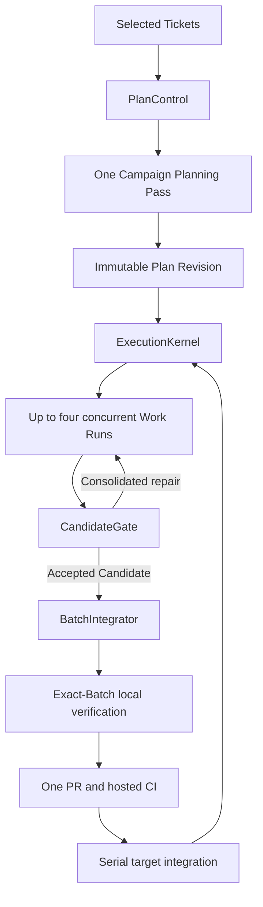

# GWO V8 lean architecture

Status: sole integrated current V8 mechanics contract. Implementation and
production cutover are incomplete.

`CONTEXT.md` owns ubiquitous language. Accepted ADRs own individual decisions
and their amendment history. This document integrates those decisions into one
current mechanics contract. The stabilization specification is a subordinate
dated requirement and Ticket-publication record; the lean roadmap owns
sequencing and exit criteria only.

V8 is a concurrent GitHub Ticket execution engine. LLMs perform bounded
semantic work; deterministic modules own scheduling, persistence, recovery,
verification orchestration, and repository delivery.

## Outcomes

V8 must:

- run independent Tickets concurrently, with four Worker Slots per Campaign by
  default;
- let semantic roles use independently configured Runtime Profiles without
  putting provider, model, or CLI facts in PlanSpec;
- keep the normal path moving after every semantic turn ends;
- freeze provider-neutral Authority Grants with the accepted Ticket contract;
- bound every semantic loop and infrastructure retry;
- combine compatible Candidates behind one exact PR and hosted-CI boundary;
- preserve exact Campaign, Work Run, Candidate, Evidence, Batch, and
  target-integration identity; and
- remain portable across Codex, Claude Code, Paseo, and compatible runtimes.

The framework succeeds when it removes coordination work from LLMs. Agent
count and protocol sophistication are not objectives.

## External API and status

The complete public orchestration surface is:

```text
start(repository, ready_refs, options?) -> CampaignHandle
advance(campaign_handle, wake_ref?) -> Running | Wait | Decision | Complete | Blocked
inspect(campaign_handle) -> Diagnostics
```

`CampaignHandle` is an opaque stable reference to `(repository, campaign_key)`.
It does not identify an Agent or Plan Revision and remains stable across
successor revisions of the same Campaign.

`Diagnostics` is a read-only projection containing the Campaign identity,
active Plan Revision digest, public status, named status reason, Work Run and
delivery summaries, outstanding event or due-time references, and Evidence
links. It is data, not another workflow actor.

`Diagnostics.status` and the result of `advance` use the same five values.
After authoritative readback, ExecutionKernel derives exactly one in this
order:

1. `Complete` when all required work and delivery are terminal and accepted;
2. otherwise `Running` when any semantic or deterministic action is active or
   currently due;
3. otherwise `Decision` when a named durable choice is required;
4. otherwise `Wait` when a named observable event or due time can continue the
   Campaign; and
5. otherwise `Blocked` when no authorized action, Decision, or wake remains.

Repair is a nested Work Run phase. A Work Run performing repair contributes
`Running`; Repair is never a sixth public status.

`options` may provide only the exact Runtime overrides described below. It
cannot rewrite Ticket contracts, expand Authority Grants, change PlanSpec
content, enlarge budgets, weaken Assurance Policy, or alter delivery policy.

## Five deep modules

| Module | Small interface, hidden behavior |
| --- | --- |
| PlanControl | Selected Ticket readback, one Campaign Planning Pass, PlanSpec v3 compilation, Authority Grant compilation, publication, activation, and readback |
| ExecutionKernel | The only persisted Campaign state machine, capacity owner, budget owner, and next-action authority |
| RuntimeGateway | Runtime selector resolution, multi-CLI execution, identity readback, exact permission handling, fallback, recovery, and retirement |
| CandidateGate | Complete Candidate diff audit, affected checks, Assurance Requirement derivation, Formal Review, Review Finding reconciliation, and consolidated repair |
| BatchIntegrator | Campaign-scoped compatibility, composition, exact verification, PR, hosted CI, serial integration, and delivery recovery |

Campaign Watchdog is an event-and-timer wake adapter, not a sixth domain
module. Runtime, Git, GitHub, CI, and filesystem adapters remain private seams
inside the module that owns their policy.

Deleting any of the five modules would spread its invariants across multiple
callers. A forwarding module that owns no invariant is prohibited.

## End-to-end flow



## PlanControl and Campaign planning

PlanControl snapshots the complete selected Ticket set, canonical blocker
relationships, Campaign source, target, and frozen repository policy. It
rejects invalid labels, missing contracts, blocker cycles, conflicting Ticket
claims, and oversized input before spending an LLM turn.

Each initial or successor Plan Revision receives one bounded Campaign Planning
Pass over that complete snapshot. Its output is private to PlanControl and may
contain only:

- admitted Ticket keys;
- justified dependency additions;
- genuine Exclusive Resources;
- factual Runtime capability requirements; and
- named Decision requirements.

The Coordinator cannot rewrite acceptance, add work, expand authority, select
a model or CLI, predict files, author lifecycle policy, or prescribe Worker
steps. PlanControl deterministically validates the private output and is the
only PlanSpec compiler. Compilation, publication, and readback retry the same
validated output and never repeat the Planning Pass.

A configured byte limit bounds the Planning input. Exceeding it returns a
named split-Campaign Decision; V8 neither truncates contracts nor creates an
automatic multi-call planning tree.

## PlanSpec v3 and frozen authority

PlanSpec v3 is a provider-, model-, and CLI-neutral Ticket Manifest. This
illustrative canonical shape shows the required ownership:

```yaml
schema_version: 3
repository: owner/repo
target_branch: main
campaign:
  key: campaign-key
  source: {ref: source-ref, digest: source-digest}
  contract: optional-frozen-parent-contract
  authority:
    policy_witness_digest: policy-digest
    grants:
      - {operation_id: repository.read.v1, resource_id: campaign.snapshot.v1}
policy: {ref: policy-ref, digest: policy-digest}
work:
  - key: issue:109
    source: {ref: issue-ref, digest: ticket-contract-digest}
    contract: complete-frozen-ticket-contract
    depends_on: []
    exclusive_resources: []
    capabilities: [git, local_check]
    authority:
      policy_witness_digest: policy-digest
      worker:
        grants:
          - {operation_id: workspace.write.v1, resource_id: work-run.workspace.v1}
      recovery_worker:
        grants:
          - {operation_id: workspace.write.v1, resource_id: work-run.workspace.v1}
      review:
        grants:
          - {operation_id: repository.read.v1, resource_id: review.subject.v1}
```

The Campaign Authority Grant permits only the read-only Coordinator planning
and Decision scope. Each PlanSpec work entry contains isolated-workspace
Authority Grants for `worker` and `recovery_worker` plus read-only grants for
Review Internal Subagents. Operation and resource identifiers are versioned
repository-policy identifiers, never provider permission strings.

PlanControl compiles every grant deterministically from the frozen Policy
Witness. Neither the Planning Pass nor Campaign-start Runtime options can add
an operation or resource. The canonical PlanSpec digest is the authority root.
The relevant authority-subtree digest is persisted and read back through Work
Run admission, Prompt acceptance, Runtime Binding, Candidate receipt, Review
Evidence, and accepted-Candidate receipt.

Runtime permission policy belongs to the frozen grants. Deterministic
PlanControl and BatchIntegrator service authority is not semantic Runtime
authority and remains repository policy enforced by their private adapters.

PlanSpec contains no generic Agent DAG, lifecycle nodes, predicted paths,
checks, Review instructions, recovery ladder, risk, difficulty, model,
provider, CLI, Runtime binding, capacity, timeout, permission decision, or
integration node.

## Campaign and Plan Revision activation

One Campaign has exactly one active Plan Revision. Several Campaigns may be
active in one repository only when their Ticket claims are disjoint. Ticket
claim acquisition and Plan Revision activation fail closed on overlap.

Activation compare-and-swaps the key `(repository, campaign_key)` using
`expected_previous_revision_digest`, which is null for the initial revision.
A successor revision names the exact previous digest. `CampaignHandle` remains
stable while the active revision changes.

Every Activation Receipt records:

- repository;
- Campaign key;
- activated Plan Revision digest;
- expected previous revision digest; and
- repository writer generation.

The immutable Plan record and Activation Receipt are published and read back
before any Work Run is admitted. Pending activation cannot execute. After a
receipt exists, recovery rolls forward; rollback is a new durable action.

The writer generation remains repository-global and prevents simultaneous
production writers. The Integration Lease is also repository-global. Those
repository fences do not collapse independent disjoint Campaigns into one
Plan Revision.

## Runtime assignment

Runtime assignment uses exact selectors:

- Campaign-scoped `coordinator`;
- Ticket-scoped `worker`;
- Ticket-scoped `recovery_worker`;
- Ticket-scoped `review_primary`;
- Ticket-scoped `review_strong`; and
- Ticket-scoped `specialist:<policy-id>`.

The `coordinator` selector resolves in this order:

1. Campaign-start Coordinator override;
2. repository `coordinator` role mapping; and
3. host-global `coordinator` role mapping.

Each Ticket-scoped selector resolves in this order:

1. exact Campaign-start `(ticket_key, role)` override;
2. repository role mapping; and
3. host-global role mapping.

There is no Ticket-wide shorthand and no Ticket override for Coordinator.
Every mapping resolves one required primary Runtime Profile and at most one
optional availability fallback. Different selectors may intentionally resolve
to the same Profile. Missing required configuration fails closed.

Campaign-start overrides are persisted with the Campaign. For every stable
Runtime action, RuntimeGateway records the selector, configuration source,
resolved Profile digest, and whether the optional fallback was selected.
Retries, resume, readback, and same-binding recovery reuse that assignment.

Availability fallback is permitted only before any Agent identity may exist
for the stable action. After identity, RuntimeGateway recovers the same
binding. A replacement Worker binding requires terminal-binding Evidence and
uses the already resolved `recovery_worker` assignment.

PlanSpec may state factual capabilities, but it never contains a selector,
Profile, provider, model, reasoning setting, CLI, fallback, or configuration
source.

## Worker Slots and Work Run bounds

A Campaign has four Worker Slots by default. The setting is host-global with a
repository override; it is not inferred by an LLM and is absent from PlanSpec.
Each Campaign also has one fixed Coordinator semantic-control capacity that is
not a general scheduling Slot.

Only an unsatisfied Ticket dependency, a genuine Exclusive Resource, the
Campaign Worker Slot limit, or observed Runtime unavailability blocks an
otherwise eligible Work Run. Predicted file overlap does not block isolated
workspaces.

A Work Run retains its Worker Slot through affected checks, Formal Review, and
immediate consolidated repair. An accepted Candidate waiting for delivery or a
Runtime proven parked releases the Slot. Resumption reacquires capacity before
semantic execution continues. Review Internal Subagents consume no Worker
Slot.

Within one Plan Revision, each Work Run permits:

- at most three distinct Candidate SHAs submitted in total;
- one initial Worker binding; and
- at most one replacement Worker binding after terminal-binding Evidence.

Switching bindings does not reset the Candidate-submission bound or the Review
Finding ledger. Invalid Review transport may retry once through
`review_strong` and does not consume a Candidate submission. An unchanged
rejected Candidate cannot obtain another Formal Review.

## Runtime permissions, waits, and recovery

RuntimeGateway normalizes each Permission Request into the exact operation ID,
resource ID, request identity, Runtime Binding, and authority-subtree digest.
It auto-approves only when the exact request is covered by both the frozen
Authority Grant and its Policy Witness. An unmatched, ambiguous, or
higher-authority request returns `PermissionRequired`.

RuntimeGateway cannot expand authority. A Coordinator may propose an
alternative already covered by the grant. Expansion requires a durable
Decision and successor Plan Revision with a newly compiled authority root.

An unmatched permission or bounded Coordinator-attention request enters a
three-minute interactive-wait grace. This default is host-global with a
repository override. The Work Run retains its Worker Slot during grace. After
expiry, ExecutionKernel releases the Slot only after RuntimeGateway proves the
binding parked. A later Decision is recorded until the Work Run reacquires a
Slot and resumes the same binding.

After thirty minutes without trusted state change, Campaign Watchdog first
requests zero-LLM Runtime, process, workspace, and Campaign readback. The stale
deadline is host-global with repository override. If one binding remains
genuinely ambiguous, that binding may receive one bounded Coordinator stale
diagnosis. Each initial or replacement binding has its own one-diagnosis
maximum; periodic LLM monitoring is prohibited.

Time, permission delay, capacity pressure after identity, and ambiguous
lifecycle never authorize a replacement. Only terminal-binding Evidence
proving the exact action, Agent, session, workspace, terminal state, fencing,
and checkpoint permits ExecutionKernel to start the one replacement binding.

## CandidateGate

CandidateGate is the only Formal Review entry:

```text
immutable Candidate
  -> complete Candidate diff and scope/authority audit
  -> affected deterministic checks
  -> Assurance Requirement
  -> required Formal Review Internal Subagent
  -> Accepted | consolidated repair | Decision | Wait
```

Deterministic failure stops before LLM Review. Worker self-checks cannot become
Formal Review Evidence. An external `code-review` skill may supply heuristics,
but V8 owns the Review Subject, coverage, transport, typed output, identity,
budget, and lifecycle.

A Review Subject binds the exact base, Candidate, Ticket contract, standards,
Check Evidence, Assurance Requirement, Policy Witness, and protocol version.
A complete no-Review allowlist match may use zero Reviewer calls. Standard
Assurance uses one `review_primary` observation. Strict Assurance adds at most
one `specialist:<policy-id>` observation or human Decision. Invalid Review
transport may retry once through `review_strong`; a valid rejection is not
repeated against an unchanged Review Subject.

A changed Candidate creates a new Review Subject. The complete Artifact-backed
Review Finding ledger is preserved, and every earlier Review Finding receives
a typed disposition. CandidateGate returns one consolidated repair request
containing that ledger; Review Findings and repair context are never silently
truncated.

Acceptance emits a compact receipt binding Campaign, Work Run, Candidate,
authority-subtree digest, Review Subject, Assurance Requirement, and Evidence.
Only that receipt makes a Candidate eligible for delivery.

## BatchIntegrator

BatchIntegrator forms Batches only from accepted Candidates in the same
Campaign. V8.0 does not batch across Campaigns. Every Batch receipt preserves
Campaign identity and each member's Work Run identity.

The Batch member limit is an integer from one through four, default four. It is
a host-global setting with repository override and is absent from PlanSpec.
When the repository-global Integration Lease is free, BatchIntegrator:

1. chooses the oldest eligible accepted Candidate as the seed;
2. scans remaining accepted Candidates oldest first;
3. adds a Candidate only when it is pairwise compatible with every frozen
   member; and
4. freezes immediately when the scan ends or the member limit is reached.

It never waits for running Work Runs, uses a timer to grow the Batch, predicts
completion, or calls an LLM.

Eligibility requires the same Campaign and compatible:

- target and base identity, or a valid Clean Base Advance;
- check environment;
- Policy Witness digest;
- delivery identity;
- Assurance Requirement;
- protected surfaces; and
- pairwise Interaction Keys.

Strict Assurance is always a Singleton Batch. A repository-policy
classification of non-decomposable, high-coupling, or protected Interaction
Key is also Singleton. Other Candidates may batch only when all Interaction
Keys and protected surfaces are pairwise compatible.

Clean Base Advance is allowed only when the original base is an ancestor of
the current target, the Candidate and Evidence are unchanged, the target delta
has no protected interaction with the Candidate, and Git composes without
manual resolution. The exact composed Batch must still pass its complete local
and hosted checks.

The same immutable Batch SHA must:

1. pass the repository-equivalent local suite;
2. be the pushed branch and pull-request head observed by GitHub; and
3. be the exact head observed by hosted CI.

Integration names that Batch SHA. The target branch may advance to a merge
commit rather than equal the Batch SHA, so target readback must prove the Batch
SHA is reachable as an ancestor and that GitHub's PR merge mapping connects the
PR head to the observed target head. Squash or rebase integration rewrites the
reviewed identity and therefore fails closed.

Infrastructure failure retries the unchanged Batch SHA at most twice. A
composition, exact-local, or code-class hosted failure may dissolve one
multi-member Batch into Singleton Batches once. There is no recursive
bisection or LLM attribution. Only a failing Singleton can resume its parked
Worker; changed code re-enters CandidateGate.

## Persistence and liveness

ExecutionKernel is the only persisted state machine and next-action authority.
Every external effect has a stable action identity and is read back before
retry. No local transaction remains open during external I/O. GitHub remains
the durable business record; local storage is rebuildable control state.

Campaign Watchdog subscribes to Runtime and hosted-check events and owns
persisted `next_check_at` timers. Events are wake hints only; each wake invokes
`advance`, which performs authoritative readback. Restart reconstructs timers
and subscriptions from Campaign state. Campaign Watchdog never restarts the
Paseo daemon automatically.

Detailed admission, action, permission, Review, and delivery records are
module-private implementation facts. They are not public actors or vocabulary
that Coordinators and Workers must learn.

## Defaults

The current deterministic defaults are:

| Setting | Default | Configuration |
| --- | --- | --- |
| Worker Slots per Campaign | 4 | host-global, repository override |
| Batch member limit | 4, maximum 4 | host-global, repository override |
| Stale-binding deadline | 30 minutes | host-global, repository override |
| Interactive-wait grace | 3 minutes | host-global, repository override |
| Distinct Candidate SHAs per Work Run | at most 3 | fixed V8.0 policy |
| Worker bindings per Work Run | initial plus at most one replacement | fixed V8.0 policy |

No default is inferred by an LLM or embedded as a Runtime assignment in
PlanSpec.

## Deliberate exclusions

V8.0 does not add:

- automatic difficulty or risk scoring;
- a model evaluator, price router, or learned scheduler;
- a resident Coordinator or periodic LLM monitor;
- a general Agent DAG;
- one Plan Revision per Ticket;
- Formal Review as a top-level workflow unit;
- repeated Review of an unchanged Review Subject;
- per-Ticket PR and hosted CI by default;
- cross-Campaign batching;
- recursive Batch optimization;
- cross-SHA Review approval reuse;
- a permanent GWO daemon or event bus;
- a long-lived shadow execution phase; or
- automatic authority expansion.

## Cutover

New Campaigns write only PlanSpec v3. Existing v2 work finishes through its
original decoder or becomes quiescent; it is never reinterpreted as v3.

Activation runs one fail-closed read-only Cutover Guard. The root repository
then runs one real Campaign with four independent Tickets and proves the public
API, parallel Work Runs, exact Runtime assignment, frozen authority,
permission parking, CandidateGate, bounded repair and replacement, restart,
one Campaign-scoped Integration Batch, exact PR/CI identity, serial integration
readback, and cleanup. Passing makes V8 the default for new Campaigns in this
repository before downstream repositories adopt it.
