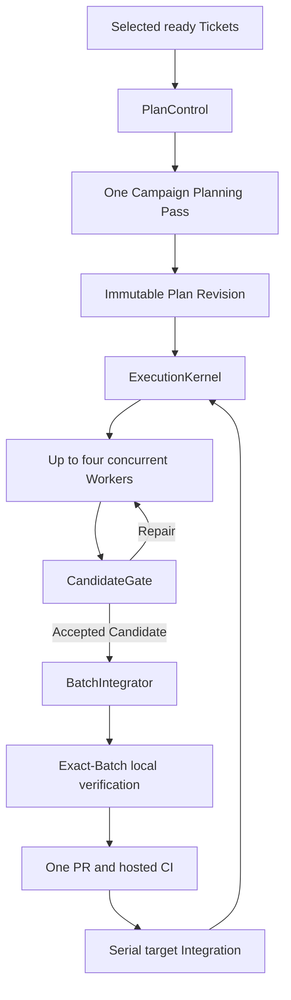

# GWO V8 lean architecture

Status: accepted target architecture; implementation and production cutover
are incomplete.

V8 is a concurrent GitHub Ticket execution engine. LLMs perform semantic work;
deterministic modules own scheduling, persistence, recovery, verification
orchestration, and repository delivery.

## Outcomes

V8 must:

- run independent Tickets concurrently, with four Worker Slots per Campaign by
  default;
- let Coordinator, Worker, Recovery Worker, and Review roles use independently
  configured Runtime Profiles;
- keep the normal path moving after every LLM turn ends;
- bound every LLM loop and infrastructure retry;
- combine compatible Candidates behind one PR and hosted-CI boundary;
- preserve exact Candidate, Evidence, Batch, and target-branch identity; and
- remain portable across Codex, Claude Code, Paseo, and compatible runtimes.

The framework is successful when it removes coordination work from LLMs. Agent
count and protocol sophistication are not objectives.

## External interface

```text
start(repository, ready_refs, options?) -> CampaignHandle
advance(campaign_handle, wake_ref?) -> Running | Wait | Decision | Complete | Blocked
inspect(campaign_handle) -> Diagnostics
```

`options` may contain exact Ticket-to-Runtime-Profile overrides. It cannot
change Ticket contracts, PlanSpec content, authority, retry budgets, Review
rules, or integration policy.

All other operations are internal.

## Five deep modules

| Module | Small interface, hidden behavior |
| --- | --- |
| PlanControl | Ready Ticket readback, one Campaign Planning Pass, PlanSpec v3 compilation, publication, activation, and readback |
| ExecutionKernel | The only persisted state machine, capacity owner, budget owner, and next-action authority |
| RuntimeGateway | Runtime Profile resolution, multi-CLI execution, identity readback, permissions, transport, fallback, recovery, and retirement |
| CandidateGate | Actual-diff audit, affected deterministic Checks, Assurance, Formal Review, Finding reconciliation, and Repair |
| BatchIntegrator | Compatibility, Clean Base Advance, composition, exact local verification, PR, hosted CI, serial Integration, and target readback |

Campaign Watchdog is an event-and-timer wake adapter, not a sixth domain
module. Runtime, Git, GitHub, CI, and filesystem adapters remain private seams
inside the module that owns their policy.

Deleting any of the five modules would spread its invariants across multiple
callers. Adding a forwarding module that owns no invariant is prohibited.

## Execution flow



PlanControl rejects structurally invalid input before invoking the Coordinator.
The complete selected Ready Set receives one LLM Planning Pass, not one pass
per Ticket. The Planning input has a configured byte budget. Exceeding it
returns a named request to split the Campaign; V8 does not silently truncate
contracts or create an automatic multi-call planning tree.

The Planning Pass may emit only admitted work, justified dependency additions,
genuine Exclusive Resources, Runtime capabilities, and Decision findings. It
cannot rewrite acceptance criteria, add work, expand authority, select models,
predict files, or author Worker steps. The deterministic compiler remains the
only PlanSpec authority.

## Concurrency

Each Campaign has:

- four Worker Slots by default, configurable globally with repository
  override; and
- one fixed Coordinator semantic-control capacity.

Worker Admission is optimistic. Only unsatisfied Ticket dependencies, a
genuinely Exclusive Resource, the Worker Slot limit, or observed Runtime
unavailability blocks execution. Same-file overlap does not block Workers in
isolated workspaces.

Actual Candidate diffs derive protected surfaces and Interaction Keys.
BatchIntegrator uses those facts to decide delivery compatibility. High-coupling
surfaces use a one-member Batch unless repository policy proves a narrower safe
rule.

A Work Run retains its Worker Slot through affected Checks, Formal Review, and
immediate Repair. Review Internal Subagents consume no additional GWO Slot.
Accepted Candidates waiting for delivery and named parked waits release the
Slot.

Target Integration is always serialized under one repository lease. This is
the only repository-wide default serialization point.

## LLM call budget

The healthy first-pass path uses:

- one Coordinator Planning Pass per Plan Revision;
- one Worker context per Ticket;
- zero Formal Review calls for a complete no-Review allowlist match, one
  `primary` call for standard Assurance, or `primary` plus at most one
  specialist for strict Assurance; and
- no Coordinator polling or Batch-level LLM.

Repair continues the same Worker binding. A changed Candidate receives a fresh
complete Review observation, but one Plan Revision permits at most three
changed Candidate submissions and two Worker Attempts. An invalid Review
payload may retry once through `strong`; a valid rejecting Review is not
repeated against the unchanged Candidate.

ExecutionKernel, Campaign Watchdog, Runtime readback, permission matching,
Candidate deterministic Checks, Batch construction, local verification, PR,
CI, Integration, and cleanup use no LLM.

After thirty minutes without trusted state change, Runtime and workspace
readback runs first. If the Worker is still genuinely ambiguous, one
Coordinator stale diagnosis is permitted for that entire Attempt. Periodic LLM
monitoring is prohibited.

## Runtime and model assignment

PlanSpec contains factual capability needs, never provider, model, reasoning,
CLI, price, difficulty, or risk.

RuntimeGateway resolves profiles in this order:

1. exact Ticket override supplied at Campaign start;
2. repository role configuration;
3. host-global role configuration.

Coordinator, Worker, Recovery Worker, Review `primary`, Review `strong`, and
specialists are independent roles. Users may map any roles to the same Profile.
V8 does not evaluate models, rank them, infer model strength, or learn routing
from execution history.

RuntimeGateway may launch an Internal Subagent through a CLI different from its
parent. It uses stable action identity and authoritative readback. Availability
fallback is allowed only before any Agent identity may exist. After identity,
the same binding is recovered; a replacement Worker requires a Terminal
Binding Receipt and consumes the second Worker Attempt.

Live sessions are not portable across CLIs. Ticket contracts, Plan Revisions,
workspace checkpoints, Candidate SHAs, and typed Evidence are portable.

## Permissions and attention

RuntimeGateway may automatically approve one exact structured permission
request only when it is completely covered by the frozen authority and
repository policy. It never grants open-ended permission.

An unmatched or higher-authority request enters a three-minute Interactive
Wait Grace while retaining the Worker Slot. A Coordinator may propose one
lower-authority alternative but cannot expand authority. If no authorized path
exists, a human Decision is required.

After grace expiry, RuntimeGateway must prove the binding parked before
ExecutionKernel releases the Slot. A later decision is recorded until the Work
Run reacquires capacity and resumes the same binding.

Workers may emit a typed deviation or attention request. Normal progress
checkpoints do not invoke a Coordinator. Scope mismatch, contract ambiguity, or
an explicit deviation may request one bounded semantic response; transcript
scanning and periodic guidance are prohibited.

## CandidateGate

CandidateGate is the sole Formal Review entry:

```text
immutable Candidate
  -> complete diff and scope/effect audit
  -> affected deterministic Checks
  -> Assurance derivation
  -> required Formal Review Internal Subagent
  -> Accepted | Repair | Decision | Wait
```

Deterministic failure stops before LLM Review. The Worker may self-check but
cannot produce Review Evidence or invoke another Formal Review. The optional
external `code-review` skill supplies heuristics only; V8 owns coverage,
transport, typed output, identity, and lifecycle.

A Review Subject binds the exact base, Candidate, Ticket contract, standards,
Check evidence, Assurance, and protocol version. A changed Candidate creates a
new subject and fresh reviewer. The complete Finding history is artifact-backed
and every prior finding receives a typed disposition. Findings and repair
context are never silently truncated.

## BatchIntegrator

Whenever its Integration Lease is free, BatchIntegrator freezes up to four
oldest compatible accepted Candidates available at that moment. It does not
wait for running Workers, use a timer, predict completion, or call an LLM.

The exact composed Batch SHA:

1. passes the repository-equivalent local suite;
2. crosses one push and PR boundary;
3. is observed by hosted CI; and
4. is integrated and read back from the target branch.

All four observations must name the same Batch SHA.

Infrastructure failure retries the unchanged SHA at most twice. Composition,
exact-local, or code-class hosted failure may dissolve the Batch once into
Singleton Batches. There is no recursive bisection or LLM attribution. Only a
failing Singleton may resume its parked Worker; changed code re-enters
CandidateGate.

## Persistence and recovery

Every external effect has a stable action identity and is read back before
retry. No SQLite transaction remains open during external I/O. GitHub remains
the durable business record; the local Store is rebuildable control state.

Detailed Admission, Attempt, Review, permission, and delivery records are
module-internal implementation facts. They are not separate workflow actors,
public lifecycle interfaces, or concepts that Coordinators and Workers must
learn.

Campaign Watchdog subscribes to Runtime and hosted-check events and owns
`next_check_at` timers. Events are wake hints only. Restart reconstructs due
work from persisted Campaign state. Campaign Watchdog never restarts the Paseo
daemon automatically.

## PlanSpec v3

PlanSpec v3 is a Runtime-neutral Ticket Manifest:

```yaml
schema_version: 3
repository: owner/repo
target_branch: main
campaign:
  key: campaign-key
  source: {ref: source-ref, digest: source-digest}
  contract: optional-frozen-parent-contract
policy: {ref: policy-ref, digest: policy-digest}
work:
  - key: issue:101
    source: {ref: issue-ref, digest: ticket-contract-digest}
    contract: complete-frozen-ticket-contract
    depends_on: []
    exclusive_resources: []
    capabilities: [git, local_check]
```

It has no generic Agent DAG, lifecycle nodes, proposed file paths, Checks,
Review requirements, recovery policy, difficulty, risk, model, Runtime binding,
capacity, timeout, permission decision, or integration node.

## Deliberate exclusions

V8.0 does not add:

- automatic difficulty or risk scoring;
- a model evaluator, price router, or learned scheduler;
- a resident Coordinator or periodic LLM monitor;
- a general Agent DAG;
- one Plan Revision per Ticket;
- Formal Review as a top-level Task;
- repeated Worker and Batch Review;
- per-Ticket PR and hosted CI by default;
- recursive Batch optimization;
- cross-SHA Review approval reuse;
- a permanent GWO daemon or event bus;
- a long-lived shadow execution phase; or
- automatic authority expansion.

## Cutover

New Campaigns write only PlanSpec v3. Existing v2 work finishes through its
original decoder or becomes quiescent; it is never reinterpreted as v3.

Activation runs one fail-closed read-only Cutover Guard. The root repository
then runs one real Campaign with four independent Tickets and proves parallel
Workers, internal Review, bounded Repair, restart/readback, one Integration
Batch, one PR/hosted-CI boundary, serial Integration, and cleanup. Passing
makes V8 the default for new Campaigns in this repository before downstream
repositories adopt it.
