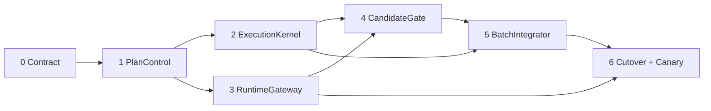

# GWO V8 lean landing roadmap

Status: accepted landing roadmap. This document does not by itself authorize
GitHub Issue mutation or production writer cutover.

The accepted architecture is
[`gwo-v8-lean-architecture.md`](gwo-v8-lean-architecture.md). This roadmap
replaces the historical Phase 0–4C implementation roadmap for new work.

## Current facts

As of 2026-07-27:

- GitHub has no open pull request for this repository.
- The accepted successor graph is published as Issues #108–#119, and #108 is
  its only immediately executable frontier Ticket.
- The local checkout remains on `work/issue-54`, while Issue #54 is closed and
  that branch has diverged from `origin/main`.
- The existing V8 implementation is production-shaped but organized around
  PlanSpec v2, Plan Nodes, GoalDriver, Review axes, Worker tiers, and a large
  Kernel interface.
- The historical V8 Epic and its conflicting executable Tickets were removed
  from the frontier after the successor graph and native blockers were read
  back.
- `/to-tickets` remains the external semantic Ticket generator. GWO will not
  introduce a competing Ticket authoring skill.

The first delivery is therefore one architecture-and-tracker reset, not another
continuation from a rejected historical Candidate SHA.

## Landing rules

Every implementation Ticket must:

- deliver one observable vertical behavior through a deep-module interface;
- include its interface-level deterministic tests;
- replace or delete the old caller path in the same delivery;
- avoid a permanent compatibility layer or second state machine;
- avoid exposing a new lifecycle noun merely to make testing easier;
- keep exact external action identity and readback-first recovery;
- run one local acceptance set before one final push/CI boundary; and
- leave unrelated historical behavior and user work intact.

Test-fixture repair, prompt formatting, state migration, and cleanup are part
of the Ticket whose interface owns them. They do not become independent
product Tickets unless they can produce an independently verifiable Result.

Temporary V2-to-V3 projections are permitted only inside the active migration
Ticket, with an explicit deletion test and no new Campaign writing V2. They
must be gone before the root-repository Canary.

## Delivery 0 — Freeze the new contract

Outcome:

- land the lean glossary, architecture, ADR chain, and replacement roadmap on a
  fresh branch from current `origin/main`;
- preserve the current dirty documentation changes without carrying the
  already-closed Issue #54 branch history;
- mark the historical V8 architecture and roadmap as non-executable; and
- publish one successor stabilization specification suitable for external
  `/to-tickets`.

Exit:

- `quick_validate.py` and documentation checks pass;
- no code path, GitHub Issue, label, PR, Runtime, or writer state changes;
- the successor specification names the historical Issue disposition but does
  not copy their Candidate-specific recovery instructions.

Expected duration: 0.5–1 working day.

## Delivery 1 — Replace planning with PlanSpec v3 and PlanControl

Outcome:

- versioned PlanSpec v3 decoder and canonical compiler;
- one complete selected Ready Set becomes one Plan Revision;
- one bounded Campaign Planning Pass produces narrow typed Plan Intent;
- deterministic publication, activation, and readback;
- optional exact Ticket Runtime overrides remain Runtime facts; and
- new Campaigns contain no generic nodes, difficulty, risk, Checks, Review
  requirements, recovery ladders, or model fields.

Implementation shape:

- deepen current `entry.py`, `compiler.py`, and `activation.py` behavior behind
  PlanControl;
- remove the per-Ticket `v8_ready_set_progress` activation loop;
- retain a V2 decoder only for quiescent historical readback;
- reject oversized Planning input with a named split-Campaign Decision.

Exit:

- `start()` compiles, publishes, activates, and reads back one v3 Plan Revision
  for four independent Tickets;
- malformed Planning output cannot publish a plan;
- compiler/publication retry reuses the same Plan Intent and invokes no second
  LLM pass.

Expected duration: 1.5–3 working days.

## Delivery 2 — Make ExecutionKernel the only driver

Outcome:

- `advance()` is the only persisted transition and next-action operation;
- Campaign, Work Run, Slot, Wait, Decision, and budget state converge through
  one interface;
- GoalDriver and separate Kernel Reconciliation ownership disappear;
- Campaign Watchdog wakes `advance()` from events and `next_check_at`; and
- normal scheduling, waiting, refill, and completion use no Coordinator.

Implementation shape:

- first wrap the current durable state behind the new Campaign/Work Run
  interface;
- route every caller to `advance()`;
- delete GoalDriver state and coordination continuation code after replacement;
- keep Admission, Attempt, and action rows internal until later storage
  simplification proves useful.

Exit:

- four eligible Work Runs acquire four Worker Slots in one advance;
- a released Slot is filled without a Coordinator turn;
- lost callbacks converge through a due targeted readback;
- restart produces no duplicate semantic or external action.

Expected duration: 2–3 working days.

## Delivery 3 — Route every semantic Runtime through RuntimeGateway

Outcome:

- Worker, Recovery Worker, Coordinator, and Internal Subagent operations use
  one RuntimeGateway interface;
- Runtime Profile precedence is exact Ticket override, repository role, then
  host-global role;
- Paseo is an internal Adapter and may launch different underlying CLIs;
- permission matching, Prompt-file transport, identity readback, command
  timeout, fallback, checkpoint, fencing, and retirement are local to the
  module; and
- cached provider-snapshot failure and empty-workspace leakage converge through
  typed bounded recovery.

Implementation shape:

- extract current `runtime.py` responsibilities without adding a public method
  for each Paseo command;
- give the module a production Paseo Adapter and deterministic in-memory
  Adapter;
- add exact permission request operations rather than blanket approval;
- enforce pre-identity fallback and post-identity same-binding recovery.

Exit:

- configured roles may use different models or CLIs without PlanSpec changes;
- no caller uses provider names or constructs a Paseo command;
- timeout and permission delay cannot create a replacement Agent;
- Terminal Binding Receipt is required before the second Worker Attempt.

Expected duration: 2–4 working days. A required upstream Paseo fix may add
2–5 working days but does not justify bypassing RuntimeGateway.

## Delivery 4 — Concentrate Candidate verification in CandidateGate

Outcome:

- exact Candidate readback, authority audit, affected deterministic Checks,
  Assurance, Formal Review, Finding reconciliation, and Repair share one
  interface;
- deterministic failures stop before LLM Review;
- standard Assurance uses one complete `primary` observation;
- strict Assurance adds at most one specialist or human Decision;
- Worker self-check and external `code-review` guidance cannot create Formal
  Review Evidence; and
- Review and Candidate budgets are enforced across the complete Plan Revision.

Implementation shape:

- move Review-axis and Evidence orchestration out of the 5,000-line Kernel;
- replace Standards/Spec lifecycle axes with one obligation-complete typed
  observation;
- store complete Finding artifacts and compact receipts;
- delete first-32 and character-slice truncation;
- replace old internal-order tests with CandidateGate interface tests.

Exit:

- unchanged valid Candidate Evidence is never repeated;
- changed Candidate gets one fresh complete Review and dispositions every prior
  Finding;
- deterministic failure consumes zero Reviewer turns;
- no path can launch Worker Review, top-level Review Task, or Batch Review.

Expected duration: 2.5–4 working days.

## Delivery 5 — Concentrate repository delivery in BatchIntegrator

Outcome:

- accepted-Candidate queue, compatibility, Clean Base Advance, composition,
  exact local suite, one PR, hosted CI, Integration lease, merge, readback, and
  Singleton fallback share one interface;
- up to four compatible Tickets share one delivery boundary;
- local, hosted, and target readback all name the same immutable Batch SHA; and
- no delivery failure repeats unaffected implementation or Formal Review.

Implementation shape:

- merge current `integration_batch.py` and Kernel delivery control into
  BatchIntegrator;
- keep Git, GitHub, hosted-check, and lease clients private;
- freeze an immediate microbatch whenever the lease is free;
- preserve evidence and split once to Singleton Batches on code-class failure.

Exit:

- four compatible Candidates can cross one PR and hosted CI;
- strict/protected work uses a Singleton Batch;
- infrastructure failure retries the same SHA at most twice;
- only a failing Singleton resumes its Worker and changed code re-enters
  CandidateGate.

Expected duration: 2–3.5 working days.

## Delivery 6 — Cut over through one Guard and one root Canary

Outcome:

- new Campaigns write only PlanSpec v3;
- active V2 work is terminal or proven quiescent;
- one fail-closed read-only Guard changes no state on failure;
- the root repository runs one real Campaign with four independent Tickets;
- V8 becomes the default here only after exact acceptance readback; and
- downstream repositories continue using their current workflow until the root
  version is published.

The Canary must prove:

- one bounded Coordinator Planning Pass;
- four concurrent Workers and independent Runtime Profiles;
- event/timer continuation after a lost callback;
- exact permissions and a parked interactive wait;
- Candidate checks before Formal Review;
- one standard Review and one strict/specialist path;
- bounded Repair and terminal Runtime recovery;
- one multi-Candidate Integration Batch, one PR, one hosted CI, and serial
  target integration;
- Runtime/workspace retirement; and
- no manual Store edit, Agent-label repair, Evidence fabrication, or daemon
  restart.

Expected duration: 2–4 working days, including live Runtime and GitHub
observation.

## Parallelism and critical path

The work is not safely four-way parallel from the first day because the core
interfaces define each other's inputs. The expected graph is:

Inside a delivery, fixtures, private Adapters, documentation, and independent
contract tests may proceed concurrently. Changes to the same deep module and
its interface integrate serially. Artificially maintaining four active Agents
when only one interface decision is ready increases conflicts rather than
throughput.

Expected elapsed time with focused Agent execution and no external blocker is
approximately 10–16 working days sequentially, or 7–11 working days with safe
parallelism. A Paseo provider fix or live-canary instability can extend the
calendar to 10–15 working days.

## Historical Issue disposition

The approved replacement Tickets and native blocker graph were published and
read back before the following transition was applied.

| Issue | Completed disposition |
| --- | --- |
| #51 old V8 cutover | Closed; replaced by #118 and #119 |
| #69 successor Candidate lineage | Kept open as `needs-triage` beyond V8.0; #112, #115, and #117 cover bounded initial-release recovery |
| #79 same-Attempt Runtime takeover | Closed; replaced by #112 Terminal Binding Receipt plus second Worker Attempt |
| #82 production-stabilization Epic | Closed with explicit parent-mutation approval; replaced by #108–#119 |
| #85–#87 old acceptance/canary/rollout | Closed; replaced by #118 and #119 |
| #93 inferred Worker capability escalation | Closed as `wontfix`; #111 and #115 use explicit assignment and fixed budgets |
| #94 and #99 PlanSpec Check Manifest | Closed; #109 keeps Checks out of PlanSpec and #114 derives them from the actual diff |
| #95 standalone test-suite slimming | Closed; test replacement belongs to every owning successor Ticket |
| #98 and #101 GoalDriver wake work | Closed; replaced by #113 Campaign Watchdog |
| #100 durable Check action claims | Closed; exact-action invariants remain private to #114 and #116 |
| #102 fixture recovery | Closed; completed evidence remains historical and future fixture migration belongs to owning Tickets |
| #103 Batch split convergence | Closed; replaced by #117 Singleton fallback |
| #104 hosted failure adoption | Closed; preserved by #117 exact Batch recovery |
| #105 Paseo provider snapshot recovery | Closed; replaced by #112 RuntimeGateway recovery |
| #35 OpenCode helper pooling | Keep independent of the lean V8 Campaign unless it becomes a proven RuntimeGateway blocker |

The resulting executable frontier starts at #108. Closed historical Issues
retain their bodies, Candidate facts, Review evidence, and disposition comments
for audit; they are not executable recovery instructions for the successor.

## PR and CI strategy during the refactor

Before BatchIntegrator is live, use one reviewable PR per delivery or tightly
coupled delivery pair. Multiple independently executable Tickets may share that
PR when they compose on one exact SHA and the PR description preserves their
individual acceptance mapping. Run local acceptance on the final composed SHA
and push once for final CI.

Do not create a PR per small fixture correction, Reviewer comment, or
continuation. Do not combine two unfinished deep-module interfaces merely to
reduce PR count.

After Delivery 5, the root Canary must use BatchIntegrator itself rather than a
manual approximation.
