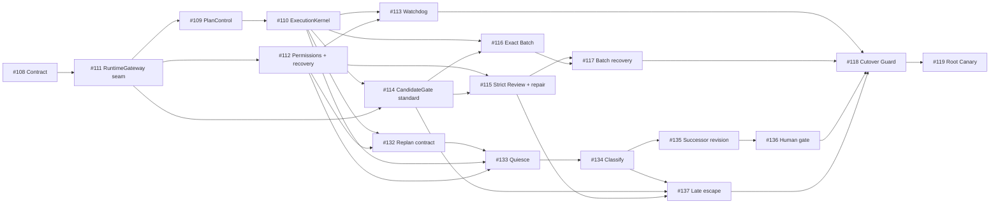

# GWO V8 lean landing roadmap

Status: accepted sequencing and exit-criteria record for Issues #108–#119, extended by the #131 bounded replanning successor Tickets #132–#137.
This document does not define V8 mechanics, authorize tracker mutation, or
authorize production writer cutover.

`CONTEXT.md` owns language, accepted ADRs own individual decisions, and
[`gwo-v8-lean-architecture.md`](gwo-v8-lean-architecture.md) is the sole
integrated current mechanics contract. The dated requirement and Ticket-source
record is
[`gwo-v8-lean-stabilization-spec.md`](gwo-v8-lean-stabilization-spec.md).

## Landing rules

Every implementation Ticket must:

- deliver an observable vertical behavior through one owning deep-module
  interface;
- include interface-level deterministic acceptance;
- replace or delete the predecessor caller path in the same delivery;
- avoid a permanent compatibility layer or competing state machine;
- avoid exposing private records as public actors or vocabulary;
- preserve exact external action identity and readback-first recovery; and
- keep unrelated historical behavior and user work intact.

Fixture repair, Prompt formatting, storage migration, and cleanup belong to the
Ticket whose interface owns them. V8 never projects V2 into V3. Before the
Cutover Guard can succeed, all V3-composition or V2-projection compatibility
adapters, callers, and write paths must be removed or proven unreachable.
Active V2 execution finishes through its original decoder or is proven
quiescent/read-only; V8 never resumes, interprets, or writes it. These
conditions are part of
[`Cutover`](gwo-v8-lean-architecture.md#cutover), not deferred cleanup before
the root Canary.

All mechanics and deterministic defaults referenced by the exit criteria below
are defined in the
[`Defaults`](gwo-v8-lean-architecture.md#defaults) and owning-module sections
of the architecture.

## Published successor sequence

The native blocker graph was read back on 2026-07-27. Issue #121 was a
temporary dedicated-runner prerequisite. The repository now uses the standard
GitHub-hosted `windows-2025` runner; that migration supersedes #121's
self-hosted operational assumption and remains outside the V8 Candidate graph.
Issue #131 decomposed bounded Campaign replanning into successor Tickets
#132–#137; #132 is the documentation prefactor that freezes the shared
contract, and #118 is additionally blocked by #136 and #137 so V8 cannot cut
over before both the successor/human-gate and late-discovery paths converge.

| Ticket | Outcome | Native blockers | State |
| --- | --- | --- | --- |
| #108 | Land this accepted contract | none | completed |
| #109 | Start one immutable PlanSpec v3 Campaign | #111 | completed |
| #110 | Advance four Work Runs without Coordinator continuation | #109 | in flight |
| #111 | Route semantic roles through one RuntimeGateway | #108 | completed |
| #112 | Bound permission waits and terminal Runtime recovery | #111 | in flight |
| #113 | Resume Campaigns without LLM polling | #110, #112 | open |
| #114 | Accept standard Candidates through one CandidateGate | #110, #111 | open |
| #115 | Bound strict Review and Review Finding repair | #112, #114 | open |
| #116 | Deliver compatible Candidates through one exact Batch | #110, #114 | open |
| #117 | Recover Batch failures without repeating unaffected work | #115, #116 | open |
| #118 | Cut over new Campaigns through a fail-closed Guard | #113, #117, #136, #137 | open |
| #119 | Prove and enable V8 with a four-Ticket root Canary | #118 | open |
| #132 | Freeze bounded Campaign replanning contract | #131 | open |
| #133 | Quiesce a Work Run on Plan Revision invalidation Evidence | #132, #110, #112 | open |
| #134 | Classify Plan Revision invalidation against the complete Campaign | #133 | open |
| #135 | Activate a successor Plan Revision from approved Campaign Tickets | #134 | open |
| #136 | Gate new scope and authority on human-approved tracker readback | #135 | open |
| #137 | Route Candidate and Repair scope escapes into Campaign replanning | #134, #114, #115 | open |



## Stage 0 — Contract

Ticket: #108.

Exit criteria:

- the glossary, reciprocal ADR chain, integrated architecture, subordinate
  stabilization record, and this roadmap follow the declared normative
  hierarchy;
- the public three-method API, five statuses, five modules, Runtime selectors,
  frozen authority, Campaign activation, Work Run bounds, Batch identity, and
  defaults have one integrated definition in the architecture;
- historical V7 and V8 architecture and roadmap documents are visibly
  non-executable;
- repository package/link validation, diff checks, local acceptance, and exact
  hosted acceptance pass; and
- no product Runtime, writer, production execution, or unrelated tracker state
  changes.

## Stage 1 — RuntimeGateway seam and PlanControl

Tickets: #111 then #109.

Exit criteria for #111:

- every semantic action uses the exact selectors and precedence in
  [`Runtime assignment`](gwo-v8-lean-architecture.md#runtime-assignment);
- every provider implementation and the deterministic in-memory implementation
  satisfy the same
  [`RuntimeGateway adapter contract`](gwo-v8-lean-architecture.md#runtimegateway-adapter-contract)
  conformance suite;
- `start` is possible only from exact Prepared readback with no
  Agent/session/binding, verified staged Prompt, and boolean fence; it is
  accepted only after complete Bound readback including normalized permissions.
  `resume` is possible only from exact unfenced parked Bound readback including
  normalized permissions;
- Campaign-start overrides and stable-action assignment receipts survive
  restart;
- #111 durably pins the primary Profile and optional fallback candidate, but
  does not classify provider unavailability/capacity or select a fallback; #112
  owns that one-time pre-identity availability decision and its bounded retry
  episode; and
- #126 is a completed operations prerequisite for this landing; it is not a
  successor-mechanics ticket and is intentionally absent from this dependency
  table; and
- only the host configuration assembler reads immutable Runtime Profile
  provider/model facts. PlanSpec, PlanControl, ExecutionKernel, CandidateGate,
  and other semantic workflow callers neither receive those facts nor construct
  vendor commands; and
- PlanSpec remains provider-, model-, CLI-, selector-, and fallback-neutral.

Exit criteria for #109:

- `start` creates one Campaign with one active Plan Revision through
  [`PlanControl and Campaign planning`](gwo-v8-lean-architecture.md#plancontrol-and-campaign-planning);
- PlanSpec v3 carries the selected Ticket contracts and provider-neutral
  Authority Grants described by
  [`PlanSpec v3 and frozen authority`](gwo-v8-lean-architecture.md#planspec-v3-and-frozen-authority);
- activation uses the Campaign-scoped compare-and-swap and read-backed receipt
  described by
  [`Campaign and Plan Revision activation`](gwo-v8-lean-architecture.md#campaign-and-plan-revision-activation);
- four disjoint Tickets can be claimed by one Campaign, while overlapping
  Campaign claims fail closed; and
- new Campaigns contain none of the removed generic graph or Runtime-assignment
  fields.

## Stage 2 — ExecutionKernel

Ticket: #110, after #109.

Exit criteria for #110:

- `advance` is the only persisted transition and next-action operation;
- four eligible Work Runs can occupy four Worker Slots without Coordinator
  scheduling;
- `inspect` and `advance` agree on the five public statuses; and
- predecessor workflow driver and separate reconciliation entrypoints are
  removed.

## Stage 3 — Runtime recovery and Campaign liveness

Tickets: #112 then #113.

Exit criteria for #112:

- exact permission matching, three-minute interactive-wait grace, proven park,
  and resume follow
  [`Runtime permissions, waits, and recovery`](gwo-v8-lean-architecture.md#runtime-permissions-waits-and-recovery);
- automatic approval matches exactly both the frozen Authority Grant and
  Policy Witness; new or broader operation/resource authority or a changed
  authority root requires an explicitly recorded human Decision,
  deterministic recompilation, and successor Plan Revision;
- configuration-invalid and transport-unavailable handling produces the exact
  named outcomes and independently counted initial-plus-two retry bounds in the
  [`Runtime failure taxonomy`](gwo-v8-lean-architecture.md#runtime-failure-taxonomy);
- an authoritative pre-identity `unavailable` or `capacity_exhausted` result
  selects the #111-pinned fallback at most once, persists that selection, and
  never crosses the identity boundary;
- post-identity live provider unavailability preserves the exact
  `stable_action_id`, Runtime Binding, Profile, provider, CLI, Agent, session,
  workspace, accepted Prompt, and authority; authoritative observations one
  and two persist
  `Wait(RuntimeProviderUnavailable, next_check_at)`, while observation three
  returns human `Decision(RuntimeProviderRecoveryRequired)`;
- cached facts, duplicate callbacks or wakes, restart, and repeated `advance`
  without a new live observation neither consume nor reset that episode;
  transport accounting remains independent, and unavailability releases no
  Slot or claim and authorizes no fallback, new `prepare` or create,
  Profile/provider/CLI switch, daemon restart, replacement, or
  semantic/Candidate/replacement budget use;
- fallback never crosses the pre-identity boundary; only authoritative
  same-binding readback or resume after provider recovery closes the episode;
- pre-Prompt failures consume no semantic or Candidate budget and never restart
  a provider daemon;
- a replacement Worker binding requires terminal-binding Evidence; and
- one initial plus at most one replacement binding and at most three distinct
  Candidate SHAs remain bounded across the Work Run.

Exit criteria for #113:

- Runtime and hosted-check events and due timers wake the same `advance`
  operation;
- Worker Candidate-reference reports and Runtime notifications are wake hints;
  RuntimeGateway transports them without adopting a Candidate;
- restart reconstructs outstanding wakes without duplicate effects, and only a
  durably persisted Candidate receipt after authoritative SHA/tree readback and
  exact diff construction and digest revalidation counts as trusted Candidate
  liveness progress;
- raw reports, duplicate notifications, logs, workspace heads, and unread-back
  completion statements neither advance state nor reset the stale deadline;
- zero-LLM readback precedes the one stale diagnosis permitted per binding; and
- healthy Campaigns use no LLM polling.

## Stage 4 — CandidateGate

Tickets: #114 then #115, with #115 also depending on #112.

Exit criteria for #114:

- CandidateGate authoritatively reads the exact Candidate commit/tree from a
  reported reference, constructs
  [`CandidateDiffRecordV1`](gwo-v8-lean-architecture.md#candidatediffrecordv1),
  and ExecutionKernel persists its Candidate receipt before state transition;
- scope/authority audit, affected Checks, Assurance, protected surfaces,
  Interaction Keys, and Formal Review consume that same persisted record;
  CandidateGate does not depend on or substitute `PatchIdentityV1`;
- Review Evidence reuse requires an identical complete Review Subject digest
  plus readable, revalidated diff content; base, Candidate, diff
  schema/digest, or protocol change creates a fresh subject, while missing,
  truncated, or mismatched content fails before Reviewer invocation;
- a Candidate is neither Evidence nor a Result, and only accepted,
  integrated, read-back work can become a code-producing Result;
- one standard `review_primary` observation covers the Review Subject; and
- unchanged valid Evidence is never repeated.

Exit criteria for #115:

- strict Assurance uses the policy-selected specialist or human Decision;
- invalid transport alone may retry through `review_strong`;
- changed Candidates receive fresh Review Subjects and disposition every prior
  Review Finding; and
- one consolidated repair request preserves the complete Review Finding ledger
  and Work Run bounds.

## Stage 5 — BatchIntegrator

Tickets: #116 then #117, with #116 also depending on #110.

Exit criteria for #116:

- Batch formation and compatibility follow
  [`BatchIntegrator`](gwo-v8-lean-architecture.md#batchintegrator);
- the configured one-to-four member limit, same-Campaign boundary, Singleton
  rules, oldest-first scan, and pairwise compatibility are deterministic;
- every Clean Base Advance member independently reproduces its original
  [`PatchIdentityV1`](gwo-v8-lean-architecture.md#patchidentityv1-and-clean-base-advance)
  when applied alone to the same exact advanced target before multi-member
  composition, and Batch Evidence binds every specified tree, digest, and
  check;
- every required terminal hosted check persists the exact keyed
  [`hosted-result receipt`](gwo-v8-lean-architecture.md#durable-hosted-result-adoption)
  for its stable delivery action, Batch SHA, suite identity, provider check ID,
  terminal outcome, and observation digest before integration;
- the local suite, pushed and PR head, and hosted CI all observe one Batch SHA;
  and
- target readback proves the exact Batch SHA reachable through the PR merge
  mapping.

Exit criteria for #117:

- infrastructure retries retain the same Batch SHA;
- a multi-member code-class failure may split once into Singletons;
- passing members retain Candidate and Review Evidence; and
- only a failing Singleton can resume its Work Run with changed code returning
  through CandidateGate;
- a persisted integrity-valid terminal
  [`hosted-result receipt`](gwo-v8-lean-architecture.md#durable-hosted-result-adoption)
  is adopted after restart without provider reread; and
- `DeliveryIdentityMismatch` and `DeliveryAttributionAmbiguous` preserve all
  observations and Evidence and allow neither Singleton fallback nor Worker
  resume.

## Stage 6 — Cutover and Canary

Tickets: #118 then #119.

Exit criteria for #118:

- one fail-closed read-only Guard proves old-writer quiescence, state
  compatibility, repository-global writer generation, Integration Lease
  availability, and required Runtime configuration;
- every V3-composition and V2-projection compatibility adapter, caller, and
  write path is absent or unreachable before Guard success;
- active V2 execution finishes through its original decoder or is proven
  quiescent/read-only, and V8 never resumes, interprets, writes, or projects
  V2;
- the durable writer-generation and Activation Receipt commit is the sole
  authority-transfer point;
- failure changes no production state and leaves V6.1 writer authority
  unchanged; and
- activation never permits simultaneous V6 and V8 writers.

Exit criteria for #119:

- one real root-repository Campaign proves the architecture's public API,
  four concurrent Work Runs, independent Runtime selectors, frozen authority,
  permission parking, deterministic continuation, standard and strict Review,
  bounded repair and binding replacement, and cleanup. Its three
  Standard-Assurance accepted Candidates form one compatible multi-member
  Batch, while its Strict-Assurance accepted Candidate forms a separate
  Singleton Batch and is never co-batched. Each Batch has its own exact Batch
  SHA, repository-equivalent local verification, pull-request, hosted-CI,
  Integration-Lease-serialized target integration, and target-readback
  boundary;
- Canary acceptance reads back the frozen Authority Grants, Policy Witness, and
  PlanSpec authority-root digest exactly. For each Work Run, it proves no more
  than three distinct Candidate SHAs, one initial Worker binding, and at most
  one replacement Worker binding authorized by terminal-binding Evidence. The
  complete Review Finding ledger belongs to that Work Run and spans its Review
  Subjects, with a typed disposition for every Finding from an earlier Review
  Subject. Neither repair nor binding replacement resets that Work Run's
  Candidate or binding bounds or ledger;
- restart reconstructs durable Campaign state, receipts, and timers; it
  recovers deliberately lost and duplicate callbacks without duplicating a
  semantic or external effect, and a stale binding follows zero-LLM readback
  plus at most one Coordinator diagnosis;
- no manual Store edit, tracker-label repair, Evidence fabrication, or daemon
  restart is needed; and
- V8 becomes the default here only after exact acceptance readback.


## Stage 7 - Bounded Campaign replanning

Tickets: #132 (documentation prefactor), then #133 through #137.

#132 freezes the shared V8 contract for bounded Campaign replanning before the
four deep modules implement it. It changes no Runtime, Campaign, repository
writer, Candidate, or GitHub execution state. The acceptance contract is
defined by
[ADR-0062](../adr/0062-bound-campaign-replanning-on-plan-revision-invalidation.md)
and the
[`Bounded Campaign replanning`](gwo-v8-lean-architecture.md#bounded-campaign-replanning)
architecture section.

Exit criteria for #132:

- the domain glossary names Plan Invalidation and its relationship to Evidence,
  Plan Revision, Work Run, Wait, and Decision without a second mutable-plan
  vocabulary;
- ADRs governing PlanSpec v3, one Planning Pass per revision, CandidateGate,
  ExecutionKernel, and RuntimeGateway are amended by one coherent decision
  record (ADR-0062) rather than silently reinterpreted;
- the architecture assigns authoritative observation readback to
  RuntimeGateway, Work Run quiescence and public status to ExecutionKernel,
  bounded Campaign snapshot and successor compilation to PlanControl, and
  scope-audit/Review entry routing to CandidateGate;
- the contract states Worker and Reviewer role boundaries, legal dispositions,
  lineage policy, replan budgets, and the public interface invariant; and
- documentation links, package validation, and repository documentation checks
  pass without product implementation changes.

Exit criteria for #133:

- RuntimeGateway reads one typed, Artifact-backed invalidation report bound to
  the exact Campaign, Plan Revision, Ticket, Work Run, stable action, Runtime
  Binding, authority-subtree digest, reporter role, and Evidence digest;
- effective capability readback proves the Worker cannot create or edit Issues,
  change blockers, activate a Plan Revision, merge, expand authority, or invoke
  global planning;
- ExecutionKernel persists the observation under a stable deduplication
  identity, quiesces the affected Work Run, releases its Worker Slot after
  quiescent readback, and preserves diagnostic context;
- unrelated valid Work Runs continue and refill released capacity;
- stale or mismatched identity cannot stop current work; duplicate callbacks,
  restart, and repeated `advance` cannot repeat the transition; and
- `inspect` exposes the invalidated obligation, Evidence identity, affected
  Work Run, Slot and claim state, and continuation condition without a
  transcript.

Exit criteria for #134:

- PlanControl snapshots the active Plan Revision, complete approved Campaign
  Ticket contracts and native blocker graph, active and terminal Work Runs,
  claims, accepted Results, pending invalidation Evidence, Policy Witness, and
  explicitly referenced external dependencies;
- all pending valid Evidence for one active revision is coalesced into one
  Coordinator semantic action;
- the Coordinator receives the complete bounded snapshot and Runtime capability
  readback proves read-only repository and tracker authority with delegation
  disabled;
- Coordinator output is typed and limited to resume, defer, successor,
  Decision, or reject invalid Evidence;
- a validated unchanged-contract or defer disposition resumes without a
  successor Plan Revision; and
- a disposition requiring plan or product change remains quiescent with no
  tracker or Plan Revision mutation in this Ticket.

Exit criteria for #135:

- a successor may admit or reorder only approved Campaign Tickets from the
  replanning snapshot and add only Coordinator-justified dependencies or
  genuine Exclusive Resources allowed by frozen contracts and policy;
- PlanControl performs one Campaign Planning Pass, validates, compiles,
  activates through compare-and-swap, and reads back exactly once;
- a changed dependency, Ticket contract, authority root, or required shared
  fact creates new Work Run and Evidence identities; old output is rejected;
- an old workspace or Candidate is retained only as diagnostic lineage and is
  never adopted under the successor revision; and
- accepted Results and unaffected exact Evidence survive only when their
  complete subjects remain identical and valid.

Exit criteria for #136:

- a required new Ticket, acceptance change, Campaign-membership change,
  product/release choice, or broader authority returns a named human Decision
  with the exact Evidence and required durable source change;
- no component performs Issue creation/editing, blocker mutation, label
  mutation, Campaign-membership mutation, or authority grant while the Decision
  is outstanding;
- only authoritative tracker and policy readback with exact digests can
  continue the Decision;
- repository policy defines finite successor-revision and repeated-invalidation
  bounds; exhaustion returns Decision with complete lineage; and
- restart, duplicate tracker events, repeated `advance`, and delayed readback
  cannot repeat the Decision, Planning Pass, source adoption, or successor
  activation.

Exit criteria for #137:

- CandidateGate distinguishes an ordinary unauthorized Candidate change from
  Evidence that the frozen Ticket cannot be satisfied safely;
- a deterministic scope audit proving plan invalidation stops before Formal
  Review and persists the same typed Evidence contract;
- a Formal Review Finding proving out-of-scope work is preserved as Evidence
  and is not converted into an impossible Repair obligation;
- Repair Verification discovering out-of-scope work invalidates repair lineage
  and emits bounded Evidence without reopening exploratory Review; and
- deterministic audit failure consumes zero Reviewer calls and plan
  invalidation adds no Formal Review, Candidate submission, or Repair budget.

## Parallelism and critical path

The safe critical path is:

```text
#108 -> #111 -> (#109 || #112)
              #109 -> #110
              (#110 + #112) -> #113
              (#110 + #111) -> #114
              (#112 + #114) -> #115
              (#110 + #114) -> #116
              (#115 + #116) -> #117
              (#110 + #112) -> #132 -> #133 -> #134 -> #135 -> #136
              (#134 + #114 + #115) -> #137
              (#113 + #117 + #136 + #137) -> #118 -> #119
```

All replanning paths must converge before #118. #132 may proceed once #110 and
#112 are in flight; #137 may proceed once #134, #114, and #115 are open.

Inside one Ticket, fixtures, private adapters, documentation, and independent
contract tests may proceed concurrently. Changes to the same deep-module
interface integrate serially.

## Historical Issue disposition

The replacement Tickets and native blocker graph were published and read back
before the historical transition below. Closed Issues retain their bodies,
Candidate facts, and Review Evidence for audit; they are not successor
instructions.

| Issue | Completed disposition |
| --- | --- |
| #51 and #85–#87 | Closed; replaced by #118 and #119 |
| #69 | Kept open as `needs-triage` beyond V8.0; current bounded recovery belongs to #112, #115, and #117 |
| #79 | Closed; replaced by #112 terminal-binding Evidence and one replacement binding |
| #82 | Closed with explicit parent-mutation approval; replaced by #108–#119 |
| #93 | Closed as `wontfix`; #111 and #115 use explicit assignment and fixed bounds |
| #94 and #99 | Closed; #109 keeps checks out of PlanSpec and #114 derives them from the actual Candidate |
| #95 and #102 | Closed; fixture and test migration belongs to each owning successor Ticket |
| #98 and #101 | Closed; replaced by #113 |
| #100 | Closed; exact-action invariants remain private to #114 and #116 |
| #103 and #104 | Closed; preserved by #117 |
| #105 | Closed; preserved by #112 |
| #35 | Independent unless it becomes a proven RuntimeGateway blocker |

## PR and CI strategy during landing

Before BatchIntegrator is live, use one reviewable PR per Ticket or tightly
coupled delivery pair. Multiple independently executable Tickets may share a
PR only when their exact Candidate identities and individual acceptance
mapping remain explicit. Run repository acceptance on the final composed head
and push once for final hosted CI.

After #116, the root Canary must use BatchIntegrator itself rather than a
manual approximation.
