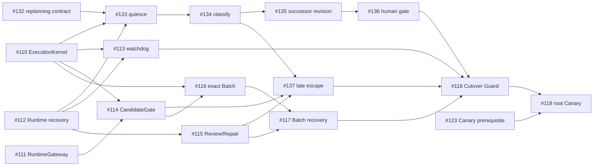

# GWO V8 release train

This document owns release sequencing and exit criteria. It does not redefine
the V8 mechanics in the architecture, authorize tracker mutation, or authorize
production writer cutover. The normative order remains `CONTEXT.md`, accepted
ADRs, the integrated architecture, the stabilization specification, and the
lean roadmap.

## Release sequence

| Release | Immutable tag | Required merged state | Production authority |
| --- | --- | --- | --- |
| Beta1 / Core Preview | `v8.0.0-beta.1` | The green `origin/main` Core baseline, this metadata, and the owner-approved tracker repair/readback | **no production admission**; no V8 writer activation |
| Beta2 / Feature Complete Preview | `v8.0.0-beta.2` | #113–#117 complete, #137 revalidated, and isolated Production V3 composition acceptance | No writer cutover |
| Beta3 / Cutover Candidate | `v8.0.0-beta.3` | #118 Cutover Guard and activation contract pass; every legacy writer path is absent or unreachable | Guarded rehearsal only; no default change |
| GA | `v8.0.0` | #119 root Canary accepted with #123, activation, and default-writer readback | Lean V8 is the default for new Campaigns |

The Beta1 evidence record is a read-only snapshot of the exact `origin/main`
SHA and its successful main CI. It is not a claim about the SHA of the
metadata commit that contains the record. After this metadata merges, the
merged documentation SHA must receive its own successful main CI readback
before the immutable Beta1 tag or GitHub Release is created.

## Exact exit gates

### Beta1 — Core Preview

- `core_baseline_sha`, the exact GWO CI URL, and the dynamic pytest summary
  come from one successful CI readback for the same `origin/main` SHA.
- Issues #113–#119 are read back with canonical `OPEN` or `CLOSED` states;
  plan text is never used as Issue-state evidence.
- The #137 tracker-semantic checkpoint is resolved only through the explicit
  owner approval/readback gate. Its native blockers and the full body/comments
  readback are preserved; this metadata lane does not perform that mutation.
- The Beta1 tag gate is a merged-main SHA and post-merge successful main CI
  readback, not the feature-branch SHA or self-referential text in the commit.

### Beta2 — Feature Complete Preview

- #113, #114, #115, #116, and #117 read back `CLOSED` after their exact PR,
  hosted-CI, and target-readback boundaries pass.
- #137 is revalidated against the complete Candidate/Review scope-escape
  contract, and Production V3 composition passes its isolated end-to-end
  acceptance without adopting a Candidate across Plan Revisions.
- The package manifests, repository validation, and exact merged-main CI are
  green. Beta2 does not cut over or enable the default V8 writer.

### Beta3 — Cutover Candidate

- #118 reads back `CLOSED` only after its fail-closed read-only Cutover Guard
  proves old-writer quiescence, compatible durable state, writer-generation and
  Integration-Lease availability, and required Runtime configuration.
- All V3-composition and V2-projection compatibility adapters, callers, and
  write paths are absent or unreachable; V6.1 and V8 cannot be simultaneous
  writers.
- The guarded rehearsal and its Activation Receipt are read back exactly, but
  no default change is made. A failed Guard changes no production state.

### GA — `v8.0.0`

- #119 reads back `CLOSED` after one real root Campaign proves the public API,
  four concurrent Work Runs, frozen authority, Candidate assurance, bounded
  repair/replacement, restart recovery, and both the Standard multi-member and
  Strict Singleton delivery boundaries.
- #123 and all transitive #118 gates (#136 and #137 included) read back
  `CLOSED`; the root Canary acceptance readback, Activation Receipt, and
  default-writer receipt identify the same immutable release subject.
- Only after exact post-merge main CI, tag, Release, and default-writer
  readbacks does Lean V8 become the default for new Campaigns.

## Executable blocker graph

The arrows point from a prerequisite to the Ticket it unblocks. A gate is
executable only after every native blocker listed for the next Ticket reads
back `CLOSED`; closed prerequisites remain evidence and are not silently
replaced by milestone labels.

The release milestones are a separate, idempotent tracker operation. The
planned assignments are #113–#117 and #137 to **GWO V8 Beta2**, #118 to
**GWO V8 Beta3**, and #119 to **GWO V8 GA**. No milestone `POST`, Issue
`PATCH`, label mutation, or blocker mutation is allowed until the named owner
approval/readback gate has proved the expected #137 state. The current Beta1
lane records this follow-up but does not perform it.

## Immutable tags and publication boundary

`v8.0.0-beta.1`, `v8.0.0-beta.2`, `v8.0.0-beta.3`, and `v8.0.0` are annotated,
immutable tags. Each tag is created once from the approved merged `origin/main`
SHA, pushed once, peeled and verified against that SHA, and then used for the
matching GitHub Release. A tag or Release that already exists is read back and
verified; it is never moved, deleted, or recreated.

**Package publication is not writer activation.** Publishing or installing a
package, committing release metadata, creating a Git tag, or publishing a
GitHub Release cannot transfer writer authority. The only authority-transfer
commit is the durable writer-generation plus Activation Receipt after the
Cutover Guard. Beta1 and Beta2 therefore never admit production work, and
Beta3 never changes the default.

## Rollback ownership

The release/program owner owns gate failure, publication hold, and the incident
record. The production cutover owner owns any explicitly approved durable
writer rollback or roll-forward after authoritative readback. Workers,
Reviewers, Coordinators, package publication, and release-note edits have no
rollback authority.

A failed Cutover Guard leaves the V6.1 writer and production state unchanged.
After an Activation Receipt exists, rollback is a new durable action: it never
erases or rewrites the receipt, never moves an immutable tag, and never relies
on an automatic fallback. New admission is frozen until the owner has the
exact receipt, target, CI, and writer-generation readbacks needed for the next
action.
