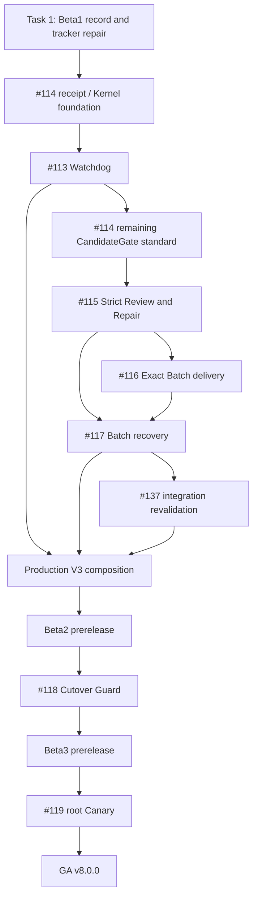

# GWO V8 GA Delivery Program Implementation Plan

> **For agentic workers:** REQUIRED SUB-SKILL: Use superpowers:subagent-driven-development (recommended) or superpowers:executing-plans to implement this plan task-by-task. Steps use checkbox (`- [ ]`) syntax for tracking.

**Goal:** Move the current green-but-transitional GWO V8 codebase from commit `a48c7d6142ae3538725cb876a8782f4ca804cd22` through traceable Beta1, Beta2, Beta3, root Canary, and GA without allowing a legacy writer, unproved Candidate, or un-read-back delivery to become production truth.

**Architecture:** Preserve the accepted five-module Lean V8 architecture and the public `start -> advance -> inspect` seam. Complete the missing liveness, Candidate assurance, Batch delivery, production composition, cutover, and root-Canary subsystems as separate reviewable plans, merge them only in blocker order, and use exact GitHub/CI/Activation readback as each release gate.

**Tech Stack:** Python 3.13, pytest, frozen dataclasses, canonical JSON, SHA-256, SQLite with compare-and-swap, Git/GitHub CLI, GitHub-hosted `windows-2025`, Paseo Runtime adapters, GitHub Issues/PRs/Checks, Skill package manifests.

## Global Constraints

- Normative order is `CONTEXT.md`, accepted ADRs, `docs/design/gwo-v8-lean-architecture.md`, stabilization spec, then roadmap.
- Public workflow operations remain exactly `start(repository, ready_refs, options?)`, `advance(campaign_handle, wake_ref?)`, and `inspect(campaign_handle)`.
- Public statuses remain exactly `Complete`, `Running`, `Decision`, `Wait`, and `Blocked`; Repair and quiescence remain internal Work Run phases.
- The five deep modules remain PlanControl, ExecutionKernel, RuntimeGateway, CandidateGate, and BatchIntegrator. Campaign Watchdog is a wake adapter, not a sixth state machine.
- Every production change uses TDD: write one behavior test, run and record the expected RED, implement the minimum behavior, run GREEN, refactor only while green, then commit.
- No Worker report, Runtime event, raw log, workspace head, or model completion statement is authoritative. Every state change follows exact durable readback.
- A Candidate is neither Evidence nor a Result. A code Result requires an accepted-Candidate receipt, exact Batch delivery, and target-branch readback.
- PlanSpec v3 remains provider-, model-, CLI-, selector-, fallback-, and lifecycle-neutral; Runtime assignment stays in host configuration.
- Frozen Authority Grants cannot be expanded by a Worker, Reviewer, Coordinator output, Runtime option, or repair. New authority requires a durable human Decision and successor Plan Revision.
- Defaults remain four Worker Slots, at most four Batch members, three-minute interactive-wait grace, thirty-minute stale deadline, at most three Candidate SHAs per Work Run, and one initial plus at most one replacement Worker binding.
- No periodic LLM polling, automatic Runtime daemon restart, recursive Batch bisection, cross-Campaign batching, cross-Plan Candidate adoption, or automatic authority expansion is introduced.
- Each implementation task starts from a clean isolated worktree at current `origin/main`; no task uses `D:\Workstation\github-work-orchestrator` while it is dirty or divergent.
- Parallel workers have disjoint write sets. Use at most five subagents, and when subagents are used, select `gpt-5.6-luna` with `max` reasoning as requested by the repository owner.
- A Ticket is not closed until its exact PR head passes focused tests, full pytest, `scripts/quick_validate.py`, `scripts/sync_orchestrator.py --check`, `git diff --check`, independent Standards/Spec review, merge readback, and post-merge main CI.
- A prerelease or GA tag is created only from a clean `origin/main` commit whose required gates are durably read back. Never move or reuse a release tag.

---

## Program Documents

The following child plans are the implementation units. Do not hand this whole program to one coding agent.

| Plan | Delivery |
| --- | --- |
| `2026-08-03-gwo-v8-campaign-watchdog.md` | Issue #113: event/timer wake convergence and bounded stale diagnosis |
| `2026-08-03-gwo-v8-candidate-assurance.md` | Issues #114 and #115: authoritative Candidate, Standard/Strict Review, bounded Repair |
| `2026-08-03-gwo-v8-batch-delivery.md` | Issues #116 and #117: exact Batch delivery and deterministic recovery |
| `2026-08-03-gwo-v8-production-composition.md` | Production V3 composition, Kernel integrity/CAS, and #137 integration revalidation |
| `2026-08-03-gwo-v8-cutover-guard.md` | Issue #118: read-only Guard and fenced authority transfer |
| `2026-08-03-gwo-v8-root-canary-ga.md` | Issue #119: four-Ticket root Canary, installation, and GA release |

## Release Train

| Release | Required merged state | Production authority |
| --- | --- | --- |
| Beta1 / Core Preview | Current green `origin/main` plus release metadata and tracker repair | No Lean V8 production admission |
| Beta2 / Feature Complete Preview | #113-#117 complete, #137 revalidated, production V3 composition passes isolated E2E | No writer cutover |
| Beta3 / Cutover Candidate | #118 Guard and activation contract pass; legacy writer path is absent or unreachable | Guarded rehearsal only; no default change |
| GA / `v8.0.0` | #119 real root Campaign accepted and Activation/default-writer readback succeeds | Lean V8 is default for new Campaigns |

## Maximum-Safe Parallelism



The maximum-safe implementation parallelism is task-granular rather than
Issue-number-granular. The generated package manifest is a real write, not an
exception to write-set ownership:

1. The Beta1 metadata branch and Candidate-foundation branch may be prepared
   concurrently because only the latter writes
   `skills/orchestrator/.skill-package.json`; merge, verify, tag, and publish
   Beta1 before merging the foundation so Beta1 remains a Core-only preview.
2. Merge the small Candidate-receipt/ExecutionKernel persistence foundation.
   It is shared by #113 and #114 and must not be implemented twice.
3. Run #113, remaining #114, #115, #116, and #117 serially on one package
   manifest lane in that order. Their handwritten production files differ in
   places, but every package-changing commit regenerates and stages the same
   `skills/orchestrator/.skill-package.json`; therefore parallel execution
   would violate the non-overlapping-write-set rule.
4. Run #137 revalidation after #117. Although its final changes are test-only,
   the production-composition child plan consumes the merged #113-#117 seam
   and shared production fixtures, so the published schedule does not overlap
   it with the Batch lane.
5. After Beta3, Root-Canary Ticket preparation, public runner preparation,
   and GA release-gate preparation may use three workers only where the root
   child plan lists disjoint files; host/admission, live run, promotion, and
   release publication remain serial.

Do not start production composition while CandidateGate or BatchIntegrator interfaces are still changing.

## Cross-Plan Write Ownership

| Owner while active | Exclusive production write set | May run beside |
| --- | --- | --- |
| Beta1 record | `docs/releases/`, release-train section of the roadmap, package release-contract test | Candidate-receipt foundation implementation before either branch merges |
| Candidate Assurance foundation | Candidate receipt classes plus diff-derived `InteractionClassification`/`InteractionKey` in `candidate_gate.py`, receipt fields/persistence in `execution_kernel.py`, receipt Kernel test/support | Beta1 record only |
| #113 | `campaign_watchdog.py`, liveness/stale slices of `execution_kernel.py`, Runtime wake projection, Watchdog host composition, Watchdog tests, generated orchestrator manifest | Read-only review only; next package owner starts after merge |
| Remaining #114 / #115 | Candidate readback/Review/Repair slices, Candidate/Review tests, #115 ADR and normative-doc amendments, generated orchestrator manifest | Read-only review/docs only; #116 starts after #115 merge |
| #116 / #117 | `batch_integrator.py`, `_batch_integrator_store.py`, `_batch_integrator_drivers.py`, predecessor batch quarantine, Batch tests, generated orchestrator manifest | Read-only review only; #137 starts after #117 merge |
| Production composition | `production_effects.py`, `production_host.py`, Kernel CAS/Result integrity, `implement-gwo` V8 preview guidance, composition tests/runbook | #137 test-only revalidation where the child plan marks disjoint files |
| #118 | `cutover_guard.py`, activation token fence, final legacy reachability/export removal, Guard CLI/tests | Nothing that still edits host/export/transition files |
| #119 / GA | root-Canary runner/fixtures, default-writer activation evidence, final release metadata | Read-only release/CI observation only |

`execution_kernel.py`, `plan_control_host.py`, `gwo_v8.__init__`, both package
manifests, and `skills/implement-gwo/SKILL.md` are sequential implementation
hotspots, not merely merge-time hotspots. Two workers never edit one of those
files concurrently merely because their handwritten source files differ;
split a mergeable foundation first or serialize the conflicting tasks.

### Task 1: Establish the Traceable Beta1 Baseline and Repair Tracker Semantics

**Files:**
- Create: `docs/releases/gwo-v8-release-train.md`
- Create: `docs/releases/v8.0.0-beta.1.md`
- Modify: `docs/design/gwo-v8-lean-roadmap.md`
- Test: `tests/test_orchestrator_package.py`

**Interfaces:**
- Consumes: current `origin/main`, GitHub Issue dependency readback, existing package manifests.
- Produces: immutable Beta1 SHA record, Beta2/Beta3/GA exit criteria, and an executable blocker graph.

Planning-time remote audit on 2026-08-03 found neither
`refs/tags/v8.0.0-beta.1` nor a GitHub Release named `v8.0.0-beta.1`. Re-run
both reads at execution time; if another operator has created either object,
stop and verify its peeled SHA and release metadata instead of recreating or
moving it.

```powershell
git ls-remote --tags origin refs/tags/v8.0.0-beta.1 'refs/tags/v8.0.0-beta.1^{}'
gh release view v8.0.0-beta.1 --repo NOirBRight/github-work-orchestrator --json tagName,targetCommitish,isPrerelease,url
```

- [ ] **Step 1: Write a failing structured release-contract test**

```python
import json
import re


def test_v8_release_train_names_exact_gates():
    text = (ROOT / "docs" / "releases" / "gwo-v8-release-train.md").read_text("utf-8")
    for required in (
        "v8.0.0-beta.1", "v8.0.0-beta.2", "v8.0.0-beta.3", "v8.0.0",
        "#113", "#114", "#115", "#116", "#117", "#118", "#119",
        "#123", "#136", "#137",
        "no production admission", "root Canary acceptance readback",
    ):
        assert required in text


def test_beta1_release_contract_has_structured_baseline_ci_dynamic_issue_and_nongoal():
    note = (ROOT / "docs" / "releases" / "v8.0.0-beta.1.md").read_text("utf-8")
    match = re.search(r"```json\n(\{.*?\})\n```", note, re.DOTALL)
    assert match is not None
    evidence = json.loads(match.group(1))
    assert re.fullmatch(r"[0-9a-f]{40}", evidence["core_baseline_sha"])
    assert re.fullmatch(r"https://github\.com/.+/actions/runs/[0-9]+", evidence["ci_url"])
    assert re.search(r"[0-9]+ passed", evidence["dynamic_pass_summary"])
    assert set(evidence["issues"]) == {"113", "114", "115", "116", "117", "118", "119"}
    assert all(value in {"OPEN", "CLOSED"} for value in evidence["issues"].values())
    assert evidence["non_goal"] == "Lean V8 production cutover"
```

- [ ] **Step 2: Run RED and confirm the structured release contract is missing**

```powershell
py -3.13 -m pytest tests/test_orchestrator_package.py::test_beta1_release_contract_has_structured_baseline_ci_dynamic_issue_and_nongoal -q
```

Expected: `FAIL` because the Beta1 note has no structured JSON evidence object
with baseline SHA, CI URL, dynamic pass summary, Issue status, and non-goal.

- [ ] **Step 3: Add the release train and Beta1 evidence record**

`gwo-v8-release-train.md` must define the table above, exact blocker gates,
immutable tags, rollback ownership, and the rule that package publication is
not writer activation. `v8.0.0-beta.1.md` must contain one fenced JSON object
with exactly `core_baseline_sha`, `ci_url`, `dynamic_pass_summary`, `issues`,
and `non_goal`; the contract test above validates the SHA shape, exact CI URL,
copied dynamic pass summary, #113-#119 Issue readback, and the explicit
non-goal “Lean V8 production cutover.” Never invent a pass count or Issue
state. The immutable prerelease tag is created only after this metadata PR
merges and the merged documentation SHA has its own successful main CI
readback; that post-merge SHA is authoritative through the tag and GitHub
Release readback rather than self-referential text inside its own commit.

```powershell
$sha = git rev-parse origin/main
$run = gh run list --repo NOirBRight/github-work-orchestrator --commit $sha --workflow 'GWO CI' --status success --limit 1 --json databaseId,url,headSha,conclusion | ConvertFrom-Json
if ($run.Count -ne 1 -or $run.headSha -ne $sha -or $run.conclusion -ne 'success') {
    throw 'Beta1 requires one successful GWO CI readback for the exact main SHA.'
}
$passSummary = @(gh run view $run.databaseId --repo NOirBRight/github-work-orchestrator --log | Select-String -Pattern '[0-9]+ passed')
if ($passSummary.Count -eq 0) {
    throw 'Beta1 exact-SHA CI has no parseable dynamic pytest pass summary.'
}
$dynamicPassSummary = $passSummary[-1].Line.Trim()
```

Generate `docs/releases/v8.0.0-beta.1.md` from those exact readbacks rather
than copying a planning-time SHA, count, URL, or Issue state:

```powershell
$repo = 'NOirBRight/github-work-orchestrator'
$issueStates = [ordered]@{}
foreach ($number in 113,114,115,116,117,118,119) {
    $issue = gh issue view $number --repo $repo --json number,state | ConvertFrom-Json
    if ($issue.number -ne $number -or $issue.state -notin 'OPEN','CLOSED') {
        throw "Issue #$number did not return a canonical state."
    }
    $issueStates["$number"] = $issue.state
}
$evidence = [ordered]@{
    core_baseline_sha = $sha
    ci_url = $run.url
    dynamic_pass_summary = $dynamicPassSummary
    issues = $issueStates
    non_goal = 'Lean V8 production cutover'
}
$note = @(
    '# GWO V8 Beta1 - Core Preview'
    ''
    'Beta1 freezes the Core Preview baseline and release-train metadata.'
    ''
    '```json'
    ($evidence | ConvertTo-Json -Compress -Depth 6)
    '```'
    ''
    'Beta1 has no production admission and does not activate a V8 writer.'
) -join "`n"
New-Item -ItemType Directory -Force docs/releases | Out-Null
[IO.File]::WriteAllText(
    (Join-Path (Get-Location) 'docs/releases/v8.0.0-beta.1.md'),
    $note + "`n",
    [Text.UTF8Encoding]::new($false)
)
```

- [ ] **Step 4: Run GREEN and package validation**

```powershell
py -3.13 -m pytest tests/test_orchestrator_package.py -q
py -3.13 scripts/quick_validate.py
py -3.13 scripts/sync_orchestrator.py --check
```

- [ ] **Step 5: Repair #137 tracker semantics before publishing Beta1**

```powershell
$blocked = gh api graphql -f query='query($owner:String!,$name:String!,$number:Int!){repository(owner:$owner,name:$name){issue(number:$number){state blockedBy(first:20){nodes{number state}}}}}' -F owner=NOirBRight -F name=github-work-orchestrator -F number=137 | ConvertFrom-Json
$nodes = $blocked.data.repository.issue.blockedBy.nodes
if ($blocked.data.repository.issue.state -eq 'CLOSED' -and ($nodes | Where-Object state -eq 'OPEN')) {
    if (-not $env:GWO_V8_TRACKER_APPROVER -or $env:GWO_V8_TRACKER_APPROVAL -ne 'REOPEN-137-PRESERVE-NATIVE-BLOCKERS') {
        throw 'STOP: present #137 plus its open native blockers to the program owner; set the named approval only after the owner authorizes this tracker mutation.'
    }
    gh issue reopen 137 --repo NOirBRight/github-work-orchestrator
}
$readback = gh issue view 137 --repo NOirBRight/github-work-orchestrator --json number,state,body,comments | ConvertFrom-Json
if (($nodes | Where-Object state -eq 'OPEN') -and $readback.state -ne 'OPEN') {
    throw '#137 must read back OPEN while an approved native blocker remains open.'
}
```

Expected before approval: the command stops before mutation and prints the
required checkpoint. Expected after the named owner approval: #137 reads back
OPEN with its full body/comments while #114/#115 remain open. Record the
approver, approval string, before/after state, and blocker snapshot in the
Beta1 evidence; never infer approval from this plan text.

- [ ] **Step 6: Reuse the explicit owner-approval/readback gate before the first milestone mutation**

No milestone `POST` or Issue `PATCH` is allowed before this gate. Reuse the
same owner env/readback convention as the #137 tracker repair; never infer
approval from plan text or caller identity.

```powershell
$repo = 'NOirBRight/github-work-orchestrator'
$requiredApproval = 'REOPEN-137-PRESERVE-NATIVE-BLOCKERS'
if (-not $env:GWO_V8_TRACKER_APPROVER -or $env:GWO_V8_TRACKER_APPROVAL -ne $requiredApproval) {
    throw 'STOP: owner approval env is absent or does not equal the named approval string; no milestone mutation is allowed.'
}
$ownerReadback = gh issue view 137 --repo $repo --json number,state,body,comments | ConvertFrom-Json
if ($ownerReadback.number -ne 137 -or $ownerReadback.state -ne 'OPEN' -or -not $ownerReadback.body) {
    throw 'STOP: owner approval/readback gate did not prove the expected #137 tracker state.'
}
$ownerReceipt = $ownerReadback | ConvertTo-Json -Compress -Depth 8
if (-not $ownerReceipt) { throw 'STOP: owner readback receipt was not captured.' }
```

Expected before approval: the command stops before the first milestone
mutation. Record approver, exact approval string, readback JSON, and the
before/after state in Beta1 evidence.

- [ ] **Step 7: Create release milestones idempotently**

```powershell
$repo = 'NOirBRight/github-work-orchestrator'
$existing = gh api "repos/$repo/milestones?state=all&per_page=100" | ConvertFrom-Json
foreach ($title in 'GWO V8 Beta2','GWO V8 Beta3','GWO V8 GA') {
    if ($title -notin $existing.title) {
        gh api "repos/$repo/milestones" -f title=$title -f description="See docs/releases/gwo-v8-release-train.md"
    }
}
$milestones = gh api "repos/$repo/milestones?state=all&per_page=100" | ConvertFrom-Json
$assignments = @{
    'GWO V8 Beta2' = @(113,114,115,116,117,137)
    'GWO V8 Beta3' = @(118)
    'GWO V8 GA' = @(119)
}
foreach ($title in $assignments.Keys) {
    $milestone = @($milestones | Where-Object title -eq $title)
    if ($milestone.Count -ne 1) { throw "Expected exactly one milestone named $title" }
    foreach ($issue in $assignments[$title]) {
        gh api -X PATCH "repos/$repo/issues/$issue" -F milestone=$milestone[0].number | Out-Null
        $readback = gh issue view $issue --repo $repo --json number,state,milestone | ConvertFrom-Json
        if ($readback.milestone.title -ne $title) {
            throw "Issue #$issue did not read back under milestone $title"
        }
    }
}
$blockers = gh api graphql -f query='query($owner:String!,$name:String!){repository(owner:$owner,name:$name){i118:issue(number:118){blockedBy(first:20){nodes{number state}}} i119:issue(number:119){blockedBy(first:20){nodes{number state}}}}}' -F owner=NOirBRight -F name=github-work-orchestrator | ConvertFrom-Json
$blockers.data.repository | ConvertTo-Json -Depth 8
```

Expected: #113-#117/#137 read back under Beta2, #118 under Beta3, and
#119 under GA. The native blocker readback still names #136/#137 for #118 and
#123 for #119; #136 and #123 are already CLOSED and are gates rather than
milestone work. This is tracker mutation and uses the same explicit owner
approval checkpoint as Step 5.

- [ ] **Step 8: Commit the Beta1 program record**

```powershell
git add docs/releases docs/design/gwo-v8-lean-roadmap.md tests/test_orchestrator_package.py
git commit -m "docs: define the GWO V8 release train"
```

- [ ] **Step 9: Create, push, verify, and publish the immutable Beta1 tag only after PR/main readback**

```powershell
git fetch origin main --tags
$sha = git rev-parse origin/main
$run = gh run list --repo NOirBRight/github-work-orchestrator --commit $sha --workflow 'GWO CI' --status success --limit 1 --json databaseId,url,headSha,conclusion | ConvertFrom-Json
if ($run.Count -ne 1 -or $run.headSha -ne $sha -or $run.conclusion -ne 'success') {
    throw 'Beta1 tag requires successful GWO CI readback for the merged metadata SHA.'
}
$passSummary = @(gh run view $run.databaseId --repo NOirBRight/github-work-orchestrator --log | Select-String -Pattern '[0-9]+ passed')
if ($passSummary.Count -eq 0) { throw 'Beta1 exact-SHA CI has no parseable dynamic pytest pass summary.' }
$passSummary[-1].Line
$existing = git ls-remote --tags origin refs/tags/v8.0.0-beta.1
if ($existing) { throw 'v8.0.0-beta.1 already exists; verify it and never move it.' }
git tag -a v8.0.0-beta.1 $sha -m 'GWO V8 Beta1 - Core Preview'
git push origin refs/tags/v8.0.0-beta.1
$remote = (git ls-remote --tags origin 'refs/tags/v8.0.0-beta.1^{}').Split("`t")[0]
if ($remote -ne $sha) { throw 'Remote Beta1 tag does not peel to the approved main SHA.' }
gh release create v8.0.0-beta.1 --repo NOirBRight/github-work-orchestrator --verify-tag --prerelease --title 'GWO V8 Beta1 - Core Preview' --notes-file docs/releases/v8.0.0-beta.1.md
gh release view v8.0.0-beta.1 --repo NOirBRight/github-work-orchestrator --json tagName,targetCommitish,isPrerelease,url
```

Expected: immutable prerelease points at the merged documentation commit and explicitly says production admission is disabled.

### Task 2: Deliver Beta2 Through the Four Feature Plans

**Files:** The exact write sets are owned by the first four child plans; this task edits only release notes after all merge.

**Interfaces:**
- Consumes: merged #113-#117, #137 revalidation, production-composition acceptance.
- Produces: `v8.0.0-beta.2` prerelease with isolated end-to-end evidence.

#### Task 2 release-note TDD cycle

- [ ] **RED — write and run the focused contract**

```python
def test_beta2_release_note_has_structured_sha_ci_dynamic_issue_and_non_goal():
    note = (ROOT / "docs" / "releases" / "v8.0.0-beta.2.md").read_text("utf-8")
    evidence = json.loads(re.search(r"```json\n(\{.*?\})\n```", note, re.DOTALL).group(1))
    assert re.fullmatch(r"[0-9a-f]{40}", evidence["merged_main_sha"])
    assert evidence["ci_url"].startswith("https://github.com/")
    assert re.search(r"[0-9]+ passed", evidence["dynamic_pass_summary"])
    assert all(evidence["issues"][str(number)] == "CLOSED" for number in (113, 114, 115, 116, 117, 137))
    assert evidence["non_goal"] == "V8 writer cutover"
```

```powershell
py -3.13 -m pytest tests/test_orchestrator_package.py::test_beta2_release_note_has_structured_sha_ci_dynamic_issue_and_non_goal -q
```

Expected: `FAIL` because the release note/evidence object is absent.

- [ ] **GREEN — generate the minimum JSON block from authoritative readback and run the focused PASS**

```powershell
git fetch origin main
$repo = 'NOirBRight/github-work-orchestrator'
$sha = git rev-parse origin/main
$run = gh run list --repo $repo --commit $sha --workflow 'GWO CI' --status success --limit 1 --json databaseId,url,headSha,conclusion | ConvertFrom-Json
if ($run.Count -ne 1 -or $run.headSha -ne $sha -or $run.conclusion -ne 'success') {
    throw 'Beta2 evidence requires successful GWO CI readback for the exact merged feature SHA.'
}
$passSummary = @(gh run view $run.databaseId --repo $repo --log | Select-String -Pattern '[0-9]+ passed')
if ($passSummary.Count -eq 0) { throw 'Beta2 exact-SHA CI has no parseable pytest summary.' }
$issueStates = [ordered]@{}
foreach ($number in 113,114,115,116,117,137) {
    $issue = gh issue view $number --repo $repo --json number,state | ConvertFrom-Json
    if ($issue.number -ne $number -or $issue.state -ne 'CLOSED') {
        throw "Beta2 requires Issue #$number to read back CLOSED."
    }
    $issueStates["$number"] = $issue.state
}
$evidence = [ordered]@{
    merged_main_sha = $sha
    ci_url = $run.url
    dynamic_pass_summary = $passSummary[-1].Line.Trim()
    issues = $issueStates
    non_goal = 'V8 writer cutover'
}
$note = @(
    '# GWO V8 Beta2 - Feature Complete Preview'
    ''
    'Beta2 records the merged feature-complete preview and isolated Production V3 evidence.'
    ''
    '```json'
    ($evidence | ConvertTo-Json -Compress -Depth 6)
    '```'
    ''
    'Beta2 does not cut over the default V8 writer.'
) -join "`n"
[IO.File]::WriteAllText(
    (Join-Path (Get-Location) 'docs/releases/v8.0.0-beta.2.md'),
    $note + "`n",
    [Text.UTF8Encoding]::new($false)
)
```

```powershell
py -3.13 -m pytest tests/test_orchestrator_package.py::test_beta2_release_note_has_structured_sha_ci_dynamic_issue_and_non_goal -q
```

Expected: `PASS`; values come from readback, never invented.

- [ ] **SYNC and small commit**

```powershell
py -3.13 scripts/sync_orchestrator.py
py -3.13 scripts/sync_orchestrator.py --check
git add docs/releases/v8.0.0-beta.2.md tests/test_orchestrator_package.py skills/orchestrator/.skill-package.json
git commit -m "docs: record the V8 Beta2 gate"
```

- [ ] Execute `2026-08-03-gwo-v8-campaign-watchdog.md` and merge #113.
- [ ] Execute `2026-08-03-gwo-v8-candidate-assurance.md` through #114, then #115.
- [ ] Execute `2026-08-03-gwo-v8-batch-delivery.md` through #116, then #117.
- [ ] Execute `2026-08-03-gwo-v8-production-composition.md`, including #137 revalidation.
- [ ] Run the Beta2 exact-tree gate.

```powershell
py -3.13 -m pytest -q
py -3.13 scripts/quick_validate.py
py -3.13 scripts/sync_orchestrator.py --check
git diff --check
$issueReadbacks = foreach ($number in 113,114,115,116,117,137) {
    gh issue view $number --repo NOirBRight/github-work-orchestrator --json number,state,closedAt,comments | ConvertFrom-Json
}
if (@($issueReadbacks | Where-Object state -ne 'CLOSED').Count -ne 0) {
    throw 'Beta2 requires #113-#117 and revalidated #137 to read back CLOSED.'
}
foreach ($number in 123,136) {
    $gate = gh issue view $number --repo NOirBRight/github-work-orchestrator --json number,state,closedAt | ConvertFrom-Json
    if ($gate.state -ne 'CLOSED') { throw "Beta2 predecessor gate #$number is not closed." }
}
```

Expected: full suite and validations pass; all six Issues are CLOSED by merged Results; public isolated-E2E tests use the V3 composition and no `Kernel.reconcile_once`.

- [ ] Create `docs/releases/v8.0.0-beta.2.md`, commit it through PR, then create the immutable prerelease from the merged main SHA.

```powershell
git fetch origin main --tags
$sha = git rev-parse origin/main
$run = gh run list --repo NOirBRight/github-work-orchestrator --commit $sha --workflow 'GWO CI' --status success --limit 1 --json databaseId,url,headSha,conclusion | ConvertFrom-Json
if ($run.Count -ne 1 -or $run.headSha -ne $sha -or $run.conclusion -ne 'success') {
    throw 'Beta2 tag requires successful GWO CI readback for the merged release-notes SHA.'
}
$passSummary = @(gh run view $run.databaseId --repo NOirBRight/github-work-orchestrator --log | Select-String -Pattern '[0-9]+ passed')
if ($passSummary.Count -eq 0) { throw 'Beta2 exact-SHA CI has no parseable dynamic pytest pass summary.' }
$passSummary[-1].Line
if (git ls-remote --tags origin refs/tags/v8.0.0-beta.2) {
    throw 'v8.0.0-beta.2 already exists; never move or replace a prerelease tag.'
}
git tag -a v8.0.0-beta.2 $sha -m 'GWO V8 Beta2 - Feature Complete Preview'
git push origin refs/tags/v8.0.0-beta.2
$remote = (git ls-remote --tags origin 'refs/tags/v8.0.0-beta.2^{}').Split("`t")[0]
if ($remote -ne $sha) { throw 'Remote Beta2 tag does not peel to the approved main SHA.' }
gh release create v8.0.0-beta.2 --repo NOirBRight/github-work-orchestrator --verify-tag --prerelease --title 'GWO V8 Beta2 - Feature Complete Preview' --notes-file docs/releases/v8.0.0-beta.2.md
gh release view v8.0.0-beta.2 --repo NOirBRight/github-work-orchestrator --json tagName,targetCommitish,isPrerelease,url
```

### Task 3: Deliver Beta3 Through the Cutover Plan

**Files:** Owned by `2026-08-03-gwo-v8-cutover-guard.md`, plus `docs/releases/v8.0.0-beta.3.md` after merge.

**Interfaces:**
- Consumes: Beta2 exact SHA and production V3 composition.
- Produces: read-only Guard, fenced activation boundary, and a cutover candidate with no default-writer change.

#### Task 3 release-note/gate TDD cycle

- [ ] **RED — write and run the focused Beta3 contract**

```python
def test_beta3_release_note_requires_guard_and_no_v6_fallback():
    note = (ROOT / "docs" / "releases" / "v8.0.0-beta.3.md").read_text("utf-8")
    evidence = json.loads(re.search(r"```json\n(\{.*?\})\n```", note, re.DOTALL).group(1))
    assert re.fullmatch(r"[0-9a-f]{40}", evidence["merged_main_sha"])
    assert re.fullmatch(r"https://github\.com/.+/actions/runs/[0-9]+", evidence["ci_url"])
    assert re.search(r"[0-9]+ passed", evidence["dynamic_pass_summary"])
    assert evidence["issues"]["118"] == "CLOSED"
    assert evidence["issues"]["123"] == "CLOSED"
    assert evidence["issues"]["136"] == "CLOSED"
    assert evidence["issues"]["137"] == "CLOSED"
    assert evidence["failure_policy"] == "freeze; no V6.1 fallback"
```

```powershell
py -3.13 -m pytest tests/test_orchestrator_package.py::test_beta3_release_note_requires_guard_and_no_v6_fallback -q
```

Expected: `FAIL` because the Beta3 evidence block is absent.

- [ ] **GREEN — generate the minimum evidence from authoritative readback and run PASS**

```powershell
git fetch origin main
$repo = 'NOirBRight/github-work-orchestrator'
$sha = git rev-parse origin/main
$run = gh run list --repo $repo --commit $sha --workflow 'GWO CI' --status success --limit 1 --json databaseId,url,headSha,conclusion | ConvertFrom-Json
if ($run.Count -ne 1 -or $run.headSha -ne $sha -or $run.conclusion -ne 'success') {
    throw 'Beta3 evidence requires successful GWO CI readback for the exact merged Guard SHA.'
}
$passSummary = @(gh run view $run.databaseId --repo $repo --log | Select-String -Pattern '[0-9]+ passed')
if ($passSummary.Count -eq 0) { throw 'Beta3 exact-SHA CI has no parseable pytest summary.' }
$issueStates = [ordered]@{}
foreach ($number in 118,123,136,137) {
    $issue = gh issue view $number --repo $repo --json number,state | ConvertFrom-Json
    if ($issue.number -ne $number -or $issue.state -ne 'CLOSED') {
        throw "Beta3 requires Issue #$number to read back CLOSED."
    }
    $issueStates["$number"] = $issue.state
}
$evidence = [ordered]@{
    merged_main_sha = $sha
    ci_url = $run.url
    dynamic_pass_summary = $passSummary[-1].Line.Trim()
    issues = $issueStates
    failure_policy = 'freeze; no V6.1 fallback'
}
$note = @(
    '# GWO V8 Beta3 - Cutover Candidate'
    ''
    'Beta3 records the read-only Guard and cutover-candidate evidence.'
    ''
    '```json'
    ($evidence | ConvertTo-Json -Compress -Depth 6)
    '```'
    ''
    'A failed successor gate freezes admission and never reactivates V6.1 automatically.'
) -join "`n"
[IO.File]::WriteAllText(
    (Join-Path (Get-Location) 'docs/releases/v8.0.0-beta.3.md'),
    $note + "`n",
    [Text.UTF8Encoding]::new($false)
)
```

```powershell
py -3.13 -m pytest tests/test_orchestrator_package.py::test_beta3_release_note_requires_guard_and_no_v6_fallback -q
```

Expected: `PASS`; a failure freezes successor admission and never automatically
selects or reactivates V6.1.

- [ ] **SYNC and small commit**

```powershell
py -3.13 scripts/sync_orchestrator.py
py -3.13 scripts/sync_orchestrator.py --check
git add docs/releases/v8.0.0-beta.3.md tests/test_orchestrator_package.py skills/orchestrator/.skill-package.json
git commit -m "docs: record the V8 Beta3 cutover gate"
```

- [ ] Execute `2026-08-03-gwo-v8-cutover-guard.md` and merge #118.
- [ ] Prove every Guard blocker path records zero mutation and every legacy production caller is absent or unreachable.
- [ ] Re-read #113/#117/#123/#136/#137 plus #118's native blocker graph; do not rehearse activation unless every required predecessor reads back CLOSED by accepted evidence.
- [ ] Rehearse Guard success and activation in a dedicated repository, then restore it only through a separately human-authorized durable compensating action that preserves the Activation receipt and diagnostics.
- [ ] On any Beta3 failure, freeze successor admission and preserve all state; never automatically hand the work or writer authority back to V6.1.
- [ ] Create `docs/releases/v8.0.0-beta.3.md`, commit through PR, and publish `v8.0.0-beta.3` as a prerelease.

```powershell
git fetch origin main --tags
$sha = git rev-parse origin/main
$run = gh run list --repo NOirBRight/github-work-orchestrator --commit $sha --workflow 'GWO CI' --status success --limit 1 --json databaseId,url,headSha,conclusion | ConvertFrom-Json
if ($run.Count -ne 1 -or $run.headSha -ne $sha -or $run.conclusion -ne 'success') {
    throw 'Beta3 tag requires successful GWO CI readback for the merged release-notes SHA.'
}
$passSummary = @(gh run view $run.databaseId --repo NOirBRight/github-work-orchestrator --log | Select-String -Pattern '[0-9]+ passed')
if ($passSummary.Count -eq 0) { throw 'Beta3 exact-SHA CI has no parseable dynamic pytest pass summary.' }
$passSummary[-1].Line
if (git ls-remote --tags origin refs/tags/v8.0.0-beta.3) {
    throw 'v8.0.0-beta.3 already exists; never move or replace a prerelease tag.'
}
git tag -a v8.0.0-beta.3 $sha -m 'GWO V8 Beta3 - Cutover Candidate'
git push origin refs/tags/v8.0.0-beta.3
$remote = (git ls-remote --tags origin 'refs/tags/v8.0.0-beta.3^{}').Split("`t")[0]
if ($remote -ne $sha) { throw 'Remote Beta3 tag does not peel to the approved main SHA.' }
gh release create v8.0.0-beta.3 --repo NOirBRight/github-work-orchestrator --verify-tag --prerelease --title 'GWO V8 Beta3 - Cutover Candidate' --notes-file docs/releases/v8.0.0-beta.3.md
gh release view v8.0.0-beta.3 --repo NOirBRight/github-work-orchestrator --json tagName,targetCommitish,isPrerelease,url
```

### Task 4: Execute the Root Canary and Publish GA

**Files:** Owned by `2026-08-03-gwo-v8-root-canary-ga.md`, plus final release notes and package manifests.

**Interfaces:**
- Consumes: Beta3, closed #118/#123, four real ready root Tickets, explicit human cutover approval.
- Produces: accepted root-Canary receipt, installed Skill packages, default Lean V8 writer, and `v8.0.0` GA release.

#### Task 4 release-note TDD cycle

- [ ] **RED — write and run the focused GA evidence contract**

```python
def test_ga_release_note_requires_canary_activation_and_fresh_v8_writer():
    note = (ROOT / "docs" / "releases" / "v8.0.0.md").read_text("utf-8")
    evidence = json.loads(re.search(r"```json\n(\{.*?\})\n```", note, re.DOTALL).group(1))
    assert evidence["canary_result"] == "ACCEPTED"
    assert set(evidence["activation_receipt"]) == {"repository", "campaign_key", "plan_revision_digest", "expected_previous_authority", "writer_generation"}
    assert evidence["fresh_start"]["writer_family"] == "v8"
    assert evidence["fresh_start"]["default_writer"] == "v8"
```

```powershell
py -3.13 -m pytest tests/test_orchestrator_package.py::test_ga_release_note_requires_canary_activation_and_fresh_v8_writer -q
```

Expected: `FAIL` because the final GA evidence object is absent.

- [ ] **GREEN — add the minimum evidence object and run PASS**

```json
{"canary_result":"ACCEPTED","activation_receipt":{"repository":"NOirBRight/github-work-orchestrator","campaign_key":"activation_receipt_campaign_key_readback","plan_revision_digest":"activation_receipt_plan_revision_digest_readback","expected_previous_authority":null,"writer_generation":"activation_receipt_writer_generation_readback"},"fresh_start":{"writer_family":"v8","default_writer":"v8","writer_generation":"same_activation_receipt_writer_generation_readback"}}
```

```powershell
py -3.13 -m pytest tests/test_orchestrator_package.py::test_ga_release_note_requires_canary_activation_and_fresh_v8_writer -q
```

Expected: `PASS`; all values are copied from durable readback.

- [ ] **SYNC and small commit**

```powershell
py -3.13 scripts/sync_orchestrator.py
py -3.13 scripts/sync_orchestrator.py --check
git add docs/releases/v8.0.0.md tests/test_orchestrator_package.py skills/orchestrator/.skill-package.json
git commit -m "docs: record the V8 GA evidence contract"
```

- [ ] Execute `2026-08-03-gwo-v8-root-canary-ga.md` through dry-run evidence.
- [ ] Stop at its explicit human authorization gate and present exact Ticket IDs, Plan Revision digest, writer-generation transition, rollback action, expected PRs, and mutation list.
- [ ] After authorization, run the real root Canary and require exact acceptance readback.
- [ ] If any Canary check fails, persist the diagnostics, freeze named-Canary and default admission, and leave V6.1 neither newly selected nor automatically reactivated; any rollback is a new human-authorized durable compensating transition.
- [ ] After Canary success, read the Activation receipt fields `repository`, `campaign_key`, `plan_revision_digest`, `expected_previous_authority`, and `writer_generation`, then prove a fresh ordinary `start` readback selects that same V8 writer before declaring it the default.
- [ ] Before the tag, read back #119 `CLOSED`, the accepted Canary Result, the exact Activation receipt fields, and a fresh ordinary `start` using the same V8 default writer.

```powershell
$issue119 = gh issue view 119 --repo NOirBRight/github-work-orchestrator --json number,state,body,comments | ConvertFrom-Json
if ($issue119.number -ne 119 -or $issue119.state -ne 'CLOSED') { throw '#119 must read back CLOSED before the GA tag.' }
$accepted = @($issue119.comments | Where-Object { $_.body -match '(?m)^Canary Result:\s*ACCEPTED$' })
if ($accepted.Count -ne 1) { throw '#119 must contain exactly one accepted Canary Result.' }
$receipt = Get-Content -Raw $env:GWO_V8_ACTIVATION_RECEIPT_JSON | ConvertFrom-Json
$fresh = Get-Content -Raw $env:GWO_V8_FRESH_START_READBACK_JSON | ConvertFrom-Json
$expectedReceiptFields = @('campaign_key','expected_previous_authority','plan_revision_digest','repository','writer_generation')
$actualReceiptFields = @($receipt.PSObject.Properties.Name | Sort-Object)
if (($actualReceiptFields -join ',') -ne (($expectedReceiptFields | Sort-Object) -join ',')) { throw 'Activation receipt fields are not exact.' }
if ($receipt.repository -ne 'NOirBRight/github-work-orchestrator' -or -not $receipt.campaign_key -or $receipt.plan_revision_digest -notmatch '^[0-9a-f]{64}$' -or -not $receipt.writer_generation) { throw 'Activation receipt values are invalid.' }
if ($fresh.operation -ne 'start' -or $fresh.writer_family -ne 'v8' -or $fresh.default_writer -ne 'v8' -or $fresh.writer_generation -ne $receipt.writer_generation) { throw 'Fresh ordinary start did not select the same V8 default writer.' }
```

Any failure persists diagnostics, freezes named-Canary and default admission,
and leaves V6.1 neither newly selected nor automatically reactivated; rollback
is a separately human-authorized durable compensating transition.

- [ ] Install first with `--install` in canonical `.agents`, `.codex`, `.claude` order, including temporary staging roots; only then perform three target-root readbacks with `--check`.

```powershell
$surfaces = @(
    @{ Name = '.agents'; Temporary = (Join-Path $HOME '.agents/.gwo-v8-install-tmp/skills'); Target = (Join-Path $HOME '.agents/skills') },
    @{ Name = '.codex'; Temporary = (Join-Path $HOME '.codex/.gwo-v8-install-tmp/skills'); Target = (Join-Path $HOME '.codex/skills') },
    @{ Name = '.claude'; Temporary = (Join-Path $HOME '.claude/.gwo-v8-install-tmp/skills'); Target = (Join-Path $HOME '.claude/skills') }
)
foreach ($surface in $surfaces) {
    New-Item -ItemType Directory -Force $surface.Temporary, $surface.Target | Out-Null
    py -3.13 scripts/sync_orchestrator.py --install --install-root $surface.Temporary --backup-root (Join-Path $surface.Target '.gwo-v8-backups')
}
foreach ($surface in $surfaces) {
    py -3.13 scripts/sync_orchestrator.py --install --install-root $surface.Target --backup-root (Join-Path $surface.Target '.gwo-v8-backups')
}
foreach ($surface in $surfaces) {
    py -3.13 scripts/sync_orchestrator.py --check --install-root $surface.Target
    if ($LASTEXITCODE -ne 0) { throw "GA install readback failed on $($surface.Name)" }
}
```

- [ ] Publish GA only when #119 is CLOSED by the accepted Canary Result and main CI is green.

```powershell
git fetch origin main --tags
$sha = git rev-parse origin/main
$run = gh run list --repo NOirBRight/github-work-orchestrator --commit $sha --workflow 'GWO CI' --status success --limit 1 --json databaseId,headSha,conclusion,url | ConvertFrom-Json
if ($run.Count -ne 1 -or $run.headSha -ne $sha -or $run.conclusion -ne 'success') {
    throw 'GA tag requires successful GWO CI readback for the exact main SHA.'
}
$passSummary = @(gh run view $run.databaseId --repo NOirBRight/github-work-orchestrator --log | Select-String -Pattern '[0-9]+ passed')
if ($passSummary.Count -eq 0) { throw 'GA exact-SHA CI has no parseable dynamic pytest pass summary.' }
$passSummary[-1].Line
if (git ls-remote --tags origin refs/tags/v8.0.0) {
    throw 'v8.0.0 already exists; never move or replace a GA tag.'
}
git tag -a v8.0.0 $sha -m 'GWO V8.0.0 GA'
git push origin refs/tags/v8.0.0
$remote = (git ls-remote --tags origin 'refs/tags/v8.0.0^{}').Split("`t")[0]
if ($remote -ne $sha) { throw 'Remote GA tag does not peel to the approved main SHA.' }
gh release create v8.0.0 --repo NOirBRight/github-work-orchestrator --verify-tag --title 'GWO V8.0.0' --notes-file docs/releases/v8.0.0.md
gh release view v8.0.0 --repo NOirBRight/github-work-orchestrator --json tagName,targetCommitish,isPrerelease,url
```

Expected: `isPrerelease=false`, tag resolves to exact green main SHA, installed package checks pass, and durable writer/Activation/Canary receipts identify the same release.

## Program Completion Gate

- [ ] Re-read every #113-#119 acceptance criterion plus the closed #123/#136 gates and #137 revalidation, and map each to a passing public or deep-module test.
- [ ] Confirm no closed Issue has an open native blocker.
- [ ] Confirm `skills/implement-gwo/SKILL.md` names only the Lean public path and does not call `Kernel.reconcile_once`.
- [ ] Confirm `gwo_v8.__init__` does not export legacy workflow drivers or mutable cutover controllers.
- [ ] Confirm full pytest, quick validation, package sync, diff check, exact main CI, installed-surface drift, root-Canary acceptance, and Activation readback all pass.
- [ ] Archive Beta release notes as historical prereleases; do not delete their tags or receipts.
