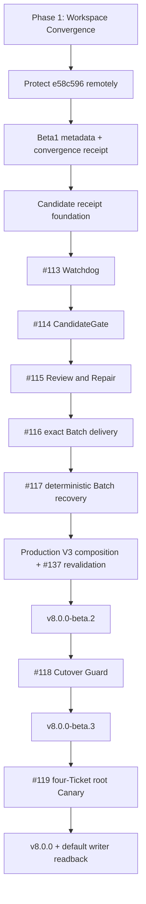

# GWO V8 GA Release Program Implementation Plan

> **For agentic workers:** REQUIRED SUB-SKILL: Use superpowers:subagent-driven-development (recommended) or superpowers:executing-plans to implement this plan task-by-task. Steps use checkbox (`- [ ]`) syntax for tracking.

**Goal:** Converge the current local workspace safely, preserve the unpushed GWO V8 implementation, and deliver immutable Beta1, Beta2, Beta3, root Canary, and GA releases without admitting an unverified writer.

**Architecture:** Add a fail-closed Workspace Convergence Gate before Beta1, then publish the existing 67-commit implementation as a stacked Draft-PR train. Preserve the accepted five-module Lean V8 architecture and finish Batch delivery, Production V3 composition, Cutover Guard, and the four-Ticket root Canary in blocker order, with exact GitHub, CI, target, Activation, and default-writer readback at every release boundary.

**Tech Stack:** Python 3.13, pytest, PowerShell 7, Git worktrees/bundles, SHA-256, GitHub CLI and Actions, Paseo Runtime readback, SQLite compare-and-swap, canonical JSON, Skill package manifests.

This document supersedes `2026-08-03-gwo-v8-ga-delivery-program.md` for program sequencing and release gates. The six 2026-08-03 subsystem child plans remain the authoritative implementation details referenced below.

## Global Constraints

- Normative order remains `CONTEXT.md`, accepted ADRs, `docs/design/gwo-v8-lean-architecture.md`, stabilization spec, then roadmap.
- Public workflow operations remain exactly `start(repository, ready_refs, options?)`, `advance(campaign_handle, wake_ref?)`, and `inspect(campaign_handle)`.
- Public statuses remain exactly `Complete`, `Running`, `Decision`, `Wait`, and `Blocked`.
- The five deep modules remain PlanControl, ExecutionKernel, RuntimeGateway, CandidateGate, and BatchIntegrator; Campaign Watchdog remains a wake adapter.
- Every production change uses TDD: behavior RED, minimum GREEN implementation, focused regression, then commit.
- Use at most five subagents. Every spawned subagent uses `gpt-5.6-luna` with `max` reasoning.
- Parallel workers receive disjoint write sets. Package manifests, `execution_kernel.py`, `production_host.py`, exports, transition code, and integration refs are serial hotspots.
- Never commit or push directly to `main`; never force-push; never use `--no-verify`.
- No branch or remote-tracking ref is deleted during Workspace Convergence. The first cleanup round removes worktrees only.
- Never use wildcard deletion, `git clean`, automatic Paseo daemon restart, manual Paseo registry edits, or manual `.git/worktrees` edits.
- Beta1 and Beta2 admit no production work. Beta3 performs guarded rehearsal only. The default writer changes only after the accepted root Canary.
- Release tags are annotated and immutable. Existing tags or Releases are verified, never moved, deleted, or recreated.

---

## Current Baseline

| Surface | Exact planning-time state |
| --- | --- |
| Remote main | `a48c7d6142ae3538725cb876a8782f4ca804cd22`; successful GWO CI run `30778312688`, 1521 passed |
| Active GA worktree | `D:\Workstation\gwo-worktrees\issue-136`; implementation boundary `e58c596998df90e65349bdb4b5f25d3d9dc1f7e2` on `codex/gwo-v8-ga-plan` |
| Local GA delta | 67 implementation commits and 45,635 inserted lines over `origin/main`; this plan-only authoring change is committed before Phase 1 and its resulting head is protected remotely |
| Completed locally | Beta1 metadata; Candidate foundation; #113; #114; #115; #116 Batch Tasks 1-5 |
| Required next implementation | #116 Tasks 6-7, #117 Tasks 8-9, Batch Beta2 gate, Production V3 composition, #118, #119 |
| Workspace inventory | 38 registered worktrees; 48 external test roots; 934.9 MiB and 162,677 generated files |
| Release state | No `v8.0.0-beta.1` tag, no GitHub Release, and no Beta2/Beta3/GA milestones |
| Tracker anomaly | #137 is CLOSED while native blockers #114 and #115 are OPEN; owner approval/readback is required before repair |

The latest exact head `e58c596` has focused Batch Task evidence but no final full-suite gate after Batch Task 5. The earlier Candidate boundary at `a0f6976` recorded 1712 passing tests; that does not replace verification of `e58c596`.

## Program Documents

| Phase | Authoritative implementation plan |
| --- | --- |
| Phase 1 — Workspace Convergence Gate | `docs/superpowers/plans/2026-08-04-gwo-v8-workspace-convergence-gate.md` |
| Campaign Watchdog / #113 | `docs/superpowers/plans/2026-08-03-gwo-v8-campaign-watchdog.md` |
| Candidate Assurance / #114-#115 | `docs/superpowers/plans/2026-08-03-gwo-v8-candidate-assurance.md` |
| Batch delivery / #116-#117 | `docs/superpowers/plans/2026-08-03-gwo-v8-batch-delivery.md` |
| Production V3 composition and #137 revalidation | `docs/superpowers/plans/2026-08-03-gwo-v8-production-composition.md` |
| Cutover Guard / #118 | `docs/superpowers/plans/2026-08-03-gwo-v8-cutover-guard.md` |
| Root Canary and GA / #119 | `docs/superpowers/plans/2026-08-03-gwo-v8-root-canary-ga.md` |

## Release and Merge Graph

### Task 1: Pass the Workspace Convergence Gate

**Files:**
- Follow: `docs/superpowers/plans/2026-08-04-gwo-v8-workspace-convergence-gate.md`
- Create: `docs/releases/gwo-v8-workspace-convergence.md`
- Modify: `docs/releases/gwo-v8-release-train.md`
- Test: `tests/test_orchestrator_package.py`

**Interfaces:**
- Consumes: the 38-worktree audit, the 48-root test inventory, exact branch `e58c596`, Paseo live ownership readback, and the repository owner's selected retention/removal policy.
- Produces: `gwo-workspace-convergence.v1`, a verified archive, a protected remote GA branch whose history contains exact implementation boundary `e58c596`, one canonical `main` checkout, and one active GA worktree.

- [ ] Execute the detailed Phase 1 plan without deleting any Git ref.
- [ ] Verify the final worktree set is exactly the canonical root checkout plus `issue-136`.
- [ ] Verify all 48 test roots are absent and the four selected green log triplets are archived with SHA-256.
- [ ] Verify `refs/heads/codex/gwo-v8-ga-plan` reads back at the captured plan head and `e58c596998df90e65349bdb4b5f25d3d9dc1f7e2` is its ancestor.
- [ ] Commit the structured convergence receipt on the Beta1 branch only after the external archive and Git readbacks pass.

Expected: Workspace Convergence is a passed Beta1 prerequisite, not a claim that Beta1 has been released.

### Task 2: Publish the Existing Work as a Stacked Draft-PR Train

**Files:**
- No new production implementation in this task.
- Read: `.superpowers/sdd/**/progress.md` and task reports already committed on `codex/gwo-v8-ga-plan`.

**Interfaces:**
- Consumes: protected source branch `codex/gwo-v8-ga-plan@e58c596` and a passed Workspace Convergence Gate.
- Produces: six non-force-pushed cumulative branches whose diffs isolate the already-reviewed delivery slices.

Use these exact source boundaries:

| Draft branch | Source boundary | Diff ownership |
| --- | --- | --- |
| `codex/gwo-v8-beta1` | `ddc1785` plus cherry-picked 2026-08-04 plan docs and the Phase 1 receipt commit | Program plans, release train, Beta1 metadata, convergence gate |
| `codex/gwo-v8-candidate-foundation` | `77ac3e3` | Candidate receipt and Kernel persistence foundation |
| `codex/gwo-v8-issue-113-watchdog` | `07086ce` | Campaign Watchdog and host composition |
| `codex/gwo-v8-issue-114-candidategate` | `657bf23` | authoritative Candidate and Standard assurance |
| `codex/gwo-v8-issue-115-review-repair` | `a0f6976` | Strict Review, Finding ledger, bounded Repair, ADR/docs |
| `codex/gwo-v8-issue-116-batch-wip` | `e58c596` | #116 Batch Tasks 1-5; remains Draft and incomplete |

- [ ] Create each branch at its exact historical boundary; do not rewrite `codex/gwo-v8-ga-plan`.
- [ ] Merge the updated predecessor branch into each successor with a normal merge commit so the old reviewed SHAs remain traceable.
- [ ] Push every branch without force and verify each remote SHA.
- [ ] Open Draft PRs with the predecessor branch as base; only the Beta1 PR targets `main` initially.
- [ ] Run independent read-only review of all six slices in parallel, up to five Luna Max reviewers at a time.
- [ ] Apply fixes serially from the bottom of the stack upward, because package manifests and shared modules are common write surfaces.

Expected: the large local delta is remotely durable and reviewable as bounded slices; no post-Beta1 code is merged before Beta1 publication.

### Task 3: Merge and Publish Beta1

**Files:**
- Modify: `docs/releases/gwo-v8-release-train.md`
- Modify: `docs/releases/v8.0.0-beta.1.md`
- Modify: `docs/releases/gwo-v8-workspace-convergence.md`
- Test: `tests/test_orchestrator_package.py`

**Interfaces:**
- Consumes: exact convergence receipt, successful Beta1 PR checks, merged-main SHA, exact post-merge main CI, and explicit owner approval/readback.
- Produces: immutable annotated tag and GitHub prerelease `v8.0.0-beta.1`.

- [ ] Run `py -3.13 -m pytest tests/test_orchestrator_package.py -q`, full pytest, quick validation, sync check, and `git diff --check` on the Beta1 PR head.
- [ ] Merge the Beta1 PR only after independent Standards/Spec review is clean.
- [ ] Read back the exact merged-main SHA and one successful GWO CI run for that SHA; dynamically parse the pytest summary.
- [ ] Stop for named owner approval before reopening #137, creating milestones, assigning Issues, or publishing any release object.
- [ ] With approval, reopen #137 only if its native blockers are still open; preserve body, comments, and blocker readback.
- [ ] Create/assign milestones idempotently: #113-#117 and #137 to Beta2, #118 to Beta3, #119 to GA.
- [ ] Create and push annotated `v8.0.0-beta.1`; verify the remote peeled SHA equals the approved merged-main SHA.
- [ ] Create the GitHub prerelease with `--verify-tag`, then read back tag, target, prerelease state, and URL.

Expected: Beta1 is Core Preview only; V8 writer admission remains disabled.

### Task 4: Merge Completed Local Feature Slices

**Files:**
- Existing files and tests owned by the #113, #114, and #115 child plans.
- Generated package manifest is serialized per PR.

**Interfaces:**
- Consumes: published Beta1 and the stacked foundation/#113/#114/#115 branches.
- Produces: merged and post-main-CI-verified Issues #113, #114, and #115.

For each slice, in order:

- [ ] Update the branch with its newly merged predecessor using a normal merge.
- [ ] Run its child-plan focused suite and the repository-wide release gate.
- [ ] Perform independent Standards and Spec review on the exact PR head.
- [ ] Merge the PR, read back the merge SHA, wait for successful main CI, then close only the Issue owned by that slice.
- [ ] Update the next Draft PR base; never batch-close Issues from plan text or local reports.

Expected: Candidate foundation, Watchdog, Standard assurance, Strict Review, Finding ledger, bounded Candidate budget, and Repair are durable on `main` before Batch delivery continues.

### Task 5: Complete Beta2

**Files:**
- Follow: `docs/superpowers/plans/2026-08-03-gwo-v8-batch-delivery.md`
- Follow: `docs/superpowers/plans/2026-08-03-gwo-v8-production-composition.md`

**Interfaces:**
- Consumes: merged #113-#115, current #116 Task-5 boundary, exact GitHub/CI drivers, and the approved #137 tracker state.
- Produces: complete #116/#117, Production V3 host composition, revalidated #137, and immutable `v8.0.0-beta.2`.

- [ ] Continue #116 with Task 6 publication/PR/hosted-CI/Integration-Lease/target readback and Task 7 normal V3 action loop plus predecessor quarantine.
- [ ] Implement #117 Task 8 unchanged-SHA infrastructure recovery and Task 9 deterministic Singleton fallback/Strict recovery.
- [ ] Run Batch Task 10 full verification and exact Beta2 evidence.
- [ ] Merge #116, then #117, with separate exact-head PR and post-main-CI gates.
- [ ] Execute Production V3 composition Tasks 1-10, including Campaign CAS, Result integrity, public host composition, restart convergence, and isolated provider/target E2E.
- [ ] Revalidate #137 only against the complete merged Candidate/Review/Batch scope-escape contract.
- [ ] Publish annotated `v8.0.0-beta.2` only after #113-#117 and #137 read back CLOSED and exact main/package/CI evidence is green.

Expected: V8 is feature complete but has no production writer authority.

### Task 6: Complete Beta3 Cutover Guard

**Files:**
- Follow: `docs/superpowers/plans/2026-08-03-gwo-v8-cutover-guard.md`

**Interfaces:**
- Consumes: Beta2 Production V3 composition, closed #113/#117/#136/#137 blockers, writer-generation state, and Runtime configuration readback.
- Produces: #118 Cutover Guard, guarded Activation Receipt rehearsal, and immutable `v8.0.0-beta.3`.

- [ ] Implement the pure read-only Guard evaluator and fail-closed reason matrix by TDD.
- [ ] Prove predecessor writer/package/export paths are absent or unreachable.
- [ ] Compose Runtime-only configuration preflight and require the Guard token at the fenced activation point.
- [ ] Run the human go/no-go CLI over exact readback; a failed Guard changes no durable production state.
- [ ] Close #118 only after exact PR, hosted CI, merge, main CI, and Guard evidence readback.
- [ ] Publish annotated `v8.0.0-beta.3`; do not change the default writer.

Expected: Beta3 proves the authority-transfer mechanism without performing the GA default promotion.

### Task 7: Execute the Root Canary and Publish GA

**Files:**
- Follow: `docs/superpowers/plans/2026-08-03-gwo-v8-root-canary-ga.md`

**Interfaces:**
- Consumes: Beta3 Guard/Activation subject, four approved low-risk root Tickets, exact Runtime and GitHub adapters, and explicit production owner authorization.
- Produces: accepted root Canary, default-writer receipt, immutable `v8.0.0`, and post-release smoke evidence.

- [ ] Provision four real Tickets: three Standard members and one Strict Singleton, each with one bounded documentation-only write.
- [ ] Run only through installed public `start`, `advance`, and `inspect`; inject the planned restart/acknowledgement-loss failures.
- [ ] Prove four concurrent Work Runs, frozen authority, Candidate assurance, bounded repair/replacement, one Standard multi-member Batch, one Strict Singleton Batch, serial integration, hosted CI, and exact target readback.
- [ ] On failure, freeze admission and retain the prior writer; do not auto-fallback or erase any receipt.
- [ ] On acceptance, bind the same release subject through root-Canary receipt, Activation Receipt, and default-writer readback.
- [ ] Merge GA metadata, obtain exact post-merge main CI, publish annotated `v8.0.0`, and verify the GitHub Release.
- [ ] Run clean-install smoke on `.agents`, `.claude`, and `.codex` surfaces, then run post-release public API smoke.
- [ ] Close #119 only after tag, Release, target, activation, default-writer, and smoke readbacks are all exact.

Expected: Lean V8 becomes the default only for new Campaigns; existing durable receipts and in-flight ownership remain authoritative.

## Program Verification Matrix

| Gate | Required proof |
| --- | --- |
| Workspace Convergence | two worktrees, 48 roots absent, archives verified, all refs retained, remote plan head protected with `e58c596` as ancestor |
| Every code PR | focused pytest, full pytest, quick validation, sync check, diff check, two independent reviews, hosted CI, merge/main readback |
| Beta1 | convergence receipt, metadata merge, exact main CI, owner-approved tracker/milestones, immutable tag/Release |
| Beta2 | #113-#117 closed, #137 revalidated, Production V3 isolated E2E, no writer cutover |
| Beta3 | #118 Guard and activation rehearsal, predecessor writer unreachable, no default change |
| GA | four-Ticket real Canary, two delivery boundaries, restart/exactly-once proof, activation/default receipt, clean install and smoke |

## Stop and Rollback Rules

- Any archive/hash/path drift, active Paseo ownership, remote SHA mismatch, failed Git integrity check, or unexpected dirty state keeps Phase 1 on HOLD.
- Any PR head movement, check mismatch, changed target, malformed receipt, or stale Issue state keeps the corresponding release gate on HOLD.
- Before activation, a failed Guard leaves V6.1 authority unchanged.
- After an Activation Receipt exists, rollback is a new explicit durable action: freeze admission first, retain receipts, and require owner-approved roll-forward or rollback readback.
- A package publish, Git tag, GitHub Release, model report, Worker completion, or local test log never transfers writer authority.
