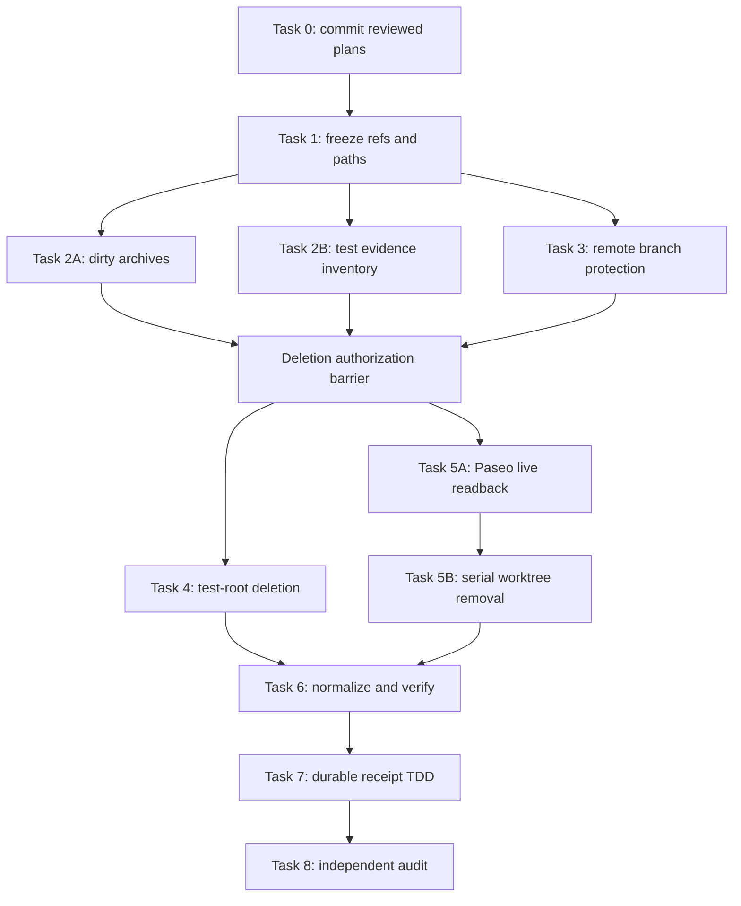

# GWO V8 Workspace Convergence Gate Implementation Plan

> **For agentic workers:** REQUIRED SUB-SKILL: Use superpowers:subagent-driven-development (recommended) or superpowers:executing-plans to implement this plan task-by-task. Steps use checkbox (`- [ ]`) syntax for tracking.

**Goal:** Protect every unique Git and uncommitted artifact, publish the active GA branch remotely, remove the approved generated test trees and stale worktrees, and finish with one canonical `main` checkout plus one active GA worktree before Beta1.

**Architecture:** Use two read-backed phases. Phase A creates a full Git bundle, dirty-worktree patches, untracked ZIPs, ignored-content inventories, retained test logs, and SHA-256 manifests; no deletion is allowed until every protection readback passes. Phase B removes exact LiteralPath targets serially, preserves every ref, normalizes the canonical checkout, and emits a structured convergence receipt whose digest becomes a Beta1 release prerequisite.

**Tech Stack:** PowerShell 7, Git worktrees and bundles, SHA-256, .NET ZIP APIs, GitHub CLI, Paseo CLI live readback, Python 3.13, pytest.

## Global Constraints

- Execute from `D:\Workstation\gwo-worktrees\issue-136`; never implement from the dirty root checkout.
- The protected implementation boundary is exactly `e58c596998df90e65349bdb4b5f25d3d9dc1f7e2`; the plan-only authoring commit may be its descendant and becomes the remote branch head captured at execution time.
- Keep exactly `D:\Workstation\github-work-orchestrator` and `D:\Workstation\gwo-worktrees\issue-136` after cleanup.
- Remove the other 36 registered worktrees, but delete no local branch, tag, stash, note, or remote-tracking ref.
- Preserve four selected green run triplets and a complete inventory; remove all 48 approved external test roots.
- Five audited stale dirty worktrees may be force-removed only after their binary patch, untracked ZIP, ignored inventory, and hashes verify.
- The root checkout's four untracked files may be removed only after their ZIP and hashes verify.
- No pre-clean Git ref may be deleted or moved unexpectedly: `refs/heads/main` and `refs/remotes/origin/main` may fast-forward (with `origin/main` created only by the required fetch), and the captured `refs/heads/codex/gwo-v8-ga-plan` may be created or advanced only to `$ProtectedGaSha` (including its local remote-tracking ref); no other ref may move or be added.
- Use only exact LiteralPath values from this plan. Reject `*`, `?`, `[` and `]` in every deletion input.
- Never use `git clean`, wildcard deletion, `git worktree prune`, cross-shell generated delete commands, `--no-verify`, or force-push.
- Do not start or restart Paseo. If live Paseo readback is unavailable, ambiguous, or references a target path, stop the Paseo subset and leave the gate on HOLD.
- Run Git worktree metadata mutations serially. Parallelism is limited to read-only inventory/archive lanes with disjoint archive subdirectories.
- All subagents use `gpt-5.6-luna` with `max` reasoning; at most five run concurrently.

---

## Fixed Policy Decisions

| Decision | Locked behavior |
| --- | --- |
| Canonical checkout | Keep the saved Codex project path and normalize it to latest `main` |
| Active implementation | Keep `issue-136` clean with exact `e58c596` in its ancestry and protect the captured plan head remotely first |
| Test retention | Keep manifest plus four green stdout/stderr/exitcode triplets; delete all 48 roots |
| Dirty worktrees | Verify patch/ZIP/hash, then remove the five stale dirty worktrees; retain all refs |
| Branch cleanup | Out of scope; no branch or remote-tracking ref deletion in this phase |
| Paseo ownership | Require live zero-reference readback; use Git worktree removal only for already archived/unreferenced linked worktrees |

## File and Evidence Map

| Output | Responsibility |
| --- | --- |
| `D:\Workstation\gwo-convergence-archive\$RunId\pre-clean.bundle` | Complete pre-clean Git ref protection |
| `...\inventory\` | Exact refs, worktrees, statuses, test-tree metadata, Paseo/GitHub readbacks |
| `$ArchiveRoot\dirty\$slug\` | Binary patch, status, untracked ZIP, ignored inventory, SHA-256 |
| `$ArchiveRoot\test-evidence\$runName\` | Four retained green triplets |
| `...\post-clean.bundle` | Final refs after canonical-main fast-forward and remote branch protection |
| `...\convergence-manifest.json` | Complete local `gwo-workspace-convergence.v1` evidence |
| `docs/releases/gwo-v8-workspace-convergence.md` | Sanitized durable release receipt containing only stable counts and digests |
| `tests/test_orchestrator_package.py` | Structured receipt and release-train contract |

`$RunId` is not supplied manually. Task 1 computes it as UTC `yyyyMMddTHHmmssZ` and records the exact resulting archive path.

## Exact Path Sets

The execution shell must define these arrays exactly once and serialize them to `inventory\approved-paths.json` before any removal.

```powershell
$Repo = 'D:\Workstation\github-work-orchestrator'
$GaWorktree = 'D:\Workstation\gwo-worktrees\issue-136'
$ImplementationSha = 'e58c596998df90e65349bdb4b5f25d3d9dc1f7e2'
$ProtectedGaSha = (git -C $GaWorktree rev-parse HEAD).Trim()
$RunId = [DateTime]::UtcNow.ToString('yyyyMMddTHHmmssZ')
$ArchiveRoot = Join-Path 'D:\Workstation\gwo-convergence-archive' $RunId

$KeepWorktrees = @(
    'D:\Workstation\github-work-orchestrator',
    'D:\Workstation\gwo-worktrees\issue-136'
)

$RemoveWorktrees = @(
    'C:\Users\noirb\.paseo\worktrees\03da5vwc\gwo-abfa647baeac0630',
    'C:\Users\noirb\.paseo\worktrees\03da5vwc\gwo-issue-100',
    'C:\Users\noirb\.paseo\worktrees\03da5vwc\gwo-issue-101',
    'C:\Users\noirb\.paseo\worktrees\03da5vwc\gwo-issue-102',
    'C:\Users\noirb\.paseo\worktrees\03da5vwc\gwo-issue-103',
    'C:\Users\noirb\.paseo\worktrees\03da5vwc\gwo-issue-104',
    'C:\Users\noirb\.paseo\worktrees\03da5vwc\gwo-issue-69',
    'C:\Users\noirb\.paseo\worktrees\03da5vwc\gwo-issue-69-continuation',
    'C:\Users\noirb\.paseo\worktrees\03da5vwc\gwo-issue-79',
    'C:\Users\noirb\.paseo\worktrees\03da5vwc\gwo-issue-79-continuation',
    'C:\Users\noirb\.paseo\worktrees\03da5vwc\gwo-issue-94',
    'C:\Users\noirb\.paseo\worktrees\03da5vwc\gwo-issue-94-continuation',
    'C:\Users\noirb\.paseo\worktrees\03da5vwc\gwo-issue-98',
    'C:\Users\noirb\.paseo\worktrees\03da5vwc\gwo-issue-99',
    'C:\Users\noirb\.paseo\worktrees\03da5vwc\gwo-v7-integration',
    'D:\Workstation\github-work-orchestrator-main-coordinator',
    'D:\Workstation\github-work-orchestrator-v8-coordinator',
    'D:\Workstation\github-work-orchestrator-v8-design',
    'D:\Workstation\github-work-orchestrator-v8-plan64',
    'D:\Workstation\gwo-review-133-repair',
    'D:\Workstation\gwo-worktrees\issue-108',
    'D:\Workstation\gwo-worktrees\issue-109',
    'D:\Workstation\gwo-worktrees\issue-111',
    'D:\Workstation\gwo-worktrees\issue-121',
    'D:\Workstation\gwo-worktrees\issue-123',
    'D:\Workstation\gwo-worktrees\issue-126-ci-timeout-headroom',
    'D:\Workstation\gwo-worktrees\issue-134',
    'D:\Workstation\gwo-worktrees\issue-135',
    'D:\Workstation\gwo-worktrees\issue-135-task1-fix',
    'D:\Workstation\gwo-worktrees\issue-135-task2',
    'D:\Workstation\gwo-worktrees\issue-135-task3',
    'D:\Workstation\gwo-worktrees\issue-135-task5',
    'D:\Workstation\gwo-worktrees\issue-135-task6',
    'D:\Workstation\gwo-worktrees\issue-135-task6-integrated-fix',
    'D:\Workstation\gwo-worktrees\issue-135-task7',
    'D:\Workstation\gwo-worktrees\issue-135-task8'
)

$ForceRemoveWorktrees = @(
    'C:\Users\noirb\.paseo\worktrees\03da5vwc\gwo-abfa647baeac0630',
    'C:\Users\noirb\.paseo\worktrees\03da5vwc\gwo-issue-104',
    'D:\Workstation\github-work-orchestrator-v8-design',
    'D:\Workstation\github-work-orchestrator-v8-plan64',
    'D:\Workstation\gwo-worktrees\issue-111'
)

$TestRoots = @(
    'D:\gwo-109-r12-full',
    'D:\gwo-109-r12-full-synced',
    'D:\gwo-109-r12-pair',
    'D:\gwo-109-r13-full-run2',
    'D:\gwo-109-r13-full-run3',
    'D:\gwo-109-r14-full-run1',
    'D:\gwo-109-round6-affected-runtime-rerun',
    'D:\gwo-109-round6-final-package-check',
    'D:\gwo-109-round6-full',
    'D:\gwo-109-round6-full-background',
    'D:\gwo-109-round6-full-complete',
    'D:\gwo-109-round6-full-final',
    'D:\gwo-109-round6-full-final-complete',
    'D:\gwo-109-round6-full-final-green',
    'D:\gwo-109-round7-affected-runtime-first',
    'D:\gwo-109-round7-affected-runtime-green',
    'D:\gwo-109-round7-focused-plancontrol',
    'D:\gwo-109-round7-focused-plancontrol-final',
    'D:\gwo-109-round7-focused-plancontrol-green',
    'D:\gwo-109-round7-focused-r7c2',
    'D:\gwo-109-round7-focused-runtime',
    'D:\gwo-109-round7-focused-runtime-complete',
    'D:\gwo-109-round7-focused-runtime-final',
    'D:\gwo-109-round7-focused-runtime-green',
    'D:\gwo-109-round7-full',
    'D:\gwo-109-round7-full-final',
    'D:\gwo-109-round7-full-final-race',
    'D:\gwo-109-round7-full-final-rerun',
    'D:\gwo-109-round7-green-initial',
    'D:\gwo-109-round7-green-policy',
    'D:\gwo-109-round7-green-r7c1-matrix',
    'D:\gwo-109-round7-green-r7c1-matrix-b',
    'D:\gwo-109-round7-package-check',
    'D:\gwo-109-round7-r7c1-host-policy',
    'D:\gwo-109-round7-red-r7c1',
    'D:\gwo-109-round7-red-r7c1b',
    'D:\gwo-109-round7-red-r7c1c',
    'D:\gwo-109-round7-red-r7c2',
    'D:\gwo-r6-affected',
    'D:\gwo-r6-contract',
    'D:\gwo-r6-existing-green-2',
    'D:\gwo-r6-focused',
    'D:\gwo-r6-focused-one',
    'D:\gwo-r6-focused-two',
    'D:\gwo-r6-matrix',
    'D:\gwo-r6-package-affected',
    'D:\gwo-r6-writer',
    'D:\gwo-r6-writer-fix'
)

$RetainedEvidenceFiles = @(
    'D:\gwo-109-r14-full-run1\stdout.log',
    'D:\gwo-109-r14-full-run1\stderr.log',
    'D:\gwo-109-r14-full-run1\exitcode.txt',
    'D:\gwo-109-r13-full-run3\stdout.log',
    'D:\gwo-109-r13-full-run3\stderr.log',
    'D:\gwo-109-r13-full-run3\exitcode.txt',
    'D:\gwo-109-round7-full-final-race\stdout.log',
    'D:\gwo-109-round7-full-final-race\stderr.log',
    'D:\gwo-109-round7-full-final-race\exitcode',
    'D:\gwo-109-r12-full-synced\stdout.log',
    'D:\gwo-109-r12-full-synced\stderr.log',
    'D:\gwo-109-r12-full-synced\exitcode.txt'
)
```

Expected counts: two keep worktrees, 36 remove worktrees, five force-approved dirty worktrees, 48 test roots, and 12 retained evidence files.

## Maximum-Safe Parallelism



Tasks 2A, 2B, and 3 may run concurrently after Task 1. Test-root deletion and Paseo live readback may overlap, but every `git worktree remove` is serialized through one coordinator.

### Task 0: Commit the Two Plan Documents Before Cleanup

**Files:**
- Create: `docs/superpowers/plans/2026-08-04-gwo-v8-ga-release-program.md`
- Create: `docs/superpowers/plans/2026-08-04-gwo-v8-workspace-convergence-gate.md`

**Interfaces:**
- Consumes: clean implementation boundary `e58c596` plus only the two reviewed plan files.
- Produces: one plan-only commit whose SHA becomes `$ProtectedGaSha`; `e58c596` remains its required ancestor.

- [ ] **Step 1: Verify the authoring diff contains only the two plans**

```powershell
$expectedPlanFiles = @(
    'docs/superpowers/plans/2026-08-04-gwo-v8-ga-release-program.md',
    'docs/superpowers/plans/2026-08-04-gwo-v8-workspace-convergence-gate.md'
)
$changed = @(
    git -C $GaWorktree status --porcelain=v1 --untracked-files=all |
        ForEach-Object { $_.Substring(3).Replace('\','/') }
)
if (@(Compare-Object ($changed | Sort-Object) ($expectedPlanFiles | Sort-Object)).Count -ne 0) {
    throw 'PLAN_AUTHORING_SCOPE_DRIFTED'
}
if ((git -C $GaWorktree rev-parse HEAD).Trim() -ne $ImplementationSha) {
    throw 'IMPLEMENTATION_BOUNDARY_MOVED_BEFORE_PLAN_COMMIT'
}
```

- [ ] **Step 2: Commit the reviewed plan-only change**

```powershell
git -C $GaWorktree add -- $expectedPlanFiles
git -C $GaWorktree diff --cached --check
git -C $GaWorktree commit -m 'docs: plan workspace convergence and GA release'
if ($LASTEXITCODE -ne 0) { throw 'PLAN_COMMIT_FAILED' }
$ProtectedGaSha = (git -C $GaWorktree rev-parse HEAD).Trim()
if ($ProtectedGaSha -eq $ImplementationSha) {
    throw 'PROTECTED_GA_SHA_DID_NOT_ADVANCE'
}
git -C $GaWorktree merge-base --is-ancestor $ImplementationSha $ProtectedGaSha
if ($LASTEXITCODE -ne 0) { throw 'IMPLEMENTATION_BOUNDARY_NOT_ANCESTOR' }
if (@(git -C $GaWorktree status --porcelain=v1 --untracked-files=all).Count -ne 0) {
    throw 'PLAN_COMMIT_WORKTREE_NOT_CLEAN'
}
```

Expected: the worktree is clean, `$ProtectedGaSha` differs from `$ImplementationSha`/`e58c596`, and no implementation file changed.

### Task 1: Freeze the Exact Pre-Clean State

**Files:**
- Create outside Git: `$ArchiveRoot\inventory\approved-paths.json`
- Create outside Git: `$ArchiveRoot\inventory\refs-before.txt`
- Create outside Git: `$ArchiveRoot\inventory\worktrees-before.txt`
- Create outside Git: `$ArchiveRoot\pre-clean.bundle`

**Interfaces:**
- Consumes: the fixed path arrays above and the current Git common directory.
- Produces: immutable pre-clean ref/worktree snapshots and a verified full-ref bundle.

- [ ] **Step 1: Verify the control worktree identity**

```powershell
$ErrorActionPreference = 'Stop'
$head = (git -C $GaWorktree rev-parse HEAD).Trim()
$branch = (git -C $GaWorktree branch --show-current).Trim()
$status = @(git -C $GaWorktree status --porcelain=v1 --untracked-files=all)
if ($head -ne $ProtectedGaSha) { throw "GA_HEAD_CHANGED:$head" }
if ($branch -ne 'codex/gwo-v8-ga-plan') { throw "GA_BRANCH_CHANGED:$branch" }
if ($status.Count -ne 0) { throw 'GA_WORKTREE_NOT_CLEAN' }
git -C $GaWorktree merge-base --is-ancestor $ImplementationSha $ProtectedGaSha
if ($LASTEXITCODE -ne 0) { throw 'IMPLEMENTATION_BOUNDARY_NOT_PROTECTED' }
```

Expected: exact SHA/branch and no output from porcelain status.

- [ ] **Step 2: Create the archive root and fixed inventory directories**

```powershell
if (Test-Path -LiteralPath $ArchiveRoot) { throw "ARCHIVE_ALREADY_EXISTS:$ArchiveRoot" }
New-Item -ItemType Directory -LiteralPath $ArchiveRoot | Out-Null
foreach ($name in 'inventory','dirty','test-evidence') {
    New-Item -ItemType Directory -LiteralPath (Join-Path $ArchiveRoot $name) | Out-Null
}
```

- [ ] **Step 3: Assert exact path-set cardinality and uniqueness**

```powershell
if ($KeepWorktrees.Count -ne 2) { throw 'KEEP_WORKTREE_COUNT_INVALID' }
if ($RemoveWorktrees.Count -ne 36) { throw 'REMOVE_WORKTREE_COUNT_INVALID' }
if ($ForceRemoveWorktrees.Count -ne 5) { throw 'FORCE_WORKTREE_COUNT_INVALID' }
if ($TestRoots.Count -ne 48) { throw 'TEST_ROOT_COUNT_INVALID' }
if ($RetainedEvidenceFiles.Count -ne 12) { throw 'EVIDENCE_FILE_COUNT_INVALID' }

$allApproved = @($KeepWorktrees + $RemoveWorktrees + $TestRoots)
$normalized = @($allApproved | ForEach-Object { [IO.Path]::GetFullPath($_).TrimEnd('\') })
if (($normalized | Sort-Object -Unique).Count -ne $normalized.Count) {
    throw 'APPROVED_PATH_DUPLICATE'
}
foreach ($path in $normalized) {
    if ($path.IndexOfAny([char[]]'*?[]') -ge 0) { throw "WILDCARD_PATH_REJECTED:$path" }
}
```

- [ ] **Step 4: Serialize the approved path policy**

```powershell
$approved = [ordered]@{
    schema = 'gwo-workspace-convergence-approved-paths.v1'
    run_id = $RunId
    implementation_sha = $ImplementationSha
    protected_ga_sha = $ProtectedGaSha
    keep_worktrees = $KeepWorktrees
    remove_worktrees = $RemoveWorktrees
    force_remove_worktrees = $ForceRemoveWorktrees
    test_roots = $TestRoots
    retained_evidence_files = $RetainedEvidenceFiles
}
$approvedPath = Join-Path $ArchiveRoot 'inventory\approved-paths.json'
[IO.File]::WriteAllText(
    $approvedPath,
    ($approved | ConvertTo-Json -Depth 8),
    [Text.UTF8Encoding]::new($false)
)
```

- [ ] **Step 5: Snapshot refs, worktrees, statuses, and disk usage**

```powershell
git -C $Repo for-each-ref --format='%(refname)%09%(objectname)' |
    Set-Content -LiteralPath (Join-Path $ArchiveRoot 'inventory\refs-before.txt') -Encoding utf8NoBOM
git -C $Repo worktree list --porcelain |
    Set-Content -LiteralPath (Join-Path $ArchiveRoot 'inventory\worktrees-before.txt') -Encoding utf8NoBOM

$statusRows = foreach ($path in @($KeepWorktrees + $RemoveWorktrees)) {
    [ordered]@{
        path = $path
        head = (git -C $path rev-parse HEAD).Trim()
        branch = (git -C $path branch --show-current).Trim()
        porcelain = @(git -C $path status --porcelain=v2 --branch --untracked-files=all)
        ignored = @(git -C $path ls-files --others --ignored --exclude-standard)
    }
}
$statusRows | ConvertTo-Json -Depth 8 |
    Set-Content -LiteralPath (Join-Path $ArchiveRoot 'inventory\worktree-status-before.json') -Encoding utf8NoBOM
Get-PSDrive -Name C,D | Select-Object Name,Used,Free |
    ConvertTo-Json |
    Set-Content -LiteralPath (Join-Path $ArchiveRoot 'inventory\disk-before.json') -Encoding utf8NoBOM
```

- [ ] **Step 6: Create and verify the complete pre-clean bundle**

```powershell
$preBundle = Join-Path $ArchiveRoot 'pre-clean.bundle'
git -C $Repo bundle create $preBundle --all
if ($LASTEXITCODE -ne 0) { throw 'PRE_CLEAN_BUNDLE_CREATE_FAILED' }
git -C $Repo bundle verify $preBundle 2>&1 |
    Set-Content -LiteralPath (Join-Path $ArchiveRoot 'inventory\pre-clean-bundle-verify.txt') -Encoding utf8NoBOM
if ($LASTEXITCODE -ne 0) { throw 'PRE_CLEAN_BUNDLE_VERIFY_FAILED' }
Get-FileHash -LiteralPath $preBundle -Algorithm SHA256 |
    ConvertTo-Json |
    Set-Content -LiteralPath (Join-Path $ArchiveRoot 'inventory\pre-clean-bundle-sha256.json') -Encoding utf8NoBOM
```

Expected: bundle verification succeeds before fetch, push, cleanup, or branch movement.

### Task 2: Archive Every Dirty or Untracked Artifact

**Files:**
- Create outside Git: `$ArchiveRoot\dirty\$slug\status.txt`
- Create outside Git: `$ArchiveRoot\dirty\$slug\tracked.patch`
- Create outside Git: `$ArchiveRoot\dirty\$slug\untracked.zip`
- Create outside Git: `$ArchiveRoot\dirty\$slug\ignored.txt`
- Create outside Git: `$ArchiveRoot\inventory\dirty-archive-sha256.json`

**Interfaces:**
- Consumes: the root checkout and five approved dirty worktrees.
- Produces: independently restorable tracked and non-ignored untracked state; ignored caches receive inventory only.

The exact dirty roots are:

```powershell
$DirtyRoots = @(
    $Repo,
    'C:\Users\noirb\.paseo\worktrees\03da5vwc\gwo-abfa647baeac0630',
    'C:\Users\noirb\.paseo\worktrees\03da5vwc\gwo-issue-104',
    'D:\Workstation\github-work-orchestrator-v8-design',
    'D:\Workstation\github-work-orchestrator-v8-plan64',
    'D:\Workstation\gwo-worktrees\issue-111'
)
```

- [ ] **Step 1: Define a contained untracked-file ZIP function**

```powershell
Add-Type -AssemblyName System.IO.Compression.FileSystem

function New-UntrackedArchive {
    param(
        [Parameter(Mandatory)] [string] $Worktree,
        [Parameter(Mandatory)] [string] $DestinationDirectory
    )

    $root = [IO.Path]::GetFullPath($Worktree).TrimEnd('\')
    $stage = Join-Path $DestinationDirectory 'untracked-stage'
    $zip = Join-Path $DestinationDirectory 'untracked.zip'
    New-Item -ItemType Directory -LiteralPath $stage | Out-Null

    $relativePaths = @(git -C $root ls-files --others --exclude-standard)
    foreach ($relative in $relativePaths) {
        if ([string]::IsNullOrWhiteSpace($relative)) { continue }
        $source = [IO.Path]::GetFullPath((Join-Path $root $relative))
        if (-not $source.StartsWith($root + '\', [StringComparison]::OrdinalIgnoreCase)) {
            throw "UNTRACKED_PATH_ESCAPES_WORKTREE:$source"
        }
        $destination = Join-Path $stage $relative
        $destinationParent = Split-Path -Parent $destination
        New-Item -ItemType Directory -LiteralPath $destinationParent -Force | Out-Null
        Copy-Item -LiteralPath $source -Destination $destination
    }

    [IO.Compression.ZipFile]::CreateFromDirectory($stage, $zip, 'Optimal', $false)
    $opened = [IO.Compression.ZipFile]::OpenRead($zip)
    try {
        if ($opened.Entries.Count -ne $relativePaths.Count) {
            throw "UNTRACKED_ZIP_ENTRY_COUNT_MISMATCH:$root"
        }
    } finally {
        $opened.Dispose()
    }

    $stageResolved = [IO.Path]::GetFullPath($stage)
    $archiveResolved = [IO.Path]::GetFullPath($ArchiveRoot).TrimEnd('\')
    if (-not $stageResolved.StartsWith($archiveResolved + '\', [StringComparison]::OrdinalIgnoreCase)) {
        throw 'UNTRACKED_STAGE_OUTSIDE_ARCHIVE'
    }
    Remove-Item -LiteralPath $stage -Recurse -Force
}
```

- [ ] **Step 2: Export status, binary patch, untracked ZIP, and ignored inventory**

```powershell
foreach ($worktree in $DirtyRoots) {
    $slug = ($worktree.TrimEnd('\') -split '[\\/]')[-1]
    $destination = Join-Path $ArchiveRoot (Join-Path 'dirty' $slug)
    New-Item -ItemType Directory -LiteralPath $destination | Out-Null

    git -C $worktree status --porcelain=v2 --branch --untracked-files=all |
        Set-Content -LiteralPath (Join-Path $destination 'status.txt') -Encoding utf8NoBOM
    git -C $worktree diff --binary HEAD -- |
        Set-Content -LiteralPath (Join-Path $destination 'tracked.patch') -Encoding utf8NoBOM
    git -C $worktree ls-files --others --ignored --exclude-standard |
        Set-Content -LiteralPath (Join-Path $destination 'ignored.txt') -Encoding utf8NoBOM
    New-UntrackedArchive -Worktree $worktree -DestinationDirectory $destination
}
```

Expected: the root ZIP contains four entries; v8-design contains 27; v8-plan64 contains two; the three other untracked ZIPs are valid and empty.

- [ ] **Step 3: Hash and reopen every archive**

```powershell
$dirtyFiles = @(Get-ChildItem -LiteralPath (Join-Path $ArchiveRoot 'dirty') -File -Recurse)
$archiveRows = foreach ($file in $dirtyFiles) {
    $hash = Get-FileHash -LiteralPath $file.FullName -Algorithm SHA256
    [ordered]@{
        record_type = 'archive_file'
        path = $file.FullName.Substring($ArchiveRoot.Length + 1).Replace('\','/')
        bytes = [Int64]$file.Length
        sha256 = $hash.Hash.ToLowerInvariant()
    }
}
$zipEntryRows = foreach ($zipPath in Get-ChildItem -LiteralPath (Join-Path $ArchiveRoot 'dirty') -Filter 'untracked.zip' -Recurse) {
    $zip = [IO.Compression.ZipFile]::OpenRead($zipPath.FullName)
    try {
        foreach ($entry in $zip.Entries) {
            if ([string]::IsNullOrEmpty($entry.Name)) {
                throw "UNTRACKED_ZIP_DIRECTORY_ENTRY:$($zipPath.FullName):$($entry.FullName)"
            }
            $entryStream = $entry.Open()
            $sha256 = [Security.Cryptography.SHA256]::Create()
            try {
                $entryDigest = $sha256.ComputeHash($entryStream)
            } finally {
                $sha256.Dispose()
                $entryStream.Dispose()
            }
            [ordered]@{
                record_type = 'zip_entry'
                archive_path = $zipPath.FullName.Substring($ArchiveRoot.Length + 1).Replace('\','/')
                entry_path = $entry.FullName.Replace('\','/')
                bytes = [Int64]$entry.Length
                sha256 = ([BitConverter]::ToString($entryDigest) -replace '-','').ToLowerInvariant()
            }
        }
    } finally {
        $zip.Dispose()
    }
}
$dirtyArchiveManifest = [ordered]@{
    schema = 'gwo-dirty-archive-sha256.v2'
    archive_files = @($archiveRows)
    zip_entries = @($zipEntryRows)
}
$dirtyArchiveManifest | ConvertTo-Json -Depth 8 |
    Set-Content -LiteralPath (Join-Path $ArchiveRoot 'inventory\dirty-archive-sha256.json') -Encoding utf8NoBOM

foreach ($zipPath in Get-ChildItem -LiteralPath (Join-Path $ArchiveRoot 'dirty') -Filter 'untracked.zip' -Recurse) {
    $zip = [IO.Compression.ZipFile]::OpenRead($zipPath.FullName)
    try { $null = @($zip.Entries | ForEach-Object { $_.FullName }) }
    finally { $zip.Dispose() }
}
```

`dirty-archive-sha256.json` is the immutable pre-delete manifest: `archive_files` records every archive file's bytes and SHA-256, while `zip_entries` records every uncompressed ZIP entry's normalized relative path, bytes, and content SHA-256. Any missing, same-name, size, or content drift fails the later deletion gate.

- [ ] **Step 4: Perform a second status read and fail on drift**

Re-run the Task 1 status snapshot into `worktree-status-pre-delete.json`. Compare HEAD, branch, porcelain, untracked, and ignored lists with the first snapshot. Any difference stops cleanup and requires regenerating the affected archive under a new run ID; never overwrite the existing run.

### Task 3: Protect the Active GA Branch Remotely

**Files:**
- Create or advance remote ref: `refs/heads/codex/gwo-v8-ga-plan`
- Create outside Git: `$ArchiveRoot\inventory\remote-ga-ref-before.json`
- Create outside Git: `$ArchiveRoot\inventory\remote-ga-ref.txt`

**Interfaces:**
- Consumes: verified pre-clean bundle, captured `$ProtectedGaSha`, and exact ancestor `e58c596`.
- Produces: non-force remote protection for the 67 implementation commits and the reviewed plan-only commit; the captured GA remote ref may move only to `$ProtectedGaSha`.

- [ ] **Step 1: Read the remote ref without mutation**

```powershell
$gaRemoteRef = 'refs/heads/codex/gwo-v8-ga-plan'
$gaRemoteTrackingRef = 'refs/remotes/origin/codex/gwo-v8-ga-plan'
$remoteLine = @(git -C $GaWorktree ls-remote --heads origin $gaRemoteRef)
if ($remoteLine.Count -gt 1) { throw 'REMOTE_GA_REF_AMBIGUOUS' }
$needsPush = $remoteLine.Count -eq 0
$remoteBeforeSha = $null
if ($remoteLine.Count -eq 1) {
    $remoteSha = ($remoteLine[0] -split '\s+')[0]
    if ($remoteSha -notmatch '^[0-9a-f]{40}$') { throw "REMOTE_GA_REF_SHA_INVALID:$remoteSha" }
    $remoteBeforeSha = $remoteSha
    if ($remoteSha -ne $ProtectedGaSha) {
        git -C $GaWorktree merge-base --is-ancestor $remoteSha $ProtectedGaSha
        if ($LASTEXITCODE -ne 0) { throw "REMOTE_GA_REF_CONFLICT:$remoteSha" }
        $needsPush = $true
    }
}
[ordered]@{
    ref = $gaRemoteRef
    tracking_ref = $gaRemoteTrackingRef
    sha = $remoteBeforeSha
    captured_at = [DateTime]::UtcNow.ToString('o')
} | ConvertTo-Json | Set-Content -LiteralPath (Join-Path $ArchiveRoot 'inventory\remote-ga-ref-before.json') -Encoding utf8NoBOM
```

- [ ] **Step 2: Create or advance only to the captured plan head**

```powershell
if ($needsPush) {
    git -C $GaWorktree push --set-upstream origin codex/gwo-v8-ga-plan
    if ($LASTEXITCODE -ne 0) { throw 'REMOTE_GA_PUSH_FAILED' }
}
```

This command contains no force option, does not target `main`, and is the only permitted remote-ref movement in Phase 1. If the captured ref existed, its recorded SHA must be an ancestor of `$ProtectedGaSha`; if it was absent, only creation at `$ProtectedGaSha` is allowed.

- [ ] **Step 3: Verify exact remote readback**

```powershell
$readback = @(git -C $GaWorktree ls-remote --heads origin refs/heads/codex/gwo-v8-ga-plan)
if ($readback.Count -ne 1) { throw 'REMOTE_GA_REF_READBACK_MISSING' }
$readbackSha = ($readback[0] -split '\s+')[0]
if ($readbackSha -ne $ProtectedGaSha) { throw "REMOTE_GA_REF_READBACK_MISMATCH:$readbackSha" }
$readback | Set-Content -LiteralPath (Join-Path $ArchiveRoot 'inventory\remote-ga-ref.txt') -Encoding utf8NoBOM
```

Expected: cleanup remains blocked until remote readback is exact.

### Task 4: Preserve Four Green Runs and Remove the 48 Test Roots

**Files:**
- Create outside Git: `$ArchiveRoot\test-evidence\**`
- Create outside Git: `$ArchiveRoot\inventory\test-roots-before.json`
- Create outside Git: `$ArchiveRoot\inventory\retained-test-evidence-sha256.json`
- Delete: the 48 exact `$TestRoots`

**Interfaces:**
- Consumes: fixed test-root/evidence allowlists and a verified archive root.
- Produces: four retained green triplets and zero remaining approved test roots.

- [ ] **Step 1: Re-inventory all test roots without following reparse points**

```powershell
$testInventory = foreach ($root in $TestRoots) {
    $item = Get-Item -LiteralPath $root -Force -ErrorAction Stop
    $files = @(Get-ChildItem -LiteralPath $root -Force -File -Recurse -ErrorAction Stop)
    [ordered]@{
        path = [IO.Path]::GetFullPath($item.FullName).TrimEnd('\')
        file_count = $files.Count
        total_bytes = [Int64](($files | Measure-Object Length -Sum).Sum)
        last_write_utc = $item.LastWriteTimeUtc.ToString('o')
        reparse_points = @(
            Get-ChildItem -LiteralPath $root -Force -Recurse -ErrorAction Stop |
                Where-Object { ($_.Attributes -band [IO.FileAttributes]::ReparsePoint) -ne 0 } |
                ForEach-Object { $_.FullName }
        )
    }
}
$testInventory | ConvertTo-Json -Depth 7 |
    Set-Content -LiteralPath (Join-Path $ArchiveRoot 'inventory\test-roots-before.json') -Encoding utf8NoBOM
```

Expected planning baseline: 48 roots, 162,677 files, and 980,313,853 bytes. A changed count is recorded, not silently normalized; if new non-generated content appears, stop for review.

- [ ] **Step 2: Copy and hash the 12 retained evidence files**

```powershell
$retainedRows = foreach ($source in $RetainedEvidenceFiles) {
    $runName = Split-Path -Leaf (Split-Path -Parent $source)
    $destinationDirectory = Join-Path $ArchiveRoot (Join-Path 'test-evidence' $runName)
    New-Item -ItemType Directory -LiteralPath $destinationDirectory -Force | Out-Null
    $destination = Join-Path $destinationDirectory (Split-Path -Leaf $source)
    Copy-Item -LiteralPath $source -Destination $destination
    $hash = Get-FileHash -LiteralPath $destination -Algorithm SHA256
    [ordered]@{
        source = $source
        archive_relative_path = $destination.Substring($ArchiveRoot.Length + 1)
        bytes = (Get-Item -LiteralPath $destination).Length
        sha256 = $hash.Hash.ToLowerInvariant()
    }
}
$fixedStdoutHashes = [ordered]@{
    'gwo-109-r14-full-run1' = 'fa25dcacb669c61e6e9938b4c128adf9a921b49f83c92ee4ddaadbf3ee516751'
    'gwo-109-r13-full-run3' = '536ec9ab1d5f270d11122af683295659c05e99d3af319aeccdfe09da35e0f915'
    'gwo-109-round7-full-final-race' = '37d7faf049813877a0ab80b592c8af0320d7684839e61dcead518fe12c1c2a69'
}
foreach ($runName in $fixedStdoutHashes.Keys) {
    $stdoutRows = @($retainedRows | Where-Object { $_.source -eq "D:\$runName\stdout.log" })
    if ($stdoutRows.Count -ne 1) { throw "FIXED_STDOUT_ROW_MISSING:$runName" }
    if ($stdoutRows[0].sha256.ToLowerInvariant() -ne $fixedStdoutHashes[$runName]) {
        throw "FIXED_STDOUT_SHA256_MISMATCH:$runName"
    }
}
$r12StdoutRows = @($retainedRows | Where-Object { $_.source -eq 'D:\gwo-109-r12-full-synced\stdout.log' })
if ($r12StdoutRows.Count -ne 1 -or [string]::IsNullOrWhiteSpace($r12StdoutRows[0].sha256)) {
    throw 'R12_STDOUT_DYNAMIC_HASH_MISSING'
}
$retainedRows | ConvertTo-Json -Depth 5 |
    Set-Content -LiteralPath (Join-Path $ArchiveRoot 'inventory\retained-test-evidence-sha256.json') -Encoding utf8NoBOM
```

The execution-time assertions must pass for all three fixed stdout SHA-256 values:

- `gwo-109-r14-full-run1`: `fa25dcacb669c61e6e9938b4c128adf9a921b49f83c92ee4ddaadbf3ee516751`
- `gwo-109-r13-full-run3`: `536ec9ab1d5f270d11122af683295659c05e99d3af319aeccdfe09da35e0f915`
- `gwo-109-round7-full-final-race`: `37d7faf049813877a0ab80b592c8af0320d7684839e61dcead518fe12c1c2a69`

The earlier `r12-full-synced` triplet is retained as independent corroboration; record its execution-time hash from the copied file.

- [ ] **Step 3: Stop if any process references an approved test root**

```powershell
$rootNames = @($TestRoots | ForEach-Object { [Regex]::Escape((Split-Path -Leaf $_)) })
$pattern = ($rootNames -join '|')
$users = @(
    Get-CimInstance Win32_Process |
        Where-Object { $_.CommandLine -and $_.CommandLine -match $pattern } |
        Select-Object ProcessId,Name,CommandLine
)
if ($users.Count -ne 0) {
    $users | ConvertTo-Json -Depth 5 |
        Set-Content -LiteralPath (Join-Path $ArchiveRoot 'inventory\test-root-process-blockers.json') -Encoding utf8NoBOM
    throw 'TEST_ROOT_IN_USE'
}
```

- [ ] **Step 4: Define a literal, exact-root deletion function**

```powershell
function Remove-ApprovedTestRoot {
    param([Parameter(Mandatory)] [string] $LiteralPath)

    if ($LiteralPath.IndexOfAny([char[]]'*?[]') -ge 0) {
        throw "TEST_ROOT_WILDCARD_REJECTED:$LiteralPath"
    }
    $full = [IO.Path]::GetFullPath($LiteralPath).TrimEnd('\')
    $approved = @($TestRoots | ForEach-Object { [IO.Path]::GetFullPath($_).TrimEnd('\') })
    if ($full -notin $approved) { throw "TEST_ROOT_NOT_APPROVED:$full" }
    if ([IO.Path]::GetDirectoryName($full) -ne 'D:\') { throw "TEST_ROOT_PARENT_INVALID:$full" }

    $item = Get-Item -LiteralPath $full -Force -ErrorAction Stop
    if (($item.Attributes -band [IO.FileAttributes]::ReparsePoint) -ne 0) {
        throw "TEST_ROOT_IS_REPARSE_POINT:$full"
    }

    $links = @(
        Get-ChildItem -LiteralPath $full -Force -Recurse -ErrorAction Stop |
            Where-Object { ($_.Attributes -band [IO.FileAttributes]::ReparsePoint) -ne 0 } |
            Sort-Object { $_.FullName.Length } -Descending
    )
    foreach ($link in $links) {
        $linkFull = [IO.Path]::GetFullPath($link.FullName)
        if (-not $linkFull.StartsWith($full + '\', [StringComparison]::OrdinalIgnoreCase)) {
            throw "TEST_REPARSE_POINT_ESCAPES_ROOT:$linkFull"
        }
        Remove-Item -LiteralPath $link.FullName -Force
    }

    Remove-Item -LiteralPath $full -Recurse -Force
    if (Test-Path -LiteralPath $full) { throw "TEST_ROOT_DELETE_READBACK_FAILED:$full" }
}
```

- [ ] **Step 5: Delete all 48 roots one at a time and read back absence**

```powershell
foreach ($root in $TestRoots) {
    Remove-ApprovedTestRoot -LiteralPath $root
}
$remaining = @($TestRoots | Where-Object { Test-Path -LiteralPath $_ })
if ($remaining.Count -ne 0) { throw "TEST_ROOTS_REMAIN:$($remaining -join ',')" }
```

Expected: all selected log copies still verify under `$ArchiveRoot`; none of the original 48 roots remains.

### Task 5: Remove the 36 Stale Worktrees Serially

**Files:**
- Delete: the exact 36 `$RemoveWorktrees`
- Preserve: every `refs/heads/*`, `refs/remotes/*`, tag, stash, and note
- Create outside Git: `$ArchiveRoot\inventory\paseo-live-*.json`
- Create outside Git: `$ArchiveRoot\inventory\worktree-removal-log.json`

**Interfaces:**
- Consumes: verified dirty archives, remote GA protection, and live Paseo zero-reference evidence.
- Produces: exactly two registered worktrees without pruning Git metadata or deleting refs.

- [ ] **Step 1: Capture live Paseo workspace and Agent state**

```powershell
$workspaceJson = paseo workspace ls --json
if ($LASTEXITCODE -ne 0) { throw 'PASEO_WORKSPACE_READBACK_UNAVAILABLE' }
$agentJson = paseo ls --json
if ($LASTEXITCODE -ne 0) { throw 'PASEO_AGENT_READBACK_UNAVAILABLE' }
$workspaceJson | Set-Content -LiteralPath (Join-Path $ArchiveRoot 'inventory\paseo-live-workspaces.json') -Encoding utf8NoBOM
$agentJson | Set-Content -LiteralPath (Join-Path $ArchiveRoot 'inventory\paseo-live-agents.json') -Encoding utf8NoBOM

$paseoTargets = @($RemoveWorktrees | Where-Object { $_ -like 'C:\Users\noirb\.paseo\worktrees\03da5vwc\*' })
foreach ($target in $paseoTargets) {
    if ($workspaceJson -match [Regex]::Escape($target) -or $agentJson -match [Regex]::Escape($target)) {
        throw "PASEO_LIVE_REFERENCE_PRESENT:$target"
    }
}
```

Expected: live workspace/Agent output contains none of the 15 Paseo-linked targets. Historical archived records do not count as live ownership.

- [ ] **Step 2: Verify the registered list still matches the approved list**

```powershell
$registered = @(
    git -C $Repo worktree list --porcelain |
        Where-Object { $_ -like 'worktree *' } |
        ForEach-Object { [IO.Path]::GetFullPath($_.Substring(9)).TrimEnd('\') }
)
$approvedRegistered = @(
    @($KeepWorktrees + $RemoveWorktrees) |
        ForEach-Object { [IO.Path]::GetFullPath($_).TrimEnd('\') }
)
if (@(Compare-Object ($registered | Sort-Object) ($approvedRegistered | Sort-Object)).Count -ne 0) {
    throw 'WORKTREE_SET_DRIFTED'
}
```

Also stop if any running process command line contains an exact remove target:

```powershell
$worktreeUsers = foreach ($process in Get-CimInstance Win32_Process) {
    if (-not $process.CommandLine) { continue }
    foreach ($target in $RemoveWorktrees) {
        $windowsTarget = [IO.Path]::GetFullPath($target).TrimEnd('\')
        $slashTarget = $windowsTarget.Replace('\','/')
        if ($process.CommandLine.Contains($windowsTarget, [StringComparison]::OrdinalIgnoreCase) -or
            $process.CommandLine.Contains($slashTarget, [StringComparison]::OrdinalIgnoreCase)) {
            [ordered]@{ process_id = $process.ProcessId; name = $process.Name; target = $target; command_line = $process.CommandLine }
        }
    }
}
if (@($worktreeUsers).Count -ne 0) {
    $worktreeUsers | ConvertTo-Json -Depth 6 |
        Set-Content -LiteralPath (Join-Path $ArchiveRoot 'inventory\worktree-process-blockers.json') -Encoding utf8NoBOM
    throw 'WORKTREE_IN_USE'
}
```

- [ ] **Step 3: Remove clean worktrees without force**

The coordinator processes `$RemoveWorktrees` in array order, except it defers the five `$ForceRemoveWorktrees` to Step 4. For each clean target:

```powershell
$removalRows = @()
foreach ($path in $RemoveWorktrees | Where-Object { $_ -notin $ForceRemoveWorktrees }) {
    $porcelain = @(git -C $path status --porcelain=v1 --untracked-files=all)
    if ($porcelain.Count -ne 0) { throw "UNEXPECTED_DIRTY_WORKTREE:$path" }

    git -C $Repo worktree remove $path
    if ($LASTEXITCODE -ne 0) {
        $ignored = @(git -C $path ls-files --others --ignored --exclude-standard)
        foreach ($relative in $ignored) {
            $candidate = [IO.Path]::GetFullPath((Join-Path $path $relative))
            $root = [IO.Path]::GetFullPath($path).TrimEnd('\')
            if (-not $candidate.StartsWith($root + '\', [StringComparison]::OrdinalIgnoreCase)) {
                throw "IGNORED_PATH_ESCAPES_WORKTREE:$candidate"
            }
            Remove-Item -LiteralPath $candidate -Force -Recurse
        }
        git -C $Repo worktree remove $path
        if ($LASTEXITCODE -ne 0) { throw "CLEAN_WORKTREE_REMOVE_FAILED:$path" }
    }
    $removalRows += [ordered]@{ path = $path; force = $false; removed = -not (Test-Path -LiteralPath $path) }
}
```

No clean target is escalated to `--force` merely because removal failed.

- [ ] **Step 4: Reverify and force-remove only the five approved dirty targets**

For every force target, verify its `status.txt`, `tracked.patch`, `untracked.zip`, and `ignored.txt` rows still exist, recompute each recorded byte count and SHA-256, and only then open the ZIP. A readable file with a changed digest is not sufficient. Then:

```powershell
$dirtyManifest = Get-Content -Raw -LiteralPath (Join-Path $ArchiveRoot 'inventory\dirty-archive-sha256.json') |
    ConvertFrom-Json
if ($dirtyManifest.schema -ne 'gwo-dirty-archive-sha256.v2') {
    throw 'DIRTY_ARCHIVE_MANIFEST_SCHEMA_INVALID'
}
$archiveRows = @($dirtyManifest.archive_files)
foreach ($path in $ForceRemoveWorktrees) {
    $slug = ($path.TrimEnd('\') -split '[\\/]')[-1]
    $archive = Join-Path $ArchiveRoot (Join-Path 'dirty' $slug)
    foreach ($name in 'status.txt','tracked.patch','untracked.zip','ignored.txt') {
        $archiveFile = Join-Path $archive $name
        if (-not (Test-Path -LiteralPath $archiveFile -PathType Leaf)) {
            throw "DIRTY_ARCHIVE_MISSING:$($slug):$name"
        }
        $relativeArchivePath = $archiveFile.Substring($ArchiveRoot.Length + 1).Replace('\','/')
        $record = @($archiveRows | Where-Object {
            $_.record_type -eq 'archive_file' -and $_.path -eq $relativeArchivePath
        })
        if ($record.Count -ne 1) { throw "DIRTY_ARCHIVE_MANIFEST_ROW_MISSING:$relativeArchivePath" }
        $actualFile = Get-Item -LiteralPath $archiveFile -ErrorAction Stop
        if ([Int64]$actualFile.Length -ne [Int64]$record[0].bytes) {
            throw "DIRTY_ARCHIVE_BYTES_MISMATCH:$relativeArchivePath"
        }
        $actualSha = (Get-FileHash -LiteralPath $archiveFile -Algorithm SHA256).Hash.ToLowerInvariant()
        if ($actualSha -ne $record[0].sha256.ToLowerInvariant()) {
            throw "DIRTY_ARCHIVE_SHA256_MISMATCH:$relativeArchivePath"
        }
    }
    $zip = [IO.Compression.ZipFile]::OpenRead((Join-Path $archive 'untracked.zip'))
    try { $null = @($zip.Entries | ForEach-Object { $_.FullName }) }
    finally { $zip.Dispose() }

    git -C $Repo worktree remove --force $path
    if ($LASTEXITCODE -ne 0) { throw "DIRTY_WORKTREE_REMOVE_FAILED:$path" }
    if (Test-Path -LiteralPath $path) { throw "DIRTY_WORKTREE_REMOVE_READBACK_FAILED:$path" }
    $removalRows += [ordered]@{ path = $path; force = $true; removed = $true }
}
```

- [ ] **Step 5: Persist the serial removal log**

```powershell
$removalRows | ConvertTo-Json -Depth 5 |
    Set-Content -LiteralPath (Join-Path $ArchiveRoot 'inventory\worktree-removal-log.json') -Encoding utf8NoBOM
```

Expected: 36 successful rows. Do not run `git worktree prune`; successful `worktree remove` readback is the metadata proof.

### Task 6: Normalize the Canonical Checkout and Verify the Gate

**Files:**
- Delete from the kept root checkout after archive verification: four exact untracked files
- Create outside Git: `$ArchiveRoot\post-clean.bundle`
- Create outside Git: `$ArchiveRoot\convergence-manifest.json`

**Interfaces:**
- Consumes: removed `main-coordinator`, verified root untracked ZIP, remaining root/GA worktrees, and current remote `main`.
- Produces: clean canonical `main`, clean protected GA worktree, final bundle, and local convergence manifest.

- [ ] **Step 1: Delete the four archived root-untracked files by exact path**

```powershell
$RootUntracked = @(
    'D:\Workstation\github-work-orchestrator\.codex-remote-attachments\019fb927-372f-74a3-a71c-ee397fa0f227\b1c76bbb-c5e7-48ee-bb9c-d61efeb8c61b\1-Photo-1.jpg',
    'D:\Workstation\github-work-orchestrator\docs\superpowers\plans\2026-08-02-activate-approved-successor-plan-revision.md',
    'D:\Workstation\github-work-orchestrator\docs\superpowers\plans\2026-08-02-gate-human-approved-scope-authority.md',
    'D:\Workstation\github-work-orchestrator\docs\superpowers\plans\2026-08-02-route-scope-escapes-into-campaign-replanning.md'
)
$rootZip = Join-Path $ArchiveRoot 'dirty\github-work-orchestrator\untracked.zip'
$rootZipRelativePath = 'dirty/github-work-orchestrator/untracked.zip'
$dirtyManifest = Get-Content -Raw -LiteralPath (Join-Path $ArchiveRoot 'inventory\dirty-archive-sha256.json') |
    ConvertFrom-Json
if ($dirtyManifest.schema -ne 'gwo-dirty-archive-sha256.v2') {
    throw 'ROOT_UNTRACKED_MANIFEST_SCHEMA_INVALID'
}
$root = [IO.Path]::GetFullPath($Repo).TrimEnd('\')
$expectedRootEntries = @(
    foreach ($path in $RootUntracked) {
        $full = [IO.Path]::GetFullPath($path)
        if (-not $full.StartsWith($root + '\', [StringComparison]::OrdinalIgnoreCase)) {
            throw "ROOT_UNTRACKED_PATH_ESCAPES:$full"
        }
        $full.Substring($root.Length + 1).Replace('\','/')
    }
) | Sort-Object
$rootZipFileRows = @($dirtyManifest.archive_files | Where-Object {
    $_.record_type -eq 'archive_file' -and $_.path -eq $rootZipRelativePath
})
if ($rootZipFileRows.Count -ne 1) { throw 'ROOT_UNTRACKED_ARCHIVE_ROW_MISSING' }
$rootZipItem = Get-Item -LiteralPath $rootZip -ErrorAction Stop
if ([Int64]$rootZipItem.Length -ne [Int64]$rootZipFileRows[0].bytes) {
    throw 'ROOT_UNTRACKED_ARCHIVE_BYTES_MISMATCH'
}
$rootZipSha = (Get-FileHash -LiteralPath $rootZip -Algorithm SHA256).Hash.ToLowerInvariant()
if ($rootZipSha -ne $rootZipFileRows[0].sha256.ToLowerInvariant()) {
    throw 'ROOT_UNTRACKED_ARCHIVE_SHA256_MISMATCH'
}
$rootZipEntryRows = @($dirtyManifest.zip_entries | Where-Object {
    $_.record_type -eq 'zip_entry' -and $_.archive_path -eq $rootZipRelativePath
})
$manifestRootEntries = @($rootZipEntryRows | ForEach-Object { $_.entry_path }) | Sort-Object
if ($rootZipEntryRows.Count -ne $expectedRootEntries.Count -or
    @(Compare-Object $manifestRootEntries $expectedRootEntries).Count -ne 0) {
    throw 'ROOT_UNTRACKED_MANIFEST_ENTRY_SET_MISMATCH'
}
$zip = [IO.Compression.ZipFile]::OpenRead($rootZip)
try {
    $actualRootEntries = @($zip.Entries | ForEach-Object { $_.FullName.Replace('\','/') }) | Sort-Object
    if ($zip.Entries.Count -ne $expectedRootEntries.Count -or
        @(Compare-Object $actualRootEntries $expectedRootEntries).Count -ne 0) {
        throw 'ROOT_UNTRACKED_ZIP_ENTRY_SET_MISMATCH'
    }
    foreach ($entry in $zip.Entries) {
        $entryPath = $entry.FullName.Replace('\','/')
        $record = @($rootZipEntryRows | Where-Object { $_.entry_path -eq $entryPath })
        if ($record.Count -ne 1) { throw "ROOT_UNTRACKED_ENTRY_MANIFEST_ROW_MISSING:$entryPath" }
        if ([Int64]$entry.Length -ne [Int64]$record[0].bytes) {
            throw "ROOT_UNTRACKED_ENTRY_BYTES_MISMATCH:$entryPath"
        }
        $entryStream = $entry.Open()
        $sha256 = [Security.Cryptography.SHA256]::Create()
        try {
            $entryDigest = $sha256.ComputeHash($entryStream)
        } finally {
            $sha256.Dispose()
            $entryStream.Dispose()
        }
        $entrySha = ([BitConverter]::ToString($entryDigest) -replace '-','').ToLowerInvariant()
        if ($entrySha -ne $record[0].sha256.ToLowerInvariant()) {
            throw "ROOT_UNTRACKED_ENTRY_SHA256_MISMATCH:$entryPath"
        }
    }
} finally {
    $zip.Dispose()
}

# All path containment and archive-content checks above must pass before any deletion begins.
foreach ($path in $RootUntracked) {
    $full = [IO.Path]::GetFullPath($path)
    if (-not $full.StartsWith($root + '\', [StringComparison]::OrdinalIgnoreCase)) {
        throw "ROOT_UNTRACKED_PATH_ESCAPES:$full"
    }
}
foreach ($path in $RootUntracked) {
    Remove-Item -LiteralPath ([IO.Path]::GetFullPath($path)) -Force
}
```

Remove now-empty `.codex-remote-attachments` and `docs\superpowers` parent directories only after proving they contain no remaining files.

- [ ] **Step 2: Fetch without pruning and fast-forward canonical main**

```powershell
git -C $Repo fetch origin 'refs/heads/main:refs/remotes/origin/main'
if ($LASTEXITCODE -ne 0) { throw 'ORIGIN_FETCH_FAILED' }
git -C $Repo switch main
if ($LASTEXITCODE -ne 0) { throw 'CANONICAL_MAIN_SWITCH_FAILED' }
git -C $Repo merge --ff-only origin/main
if ($LASTEXITCODE -ne 0) { throw 'CANONICAL_MAIN_FAST_FORWARD_FAILED' }
```

`work/issue-133` remains a local ref and is not reset or deleted.

- [ ] **Step 3: Verify exactly two clean worktrees**

```powershell
$finalWorktrees = @(
    git -C $Repo worktree list --porcelain |
        Where-Object { $_ -like 'worktree *' } |
        ForEach-Object { [IO.Path]::GetFullPath($_.Substring(9)).TrimEnd('\') }
)
$expectedFinal = @($KeepWorktrees | ForEach-Object { [IO.Path]::GetFullPath($_).TrimEnd('\') })
if (@(Compare-Object ($finalWorktrees | Sort-Object) ($expectedFinal | Sort-Object)).Count -ne 0) {
    throw 'FINAL_WORKTREE_SET_INVALID'
}
if (@(git -C $Repo status --porcelain=v1 --untracked-files=all).Count -ne 0) {
    throw 'CANONICAL_MAIN_NOT_CLEAN'
}
if (@(git -C $GaWorktree status --porcelain=v1 --untracked-files=all).Count -ne 0) {
    throw 'GA_WORKTREE_NOT_CLEAN_AFTER_CONVERGENCE'
}
if ((git -C $GaWorktree rev-parse HEAD).Trim() -ne $ProtectedGaSha) {
    throw 'GA_HEAD_CHANGED_DURING_CONVERGENCE'
}
git -C $GaWorktree merge-base --is-ancestor $ImplementationSha $ProtectedGaSha
if ($LASTEXITCODE -ne 0) { throw 'IMPLEMENTATION_BOUNDARY_LOST' }
```

- [ ] **Step 4: Prove no pre-clean ref disappeared**

```powershell
git -C $Repo for-each-ref --format='%(refname)%09%(objectname)' |
    Set-Content -LiteralPath (Join-Path $ArchiveRoot 'inventory\refs-after.txt') -Encoding utf8NoBOM

$before = @{}
foreach ($line in Get-Content -LiteralPath (Join-Path $ArchiveRoot 'inventory\refs-before.txt')) {
    $name,$sha = $line -split "`t",2
    $before[$name] = $sha
}
$after = @{}
foreach ($line in Get-Content -LiteralPath (Join-Path $ArchiveRoot 'inventory\refs-after.txt')) {
    $name,$sha = $line -split "`t",2
    $after[$name] = $sha
}
$gaRemoteRef = 'refs/heads/codex/gwo-v8-ga-plan'
$gaRemoteTrackingRef = 'refs/remotes/origin/codex/gwo-v8-ga-plan'
$remoteBeforePath = Join-Path $ArchiveRoot 'inventory\remote-ga-ref-before.json'
if (-not (Test-Path -LiteralPath $remoteBeforePath -PathType Leaf)) {
    throw 'REMOTE_GA_REF_BEFORE_MISSING'
}
$remoteBefore = Get-Content -Raw -LiteralPath $remoteBeforePath | ConvertFrom-Json
if ($remoteBefore.ref -ne $gaRemoteRef -or $remoteBefore.tracking_ref -ne $gaRemoteTrackingRef) {
    throw 'REMOTE_GA_REF_BEFORE_IDENTITY_INVALID'
}
$remoteAfterLine = @(git -C $GaWorktree ls-remote --heads origin $gaRemoteRef)
if ($remoteAfterLine.Count -ne 1) { throw 'REMOTE_GA_REF_AFTER_MISSING' }
$remoteAfterSha = ($remoteAfterLine[0] -split '\s+')[0]
if ($remoteAfterSha -ne $ProtectedGaSha) {
    throw "REMOTE_GA_REF_MOVED_UNEXPECTEDLY:$remoteAfterSha"
}
if ($null -ne $remoteBefore.sha -and $remoteBefore.sha -ne $ProtectedGaSha) {
    git -C $GaWorktree merge-base --is-ancestor $remoteBefore.sha $ProtectedGaSha
    if ($LASTEXITCODE -ne 0) { throw 'REMOTE_GA_REF_NOT_FAST_FORWARD' }
}
$remoteAfterLine | Set-Content -LiteralPath (Join-Path $ArchiveRoot 'inventory\remote-ga-ref-after.txt') -Encoding utf8NoBOM
$allowedFastForwardRefs = @('refs/heads/main','refs/remotes/origin/main')
foreach ($name in $before.Keys) {
    if (-not $after.ContainsKey($name)) { throw "REF_DELETED:$name" }
    if ($name -eq $gaRemoteTrackingRef) {
        if ($after[$name] -ne $ProtectedGaSha) { throw "REF_MOVED_UNEXPECTEDLY:$name" }
    } elseif ($name -notin $allowedFastForwardRefs -and $after[$name] -ne $before[$name]) {
        throw "REF_MOVED_UNEXPECTEDLY:$name"
    }
}
foreach ($name in $after.Keys) {
    if ($before.ContainsKey($name)) { continue }
    if ($name -eq $gaRemoteTrackingRef -and $after[$name] -eq $ProtectedGaSha) { continue }
    if ($name -eq 'refs/remotes/origin/main') { continue }
    throw "REF_ADDED_UNEXPECTEDLY:$name"
}
foreach ($name in $allowedFastForwardRefs) {
    if (-not $after.ContainsKey($name)) { throw "REF_MISSING_AFTER:$name" }
    if ($before.ContainsKey($name)) {
        git -C $Repo merge-base --is-ancestor $before[$name] $after[$name]
        if ($LASTEXITCODE -ne 0) { throw "REF_DID_NOT_FAST_FORWARD:$name" }
    }
}
```

The only non-`main` exception in this comparison is the captured GA remote ref and, if the push creates it, its exact local `origin` tracking ref; both must read `$ProtectedGaSha`. Every pre-clean ref must still exist, and any other movement or addition fails closed.

- [ ] **Step 5: Run Git integrity and create the final bundle**

```powershell
git -C $Repo fsck --full 2>&1 |
    Set-Content -LiteralPath (Join-Path $ArchiveRoot 'inventory\git-fsck.txt') -Encoding utf8NoBOM
if ($LASTEXITCODE -ne 0) { throw 'GIT_FSCK_FAILED' }

$postBundle = Join-Path $ArchiveRoot 'post-clean.bundle'
git -C $Repo bundle create $postBundle --all
if ($LASTEXITCODE -ne 0) { throw 'POST_CLEAN_BUNDLE_CREATE_FAILED' }
git -C $Repo bundle verify $postBundle 2>&1 |
    Set-Content -LiteralPath (Join-Path $ArchiveRoot 'inventory\post-clean-bundle-verify.txt') -Encoding utf8NoBOM
if ($LASTEXITCODE -ne 0) { throw 'POST_CLEAN_BUNDLE_VERIFY_FAILED' }
```

- [ ] **Step 6: Build the local structured convergence manifest**

```powershell
$preHash = (Get-FileHash -LiteralPath (Join-Path $ArchiveRoot 'pre-clean.bundle') -Algorithm SHA256).Hash.ToLowerInvariant()
$postHash = (Get-FileHash -LiteralPath $postBundle -Algorithm SHA256).Hash.ToLowerInvariant()
$inventoryFiles = @(
    Get-ChildItem -LiteralPath $ArchiveRoot -File -Recurse |
        Where-Object { $_.Name -ne 'convergence-manifest.json' }
)
$inventoryProjection = foreach ($file in $inventoryFiles) {
    [ordered]@{
        path = $file.FullName.Substring($ArchiveRoot.Length + 1)
        bytes = $file.Length
        sha256 = (Get-FileHash -LiteralPath $file.FullName -Algorithm SHA256).Hash.ToLowerInvariant()
    }
}
$manifestBody = [ordered]@{
    schema = 'gwo-workspace-convergence.v1'
    run_id = $RunId
    source_sha = $ImplementationSha
    protected_remote_ref = 'refs/heads/codex/gwo-v8-ga-plan'
    protected_remote_sha = $ProtectedGaSha
    kept_worktrees = @('canonical-main','active-ga')
    removed_worktree_count = 36
    removed_test_root_count = 48
    retained_green_runs = @(
        'gwo-109-r14-full-run1',
        'gwo-109-r13-full-run3',
        'gwo-109-round7-full-final-race',
        'gwo-109-r12-full-synced'
    )
    refs_deleted = $false
    pre_clean_bundle_sha256 = $preHash
    post_clean_bundle_sha256 = $postHash
    completed_at = [DateTime]::UtcNow.ToString('o')
    files = @($inventoryProjection)
}
$manifestPath = Join-Path $ArchiveRoot 'convergence-manifest.json'
[IO.File]::WriteAllText(
    $manifestPath,
    ($manifestBody | ConvertTo-Json -Depth 10),
    [Text.UTF8Encoding]::new($false)
)
Get-FileHash -LiteralPath $manifestPath -Algorithm SHA256 |
    ConvertTo-Json |
    Set-Content -LiteralPath (Join-Path $ArchiveRoot 'convergence-manifest.sha256.json') -Encoding utf8NoBOM
```

Expected: the manifest is the local detailed evidence. The repository receipt records its SHA-256 but does not embed private absolute paths.

### Task 7: Add the Durable Beta1 Convergence Receipt by TDD

**Files:**
- Create by cherry-pick: `docs/superpowers/plans/2026-08-04-gwo-v8-ga-release-program.md`
- Create by cherry-pick: `docs/superpowers/plans/2026-08-04-gwo-v8-workspace-convergence-gate.md`
- Create: `docs/releases/gwo-v8-workspace-convergence.md`
- Modify: `docs/releases/gwo-v8-release-train.md`
- Modify: `tests/test_orchestrator_package.py`

**Interfaces:**
- Consumes: verified local `convergence-manifest.json`, its SHA-256, pre/post bundle hashes, and remote GA ref readback.
- Produces: a structured `gwo-workspace-convergence.v1` release receipt required by the Beta1 contract.

- [ ] **Step 1: Create an isolated Beta1 receipt worktree**

```powershell
$Beta1Worktree = 'D:\Workstation\gwo-worktrees\beta1-convergence'
if (Test-Path -LiteralPath $Beta1Worktree) { throw 'BETA1_WORKTREE_ALREADY_EXISTS' }
git -C $Repo show-ref --verify --quiet refs/heads/codex/gwo-v8-beta1
if ($LASTEXITCODE -eq 0) {
    git -C $Repo worktree add $Beta1Worktree codex/gwo-v8-beta1
} elseif ($LASTEXITCODE -eq 1) {
    git -C $Repo worktree add $Beta1Worktree -b codex/gwo-v8-beta1 ddc1785
} else {
    throw 'BETA1_BRANCH_READBACK_FAILED'
}
if ($LASTEXITCODE -ne 0) { throw 'BETA1_WORKTREE_CREATE_FAILED' }
```

- [ ] **Step 2: Cherry-pick only the plan-document patch onto Beta1**

```powershell
$expectedPlanFiles = @(
    'docs/superpowers/plans/2026-08-04-gwo-v8-ga-release-program.md',
    'docs/superpowers/plans/2026-08-04-gwo-v8-workspace-convergence-gate.md'
)
$presentPlanFiles = @($expectedPlanFiles | Where-Object { Test-Path -LiteralPath (Join-Path $Beta1Worktree $_) })
if ($presentPlanFiles.Count -eq 0) {
    git -C $Beta1Worktree cherry-pick $ProtectedGaSha
    if ($LASTEXITCODE -ne 0) { throw 'BETA1_PLAN_CHERRY_PICK_FAILED' }
    $planChanged = @(
        git -C $Beta1Worktree diff --name-only HEAD^ HEAD |
            ForEach-Object { $_.Replace('\','/') }
    )
    if (@(Compare-Object ($planChanged | Sort-Object) ($expectedPlanFiles | Sort-Object)).Count -ne 0) {
        throw 'BETA1_PLAN_CHERRY_PICK_SCOPE_INVALID'
    }
} elseif ($presentPlanFiles.Count -eq $expectedPlanFiles.Count) {
    foreach ($path in $expectedPlanFiles) {
        $sourceBlob = (git -C $GaWorktree rev-parse "$ProtectedGaSha`:$path").Trim()
        $betaBlob = (git -C $Beta1Worktree rev-parse "HEAD`:$path").Trim()
        if ($sourceBlob -ne $betaBlob) { throw "BETA1_PLAN_FILE_DRIFTED:$path" }
    }
} else {
    throw 'BETA1_PLAN_FILE_SET_PARTIAL'
}
```

Before proceeding, prove the existing or newly created branch is the intended Beta1 slice from the exact source boundary. Do not infer this from the two plan blobs or from an assumed remote branch:

```powershell
$beta1SourceBoundarySha = (git -C $Repo rev-parse 'ddc1785^{commit}').Trim()
if ($LASTEXITCODE -ne 0 -or $beta1SourceBoundarySha -notmatch '^[0-9a-f]{40}$') {
    throw 'BETA1_SOURCE_BOUNDARY_UNAVAILABLE'
}
$beta1Head = (git -C $Beta1Worktree rev-parse HEAD).Trim()
git -C $Beta1Worktree merge-base --is-ancestor $beta1SourceBoundarySha $beta1Head
if ($LASTEXITCODE -ne 0) { throw 'BETA1_SOURCE_BOUNDARY_NOT_ANCESTOR' }

$beta1AllowedPaths = @(
    $expectedPlanFiles
    'docs/releases/gwo-v8-workspace-convergence.md'
    'docs/releases/gwo-v8-release-train.md'
    'tests/test_orchestrator_package.py'
)
$beta1Commits = @(git -C $Beta1Worktree rev-list "$beta1SourceBoundarySha..$beta1Head")
$beta1TouchedPaths = @(
    foreach ($commit in $beta1Commits) {
        git -C $Beta1Worktree diff-tree --no-commit-id --name-only -r -m $commit
    }
)
$beta1TouchedPaths = @($beta1TouchedPaths | ForEach-Object { $_.Replace('\','/') } | Sort-Object -Unique)
if (@($beta1TouchedPaths | Where-Object { $_ -notin $beta1AllowedPaths }).Count -ne 0) {
    throw "BETA1_FILE_SCOPE_DRIFTED:$($beta1TouchedPaths -join ',')"
}
$protectedPlanPaths = @(
    git -C $GaWorktree diff-tree --no-commit-id --name-only -r $ProtectedGaSha |
        ForEach-Object { $_.Replace('\','/') }
)
if (@(Compare-Object ($protectedPlanPaths | Sort-Object) ($expectedPlanFiles | Sort-Object)).Count -ne 0) {
    throw 'PROTECTED_PLAN_COMMIT_SCOPE_INVALID'
}
```

Expected: `$beta1SourceBoundarySha` is an available commit and an ancestor of the Beta1 head; every commit after it touches only the intended Beta1 file scope; and `$ProtectedGaSha` itself contains exactly the two plan files. No post-Beta1 implementation commit can enter the Beta1 branch through an existing local branch.

- [ ] **Step 3: Write the failing structured receipt test**

Add to `tests/test_orchestrator_package.py`:

```python
def test_beta1_requires_structured_workspace_convergence_receipt():
    import hashlib
    import os
    import re
    from pathlib import PurePosixPath, PureWindowsPath

    receipt_path = ROOT / "docs" / "releases" / "gwo-v8-workspace-convergence.md"
    release_train = (ROOT / "docs" / "releases" / "gwo-v8-release-train.md").read_text("utf-8")
    assert "Workspace Convergence Gate" in release_train
    assert "gwo-v8-workspace-convergence.md" in release_train

    text = receipt_path.read_text("utf-8")
    blocks = re.findall(r"```json\n(\{.*?\})\n```", text, re.DOTALL)
    assert len(blocks) == 1
    receipt = json.loads(blocks[0])
    assert set(receipt) == {
        "schema",
        "source_sha",
        "protected_remote_ref",
        "protected_remote_sha",
        "kept_worktrees",
        "removed_worktree_count",
        "removed_test_root_count",
        "retained_green_runs",
        "refs_deleted",
        "archive_manifest_sha256",
        "pre_clean_bundle_sha256",
        "post_clean_bundle_sha256",
        "evidence",
        "completed_at",
    }
    assert receipt["schema"] == "gwo-workspace-convergence.v1"
    assert receipt["source_sha"] == "e58c596998df90e65349bdb4b5f25d3d9dc1f7e2"
    assert receipt["protected_remote_ref"] == "refs/heads/codex/gwo-v8-ga-plan"
    assert re.fullmatch(r"[0-9a-f]{40}", receipt["protected_remote_sha"])
    assert receipt["kept_worktrees"] == ["canonical-main", "active-ga"]
    assert receipt["removed_worktree_count"] == 36
    assert receipt["removed_test_root_count"] == 48
    assert receipt["retained_green_runs"] == [
        "gwo-109-r14-full-run1",
        "gwo-109-r13-full-run3",
        "gwo-109-round7-full-final-race",
        "gwo-109-r12-full-synced",
    ]
    assert receipt["refs_deleted"] is False
    for key in (
        "archive_manifest_sha256",
        "pre_clean_bundle_sha256",
        "post_clean_bundle_sha256",
    ):
        assert re.fullmatch(r"[0-9a-f]{64}", receipt[key])
    evidence = receipt["evidence"]
    assert set(evidence) == {
        "manifest",
        "pre_clean_bundle",
        "post_clean_bundle",
        "remote_ga_readback",
    }
    assert evidence["manifest"] == {
        "path": "convergence-manifest.json",
        "sha256": receipt["archive_manifest_sha256"],
    }
    assert evidence["pre_clean_bundle"] == {
        "path": "pre-clean.bundle",
        "sha256": receipt["pre_clean_bundle_sha256"],
    }
    assert evidence["post_clean_bundle"] == {
        "path": "post-clean.bundle",
        "sha256": receipt["post_clean_bundle_sha256"],
    }
    assert evidence["remote_ga_readback"] == {
        "path": "inventory/remote-ga-ref-after.txt",
        "ref": receipt["protected_remote_ref"],
        "sha256": receipt["protected_remote_sha"],
    }

    def relative_path(value):
        assert not Path(value).is_absolute()
        assert not PureWindowsPath(value).is_absolute()
        relative = PurePosixPath(value)
        assert ".." not in relative.parts
        return Path(*relative.parts)

    for item in evidence.values():
        relative_path(item["path"])

    # Ordinary source checkouts do not contain the ephemeral archive. When the
    # coordinator exposes it, bind the receipt to the actual local evidence.
    archive_root_value = os.environ.get("GWO_CONVERGENCE_ARCHIVE_ROOT")
    if archive_root_value:
        archive_root = Path(archive_root_value)
        manifest_path = archive_root / relative_path(evidence["manifest"]["path"])
        manifest = json.loads(manifest_path.read_text(encoding="utf-8"))
        assert hashlib.sha256(manifest_path.read_bytes()).hexdigest() == receipt["archive_manifest_sha256"]
        assert manifest["source_sha"] == receipt["source_sha"]
        assert manifest["protected_remote_ref"] == receipt["protected_remote_ref"]
        assert manifest["protected_remote_sha"] == receipt["protected_remote_sha"]
        assert manifest["pre_clean_bundle_sha256"] == receipt["pre_clean_bundle_sha256"]
        assert manifest["post_clean_bundle_sha256"] == receipt["post_clean_bundle_sha256"]
        for receipt_key, evidence_key in (
            ("pre_clean_bundle_sha256", "pre_clean_bundle"),
            ("post_clean_bundle_sha256", "post_clean_bundle"),
        ):
            bundle_path = archive_root / relative_path(evidence[evidence_key]["path"])
            assert hashlib.sha256(bundle_path.read_bytes()).hexdigest() == receipt[receipt_key]
        readback_path = archive_root / relative_path(evidence["remote_ga_readback"]["path"])
        readback_lines = readback_path.read_text(encoding="utf-8").splitlines()
        assert len(readback_lines) == 1
        readback_sha, readback_ref = readback_lines[0].split()
        assert readback_sha == receipt["protected_remote_sha"]
        assert readback_ref == receipt["protected_remote_ref"]
    assert re.fullmatch(r"\d{4}-\d{2}-\d{2}T.+Z", receipt["completed_at"])
```

- [ ] **Step 4: Run RED**

```powershell
py -3.13 -m pytest `
    tests/test_orchestrator_package.py::test_beta1_requires_structured_workspace_convergence_receipt `
    -q
```

Expected: FAIL because the receipt file and release-train gate are absent.

- [ ] **Step 5: Render the receipt from verified runtime values**

Read the actual manifest and SHA files under `$ArchiveRoot`; read the final `inventory\remote-ga-ref-after.txt`; and write `docs/releases/gwo-v8-workspace-convergence.md` with one fenced JSON object containing exactly the tested keys. `archive_manifest_sha256`, bundle hashes, the protected remote ref/SHA, and `completed_at` come from Task 6 readback; never copy planning-time placeholder values. Add this `evidence` object using archive-relative paths only:

```json
{
  "manifest": {"path": "convergence-manifest.json", "sha256": "<archive_manifest_sha256>"},
  "pre_clean_bundle": {"path": "pre-clean.bundle", "sha256": "<pre_clean_bundle_sha256>"},
  "post_clean_bundle": {"path": "post-clean.bundle", "sha256": "<post_clean_bundle_sha256>"},
  "remote_ga_readback": {
    "path": "inventory/remote-ga-ref-after.txt",
    "ref": "refs/heads/codex/gwo-v8-ga-plan",
    "sha256": "<protected_remote_sha>"
  }
}
```

The test always checks these relative evidence bindings and, when `GWO_CONVERGENCE_ARCHIVE_ROOT` is supplied by coordinator verification, recomputes the manifest and bundle hashes and parses the actual remote readback. The environment variable is optional; no ephemeral absolute path is committed or required for an ordinary source-controlled test run.

The prose before the JSON states:

- the receipt proves local workspace convergence only;
- local historical test logs are forensic evidence, not Candidate/CI authority;
- no Git ref was deleted;
- passing this gate does not publish Beta1 or transfer writer authority.

Update `docs/releases/gwo-v8-release-train.md` so Beta1 explicitly requires the structured Workspace Convergence Gate receipt before metadata merge, tag, or Release publication.

- [ ] **Step 6: Run GREEN and release-contract checks**

```powershell
py -3.13 -m pytest `
    tests/test_orchestrator_package.py::test_beta1_requires_structured_workspace_convergence_receipt `
    -q
py -3.13 -m pytest tests/test_orchestrator_package.py -q
py -3.13 scripts/quick_validate.py
py -3.13 scripts/sync_orchestrator.py --check
git diff --check
```

Expected: all commands pass without regenerating a package manifest.

- [ ] **Step 7: Commit, push, and remove the temporary receipt worktree**

```powershell
git -C $Beta1Worktree add -- `
    docs/releases/gwo-v8-workspace-convergence.md `
    docs/releases/gwo-v8-release-train.md `
    tests/test_orchestrator_package.py
if ($LASTEXITCODE -ne 0) { throw 'BETA1_RECEIPT_STAGE_FAILED' }
git -C $Beta1Worktree diff --cached --check
if ($LASTEXITCODE -ne 0) { throw 'BETA1_RECEIPT_DIFF_CHECK_FAILED' }
git -C $Beta1Worktree commit -m 'docs: record workspace convergence gate'
if ($LASTEXITCODE -ne 0) { throw 'BETA1_RECEIPT_COMMIT_FAILED' }
git -C $Beta1Worktree push --set-upstream origin codex/gwo-v8-beta1
if ($LASTEXITCODE -ne 0) { throw 'BETA1_RECEIPT_PUSH_FAILED' }
```

Read back the remote Beta1 branch SHA. Then return to the canonical root and remove only the clean temporary worktree:

```powershell
git -C $Repo worktree remove $Beta1Worktree
if ($LASTEXITCODE -ne 0) { throw 'BETA1_TEMP_WORKTREE_REMOVE_FAILED' }
```

Expected: registered worktrees return to exactly the canonical root and `issue-136`; the Beta1 branch/ref remains.

### Task 8: Independent Verification and Phase Handoff

**Files:**
- Read only: archive, Git refs/worktrees, remote branches, Paseo live state, Beta1 receipt commit
- Modify only if a concrete verification finding requires a new TDD fix commit

**Interfaces:**
- Consumes: the completed local manifest and Beta1 receipt branch.
- Produces: a two-axis verification report and Phase 2 go/no-go decision.

- [ ] **Step 1: Dispatch two independent Luna Max reviewers in parallel**

Reviewer A verifies filesystem safety and evidence:

- exact 48-root absence;
- four retained triplets and hashes;
- six dirty-root archives and ZIP readability;
- pre/post bundles and manifest digest;
- no archive path was inside a deleted target.

Reviewer B verifies Git/Paseo/release identity:

- exactly two registered worktrees;
- clean canonical `main` and clean `issue-136@$ProtectedGaSha` with `e58c596` as ancestor;
- every pre-clean ref name remains;
- remote `codex/gwo-v8-ga-plan@$ProtectedGaSha` and Beta1 receipt branch read back exactly;
- Paseo live state has no removed target;
- receipt JSON matches the local manifest digests.

- [ ] **Step 2: Run final coordinator verification**

```powershell
git -C $Repo status --short --branch
git -C $GaWorktree status --short --branch
git -C $Repo worktree list --porcelain
git -C $Repo fsck --full
git -C $Repo bundle verify (Join-Path $ArchiveRoot 'pre-clean.bundle')
git -C $Repo bundle verify (Join-Path $ArchiveRoot 'post-clean.bundle')
git -C $Repo ls-remote --heads origin refs/heads/codex/gwo-v8-ga-plan refs/heads/codex/gwo-v8-beta1
Push-Location $GaWorktree
try {
    py -3.13 -m pytest -q
    if ($LASTEXITCODE -ne 0) { throw 'GA_FULL_SUITE_FAILED' }
    py -3.13 scripts/quick_validate.py
    if ($LASTEXITCODE -ne 0) { throw 'GA_QUICK_VALIDATE_FAILED' }
    py -3.13 scripts/sync_orchestrator.py --check
    if ($LASTEXITCODE -ne 0) { throw 'GA_SYNC_CHECK_FAILED' }
    git diff --check
    if ($LASTEXITCODE -ne 0) { throw 'GA_DIFF_CHECK_FAILED' }
} finally {
    Pop-Location
}
```

- [ ] **Step 3: Apply the go/no-go rule**

Set Phase 1 `PASS` only when both reviewers and the coordinator independently agree on every exact identity and no required work remains. Otherwise record `HOLD` plus the concrete failed readback; do not start stacked PR construction, Beta1 tracker repair, milestone mutation, tag creation, or Release publication.

## Acceptance Checklist

- [ ] Pre-clean and post-clean bundles verify and have recorded SHA-256.
- [ ] `codex/gwo-v8-ga-plan` reads back at `$ProtectedGaSha`, and exact implementation boundary `e58c596` is its ancestor.
- [ ] Six dirty roots have status, binary patch, untracked ZIP, ignored inventory, and hashes.
- [ ] All 48 test roots are absent; 12 retained log files verify in the archive.
- [ ] Exactly two registered worktrees remain; both are clean.
- [ ] Canonical root is latest fast-forwarded `main`; `work/issue-133` ref still exists.
- [ ] Every pre-clean ref name remains; `refs/heads/main` and `refs/remotes/origin/main` may only fast-forward, the captured GA remote ref may only end at `$ProtectedGaSha`, and no other ref moves or additions are accepted.
- [ ] Paseo live readback contains no removed target and no daemon mutation occurred.
- [ ] `docs/releases/gwo-v8-workspace-convergence.md` matches the local manifest digests.
- [ ] Beta1 release contract tests and repository checks pass.
- [ ] The protected GA plan head passes full pytest, quick validation, sync check, and `git diff --check` after cleanup.
- [ ] No tag, Release, milestone, Issue state, or default-writer mutation occurred during Phase 1.
