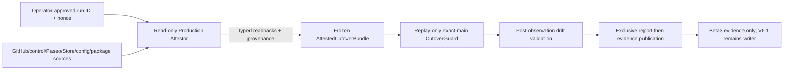

# GWO V8 Beta3 Production Bootstrap Design

**Status:** Approved design, production execution remains HOLD until implementation and independent review pass.

**Date:** 2026-08-10

## Objective

Build a one-off, fail-closed production bootstrap that obtains source-bound read-only observations for the fixed GWO V8 Beta3 subject, converts them to exact current-main Cutover Guard readbacks, evaluates the Guard over frozen replay ports, and publishes only the existing report/evidence pair. The bootstrap must never turn an unavailable production fact into an empty value or a GO result.

A successful Beta3 Guard is release evidence only. It does not stop V6.1, transfer writer authority, activate V8, admit work, install packages, invoke a provider, or publish a tag or release.

## Fixed release subject

The bootstrap is bound to these exact values:

- Repository: `NOirBRight/github-work-orchestrator`
- Production checkout: `D:\Workstation\github-work-orchestrator`
- Source commit: `5de34bdaee45f0aba44077a8d1d3e3ed8293f237`
- Source tree: `104ee822dbfb494d33d56b8ccf54092d9d1d9c86`
- Control branch: `gwo-control`
- Target branch: `main`
- Source writer: `v6.1`
- Target writer: `v8`
- Fresh Store generation: `store:v8:production:20260809T081500Z`
- Fresh Store SHA-256: `afff1078e7a65fb8acccde28fee78fab3cf2278db9dd6548f5ef96a882076b98`
- Fresh receipt SHA-256: `46814d166c857e3d7f847b7da6f3da5b39c394b42402b2f1d2cdd61d78ce7781`
- Evidence root: `D:\gwo-release-evidence\2026-08-09-gwo-v8-beta3-production-cutover`
- Final report: `beta3-live-guard-report.json`
- Final evidence: `beta3-live-guard-evidence.json`

Any different repository, commit, tree, branch, generation, Store, receipt, package identity, installed surface, output directory, or runbook digest is a different subject and requires a new reviewed run.

## Trust and threat boundary

ADR-0015 defines a cooperative single-host trust boundary. GWO V8 does not attempt hostile-host attestation or protection from a malicious local administrator. Therefore this design does not introduce signing keys, a certificate service, or a capability broker.

The trusted root for this operation is:

1. the operator-approved run identity and empty output directory;
2. the independently reviewed Attestor/runner bytes and their SHA-256 digests;
3. exact current-main Guard/package bytes loaded only from the fixed production checkout;
4. direct read-only source calls made by the Attestor; and
5. retained local file handles plus remote source identities revalidated around Guard execution.

Self-consistent operator JSON, timestamps, model output, chat text, and intrinsic `readback_digest` values are not source authority.

## Decision

Use a capability-separated, single-process **Attestor → frozen bundle → replay-only Guard → exclusive publication** pipeline.



Rejected alternatives:

- Existing Legacy/Writer/Ownership controls are not used as Guard ports because they expose mutation, omit required facts, use moving sources, or have cross-source TOCTOU windows.
- Operator-authored readback files are not accepted as authority merely because their schema and hashes are valid.
- Guard does not call live GitHub, Paseo, provider, Runtime, Gateway, transition, activation, installation, or SQLite write paths.

## Components and interfaces

### 1. AttemptIdentity

`AttemptIdentity` is generated once after zero-write preflight and contains exactly:

- `run_id`: operator-visible, unique non-empty text;
- `challenge_nonce`: at least 128 bits from the OS random source, encoded as lowercase hexadecimal;
- `repository`;
- `evidence_root`;
- `cutover_subject_digest`;
- `runner_sha256`;
- `attestor_sha256`.

The attempt identity is immutable. A retry after a crash or collision uses a new run ID, nonce, and operator-approved directory. It never adopts residue from an earlier attempt.

### 2. ProductionBootstrapAttestor

The Attestor is the only component allowed to contact Legacy, control, Paseo, and Runtime production sources. Zero-write preflight may perform the separately audited fixed Git/origin reads, but the Guard phase contacts no production source. Its public operation is equivalent to:

```python
attest(config: RunnerConfig, attempt: AttemptIdentity) -> AttestedCutoverBundle
```

It receives narrow read capabilities, not general controls. An accepted source object exposes only its declared read method. Objects exposing `start`, `stop`, `restore`, `drain`, `write`, `publish`, `compare_and_swap`, `activate`, `advance`, `install`, or equivalent mutators are rejected before use.

The Attestor must not call `production_legacy_writer_control`, `_production_legacy_execution_readback`, `coordination_mutex`, `StoreV8OwnershipControl`, `install_github_plan_control_start`, or `ProductionPlanControlStartHost.start`.

### 3. SourceRecord

Every independent source observation produces a closed `SourceRecord` containing:

- source role;
- exact locator and repository;
- read mode;
- immutable ref/OID, epoch, generation, or retained file identity;
- exact raw-byte or canonical-record SHA-256;
- typed readback digest when one exists;
- producer code digest.

A timestamp may be recorded for audit but never substitutes for an OID, generation, epoch, retained file identity, or complete double-read equality.

### 4. AttestedCutoverBundle

The Attestor returns one immutable in-memory value containing:

- exact current-main `CutoverSubject`;
- exact typed `LegacyReadback`;
- exact typed `DurableStateReadback`;
- exact typed `WriterFenceReadback`;
- exact typed `OwnershipReadback`;
- exact typed `CompatibilityPathReadback`;
- exact typed `RuntimePreflightReadback`;
- exact typed `PackageReadback`;
- ordered source records;
- `AttemptIdentity`;
- canonical attestation digest.

The current-main readback schemas remain unchanged. Provenance is held by the outer attestation and is not added to an inner readback object.

### 5. Frozen replay ports

Each replay port owns one exact typed value and exposes only the applicable `read(...)` method. Repeated reads return the same value. A replay port cannot import or retain a production client.

The replay phase constructs exact current-main `CutoverGuardSources` and calls exact current-main `install_cutover_guard`. It does not construct `ProductionPlanControlStartHost`, `ArtifactStore`, RuntimeGateway, a repository implementation, or a content client.

### 6. BootstrapLease

`BootstrapLease` retains and verifies all local inputs and all external source identities used by the attestation. It covers:

- fresh, rollback, and prior Stores;
- fresh Store receipt;
- production source tree and runbook/module files;
- package manifests/content and all installed package files;
- Runtime configuration bytes;
- any local Legacy or Runtime registry bytes;
- output-parent path components;
- fixed GitHub control ref/OID and blob identities;
- Paseo inventory identity/epoch; if the source provides no complete identity or equivalent complete double-read proof, the source is unavailable.

Local files are opened without following links/reparse points, hashed from retained handles, and re-read through both the retained handle and path identity. The Store uses `mode=ro&immutable=1` and no SQLite sidecar may exist or appear.

Remote identities are re-read before Guard, immediately after Guard, and before publication. Any change is input drift.

## Source-specific contracts

### LegacyReadback producer

The producer reads independent source observations for:

- repository and current writer generation;
- legacy fence/authority state from `.gwo-v8/legacy-writer-fence.json`;
- complete active Dispatch inventory;
- complete active Worker inventory;
- V6.1 Integration Lease owner;
- V2 execution references and aggregate state;
- original V2 decoder readability;
- exact durable-state bytes or an independently defined durable-state record.

The producer may derive a typed field only from documented source records included in the attestation. It must not derive absence solely from a constant, omitted row, truncated pagination, a stale timestamp, or a caller-provided empty collection.

`original_decoder_readable=True` is valid without invoking a decoder only when the authoritative V2 source proves that the reference set is empty. If references exist, each reference must be decoded through the original read-only decoder. Unknown, contradictory, partially enumerated, or unreadable state is unavailable.

`durable_state_digest` is the digest of the exact authoritative durable observation defined by the source adapter. It is not a digest of the projected `LegacyReadback`.

If any Legacy fact has no authoritative source under the cooperative-host boundary, the Attestor returns `LEGACY_SOURCE_UNAVAILABLE`. It never substitutes `None`, `[]`, `True`, or a generated digest.

### WriterFenceReadback producer

The producer first captures the exact `gwo-control` head OID and reads `.gwo-v8/writer-transition.json` plus `.gwo/v8/active-plan.json` at that OID. It validates canonical bytes, closed schemas, repository identity, record lineage, current pointer, writer generation, authority state, activation identity, and predecessor binding.

It constructs `control_ref_digest` from repository, branch, fixed OID, paths, blob identities, byte digests, and selected record identities. A missing control record is unavailable; there is no `initial_writer="v6.1"` fallback.

The resulting port is frozen. A separate source probe verifies that the control head and bound blobs remain unchanged around Guard execution.

### OwnershipReadback producer

The producer reads the exact fresh Store with `mode=ro&immutable=1` after the existing schema, integrity, generation, receipt, row-count, file-identity, and sidecar gates pass.

One coherent read enumerates:

- active admissions;
- active attempts;
- Integration Lease holder;
- resource claims.

Runtime resource references come from a separate read-only Runtime registry source with a complete identity/epoch or retained immutable bytes. If the registry cannot prove a complete result, ownership is unavailable.

Any active admission, attempt, lease, claim, or Runtime resource is represented honestly and causes the existing Guard blocker. It is not converted to unavailable merely because it would produce `NO_GO`.

### Durable state, compatibility, Runtime configuration, and packages

The runner-owned durable-state port continues to validate the exact fresh Store and uses immutable read-only SQLite.

Compatibility and package readers inspect only the fixed production source tree and the three installed package surfaces. Their files are part of `BootstrapLease`.

Runtime configuration is read once from `C:\Users\noirb\.orch\config.json`, validated against the exact five required selectors, converted to the exact current-main immutable configuration type, and bound by raw-byte hash, file identity, resolved Profile digests, and configuration digest. The Guard performs no provider action.

## Execution flow

1. **Zero-write preflight** validates fixed Git identities, origin/main, clean-status allowance, Stores, receipt, package/install identities, absent sidecars, absent final outputs, and output-parent identity.
2. **Attempt creation** generates the run ID and nonce in memory. No production artifact is created.
3. **Attestation observation A** reads every required source and constructs complete source records.
4. **Attestation observation B** independently re-reads every source. Complete source identities and canonical source observations must equal observation A.
5. **Bundle freeze** constructs all seven exact typed readbacks and the outer attestation. Missing source facts stop here with exit `3`.
6. **Lease entry** retains all local inputs and validates external identities.
7. **Replay Guard** evaluates exact current-main Guard code over frozen replay ports. Dynamic tripwires require zero external calls from the Guard phase.
8. **Post-observation** revalidates local handles, Store sidecars, Git status, package files, Runtime config, control OID/blobs, Runtime registry identity, and other source records.
9. **Exclusive publication** writes the report first and evidence second, with complete writes, flush, handle readback, path identity readback, and retained output handles.
10. **Final validation** revalidates both outputs and all retained inputs, then returns `GO`, `NO_GO`, `REFUSED`, or `UNAVAILABLE`.

## Outcome contract

- `GO`, exit `0`: all seven source-bound checks pass, a receipt exists, activation is false, and V6.1 remains the writer.
- `NO_GO`, exit `2`: all sources are valid and authoritative, but one or more Guard predicates block. Canonical report/evidence are published.
- `REFUSED`, exit `1`: output collision or observed input/source drift. No stale Guard result is published; existing bytes are preserved.
- `UNAVAILABLE`, exit `3`: a required source, type, schema, provenance proof, attestation, or Guard composition is unavailable or invalid. No report/evidence is fabricated.

Exceptions never become GO. Missing facts never become empty facts.

## Evidence and publication

The production evidence directory receives only:

1. `beta3-live-guard-report.json`;
2. `beta3-live-guard-evidence.json`.

The report embeds the exact readback bundle, attempt identity, ordered source records, attestation digest, seven Guard checks, blockers, receipt, and mutation flags.

The evidence embeds the same attestation identity, exact report digest/file identity, before/after source observations, fixed release subject, input identities, safety flags, and exit result.

Neither file is a recovery anchor. Any pre-existing report, evidence, partial output, or complete pair is `OUTPUT_COLLISION`. The runner does not resume, adopt, repair, overwrite, rename over, or delete residue. A crash requires a new operator-approved directory/run identity.

## TDD verification groups

Implementation follows RED → GREEN → REFACTOR for each group:

1. **Attempt and source binding:** forged self-digested readbacks, nonce/run substitution, subject substitution, incomplete pagination, missing Legacy sources, and equal projections from different source identities must fail before Guard.
2. **Exact producers:** Legacy, WriterFence, Ownership, Store, Runtime config, and source-record schemas reject noncanonical bytes, unknown fields, wrong types, stale digests, missing identities, and unsafe capability surfaces.
3. **Replay-only Guard:** GO and NO_GO fixtures use exact current-main types and seven checks while tripwires observe zero GitHub, Paseo, provider, Runtime, subprocess, socket, Gateway, Artifact, install, transition, activation, CAS, and SQLite-write calls.
4. **Drift and unavailable outcomes:** every local input and external source identity is independently changed at each boundary; drift yields exit `1`, missing/untrusted source yields exit `3`, and neither path publishes GO.
5. **Exclusive publication:** report/evidence collisions, short writes, identity replacement, parent replacement, crash boundaries, and competing file creation preserve all residue and never use recovery/adoption helpers.

Existing 74 scratch-runner tests remain regression coverage. Final verification also includes AST parsing, Ruff, the focused release-runner suite, and the repository-local pytest suite. GitHub Actions remain disabled; all evidence is Local Verification Only.

## Operational and review gates

Production reads are allowed only after:

1. this design is committed and reviewed;
2. a detailed implementation plan exists;
3. all implementation work follows TDD in an isolated branch/worktree;
4. an independent Luna Max reviewer returns `SPEC GO`, `QUALITY GO`, `TDD VALID`, and `OPEN 0`;
5. runner/attestor/test/review-package hashes are fixed; and
6. zero-write production preflight passes.

A single production `--execute` is allowed only when final outputs are absent and the owner has approved the exact run identity and evidence directory. A GO result still does not authorize writer transition.

## Transition boundary

Beta3 Guard and writer activation are separate operations. After Beta3 publication, the sequence remains:

```text
V6.1 HOLD
→ Beta3 Guard/#118 evidence
→ v8.0.0-beta.3
→ #119 root Canary readiness
→ fresh activation-time source validation
→ V6.1 stop/readback
→ WriterFence CAS + Activation Receipt
→ V8 default
→ v8.0.0 GA
```

The activation operation must independently revalidate source authority and use the existing durable CAS/readback protocol. It may not trust an old Beta3 report as a current mutation token.

## Non-goals

This bootstrap does not:

- weaken or change current-main Cutover Guard predicates;
- modify the fixed production Store or receipt;
- install packages;
- mutate GitHub or Paseo;
- stop or restore V6.1;
- create a Gateway, Artifact store, Campaign, Plan, Admission, Worker, or provider action;
- activate V8 or change the default writer;
- publish a tag or release;
- clean or merge unrelated worktrees/directories.

Workspace convergence resumes only after the release-control result is known and protected evidence/branches have been classified.

## Acceptance criteria

The design is implemented only when all of the following are true:

- every Guard fact is tied to an explicit source record or produces exit `3`;
- all seven Guard inputs are exact current-main typed values;
- the Guard phase performs zero external calls;
- local handles and remote identities are stable across the operation;
- only the two final outputs can be created in production;
- collisions and crashes never overwrite or delete residue;
- GO/NO_GO/REFUSED/UNAVAILABLE retain distinct exit semantics;
- evidence records `activation_performed=false` and all mutation flags false;
- independent review is clean; and
- production remains V6.1 until a later, separately authorized activation succeeds.
